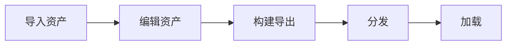

在 Galacean 中，网格，材质，纹理，精灵，图集，动画片段，动画控制器等等都属于资产。

## 资产工作流

在 Galacean 中，资产的工作流通常如下：

本章节将主要讲述：

- [资产类型](/docs/assets-type)：介绍**内置资产类型**和如何**自定义资产加载器**
- 编辑状态下[资产的增删改查](/docs/assets-interface)
- 构建项目后[资产如何导出并部署](/docs/assets-build)
- 运行时如何[加载资产](/docs/assets-load)
- 运行时如何[垃圾回收](/docs/assets-gc)
