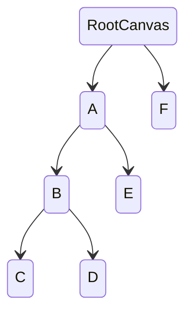

UI events follow the engine's event system, with the additional support for event bubbling in UI components.

## Bubbling

The current version only supports the following bubbling flow:

| Interface                                                     | Bubbles    |
| :----------------------------------------------------------- | :--------- |
| [onPointerEnter](/apis/core/#Script-onPointerEnter)          | Does not bubble |
| [onPointerExit](/apis/core/#Script-onPointerExit)            | Does not bubble |
| [onPointerDown](/apis/core/#Script-onPointerDown)            | Bubbles    |
| [onPointerUp](/apis/core/#Script-onPointerUp)                | Bubbles    |
| [onPointerClick](/apis/core/#Script-onPointerClick)          | Bubbles    |
| [onPointerBeginDrag](/apis/core/#Script-onPointerBeginDrag)  | Bubbles    |
| [onPointerDrag](/apis/core/#Script-onPointerDrag)            | Bubbles    |
| [onPointerEndDrag](/apis/core/#Script-onPointerEndDrag)      | Bubbles    |
| [onPointerDrop](/apis/core/#Script-onPointerDrop)            | Bubbles    |

As shown in the diagram below, if node C triggers the `pointerup` event, the event will bubble along the path C --> B --> A --> RootCanvas.

## Script Development

<Playground href="/embed/ui-Event" />