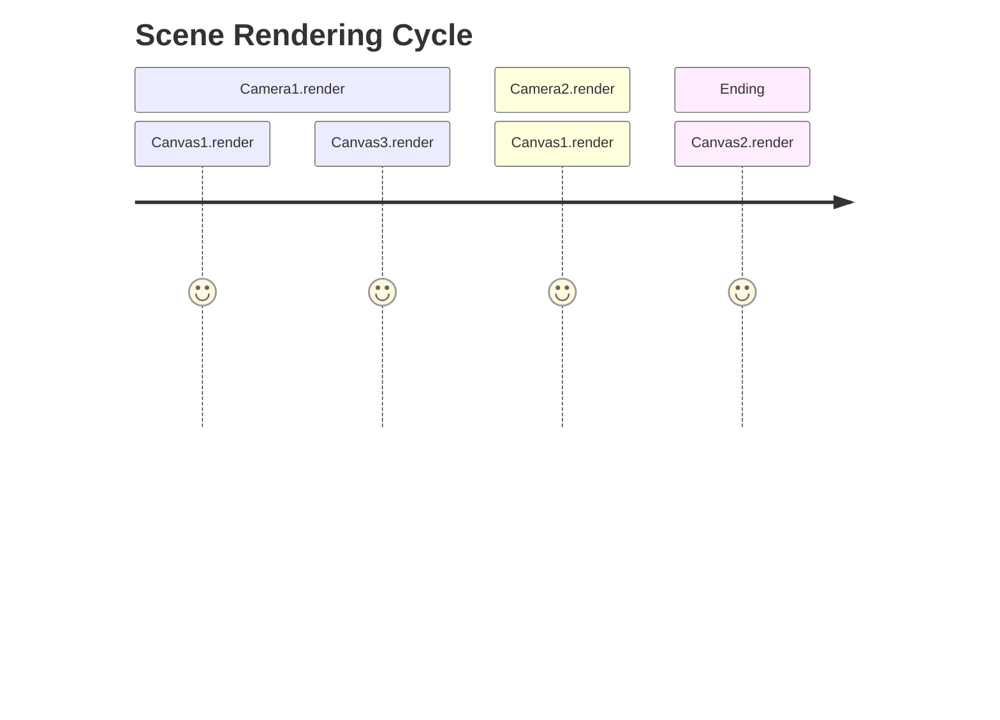
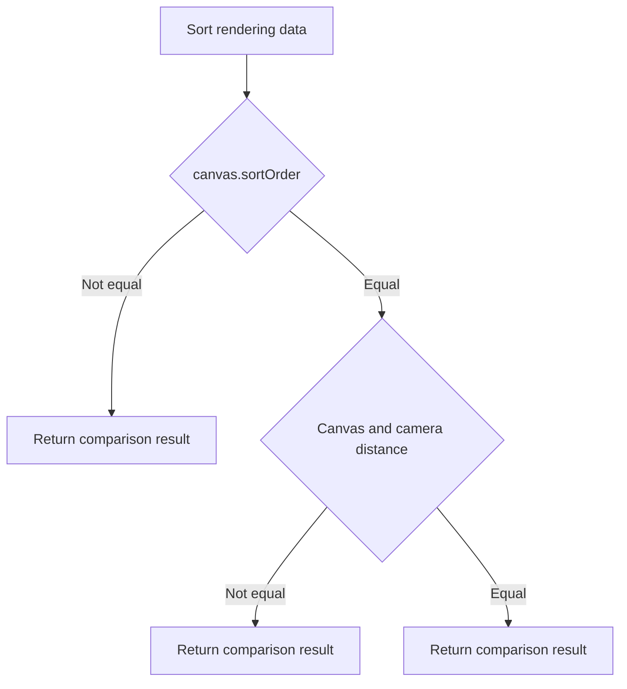
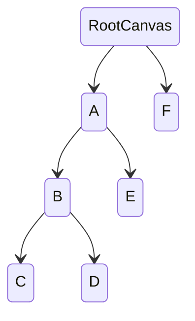

The rendering order of UI components follows two rules:

- Different `UICanvas` instances follow a specific rendering order based on their `RendererMode` type.
- `UIRenderer` components under a `UICanvas` are rendered according to a **depth-first** order, from parent to child, and from left to right.

## UICanvas

Assume the current runtime:
- There is a scene `Scene`
- The scene `Scene` contains two cameras, `Camera1` and `Camera2`
- The scene `Scene` contains three canvases:
  - `Canvas1` with `WorldSpace` render mode
  - `Canvas2` with `ScreenSpace-Overlay` render mode
  - `Canvas3` with `ScreenSpace-Camera` render mode, using `Camera1` as the render camera

It's important to note:
- Canvases with `ScreenSpace-Camera` render mode will only render with their corresponding camera, and they follow the general camera clipping rules, just like canvases with `ScreenSpace-Overlay` render mode.
- Canvases with `ScreenSpace-Overlay` render mode can still be rendered without a camera.
- Within the same camera, the rendering order of `UICanvas` follows these rules: canvases in the overlay mode have their rendering order determined only by `sortOrder`.

## UIRenderer Rendering Order

As shown in the diagram above, the rendering order under the root canvas follows A -> B -> C -> D -> E -> F. It is important to note that setting `UIRenderer.priority` does not change its rendering order.