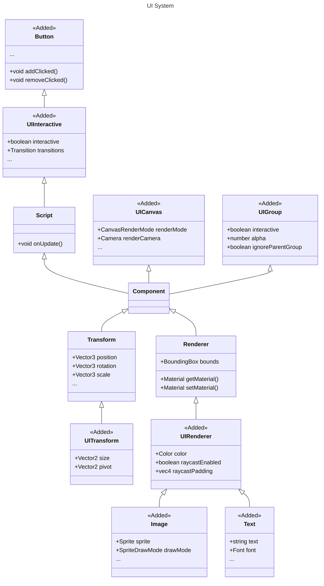

## System Design

## Module Management

| Package                                                                 | Description     | Related Documentation   |
| :--------------------------------------------------------------------- | :------------- | ----------------------- |
| [@galacean/engine-ui](https://www.npmjs.com/package/@galacean/engine-xr) | Core architecture logic | [API](/apis/galacean)    |

> `@galacean/engine-ui` is a dependency that must be included to implement **UI**.

> The [version dependency rules](/docs/basics/version/#version-dependency) must be followed, meaning the version of `@galacean/engine-ui` should match the version of `@galacean/engine`.