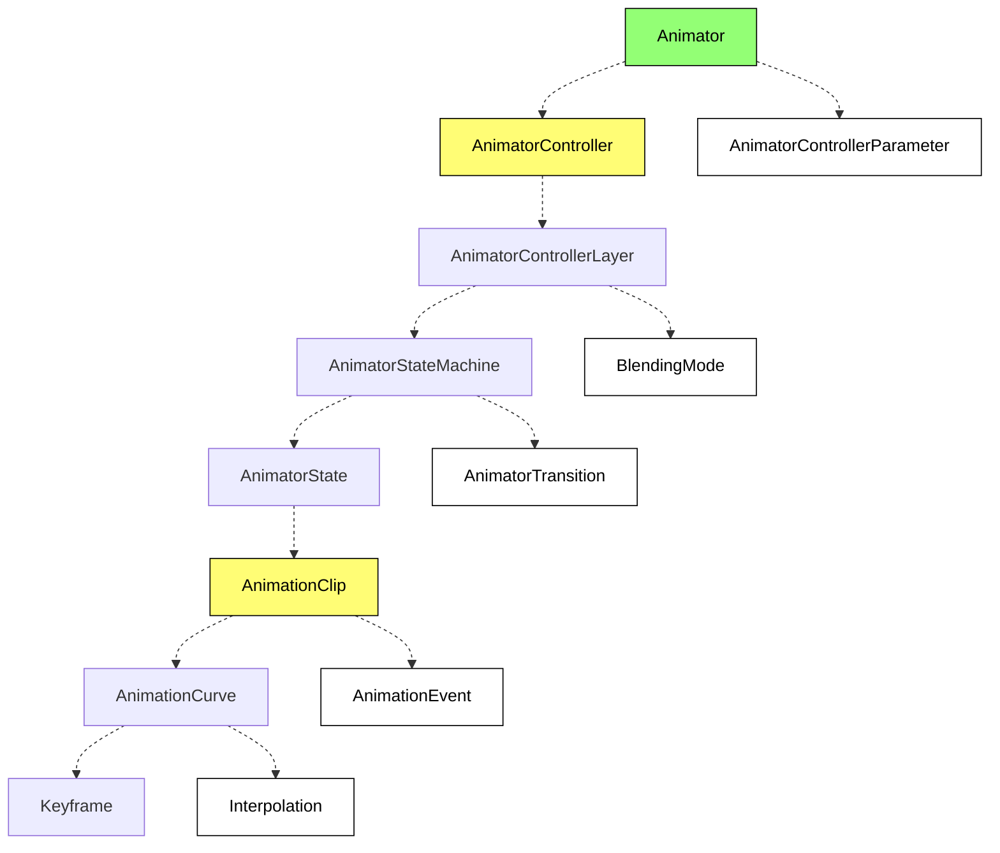

### Composition of Animation System

| Concept                                                        | Explanation                                                                                                                                                                                      |
| -------------------------------------------------------------- | ------------------------------------------------------------------------------------------------------------------------------------------------------------------------------------------------ |
| [Animator](/apis/core/#Animator)                                | The animation controller component used to control the playback of animations. The Animator component reads the AnimatorController as animation data. Use AnimatorControllerParameter to set variables in the Animator. |
| [AnimatorController](/apis/core/#AnimatorController)            | Stores animation data for the Animator component. An AnimatorController contains multiple AnimatorControllerLayers for layered playback or animation overlay.                                      |
| AnimatorControllerParameter (In development)                   | Variables used in the animation controller, allowing users to change variables in scripts to control animation state transitions.                                                                  |
| [AnimatorControllerLayer](/apis/core/#AnimatorControllerLayer)  | Stores animation state machine data for this layer, blending mode, and blend weight. When multiple AnimatorControllerLayers are played simultaneously, setting `blendingMode = AnimatorLayerBlendingMode.Additive` achieves animation overlay effect. |
| [AnimatorStateMachine](/apis/core/#AnimatorStateMachine)        | Each AnimatorControllerLayer has an AnimatorStateMachine for controlling animation state playback, transitions between states, and transitions.                                                     |
| [BlendingMode](/apis/core/#AnimatorControllerLayer-blendingMode) | The blending mode of the animation layer, defaulting to `AnimatorLayerBlendingMode.Override`, can be set to `AnimatorLayerBlendingMode.Additive` for animation overlay effect by setting the layers below to `AnimatorLayerBlendingMode.Additive`. |
| [AnimatorState](/apis/core/#AnimatorState)                      | AnimatorState is the basic component of AnimatorStateMachine. It can control the speed, looping, start, and end times of an AnimationClip. Each AnimatorState needs to be bound to an AnimationClip, which will be played when in that state. |
| [AnimatorTransition](/apis/core/#AnimatorTransition)            | Defines when and how the state machine transitions from one state to another. It allows setting transition start time `exitTime`, target state start time `offset`, and transition duration `duration`. |
| [AnimationClip](/apis/core/#AnimationClip)                      | A segment of animation data created by designers based on keyframes. An AnimationClip generally corresponds to a specific action of a model, and each AnimationClip contains multiple AnimationCurves. |
| [AnimationCurve](/apis/core/#AnimationCurve)                    | In a model with multiple bones, the animation keyframe data for a specified property of each bone entity is stored in AnimationCurve. An AnimationCurve contains multiple Keyframes, which are keyframe data. |
| [AnimationEvent](/apis/core/#AnimationEvent)                    | Allows you to call callback functions in a script bound to the same entity at a specified time.                                                                                                  |
| [Keyframe](/apis/core/#KeyFrame)                                | Stores keyframe data for animations, specifying what the value of an entity's property should be at a given time.                                                                               |
| [Interpolation](/apis/core/#AnimationCurve-interpolation)       | The interpolation method of keyframes in an animation curve, determining how the value of a property should be calculated when the time is between two keyframes.                                 |

Please paste the Markdown content you need to be translated.
