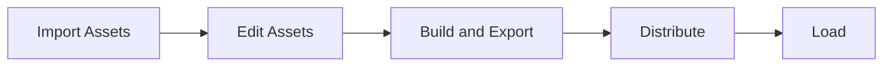

In Galacean, meshes, materials, textures, sprites, atlases, animation clips, animation controllers, etc., are all considered assets.

## Asset Workflow

In Galacean, the asset workflow typically follows these steps:

This chapter will mainly cover:

- How to [customize asset loaders](/en/docs/assets/custom)
- [CRUD operations on assets](/en/docs/assets/interface) in edit mode
- How to [export and deploy assets](/en/docs/assets/build) after building the project
- How to [load assets](/en/docs/assets/load) at runtime
- How to [perform garbage collection](/en/docs/assets/gc) at runtime
