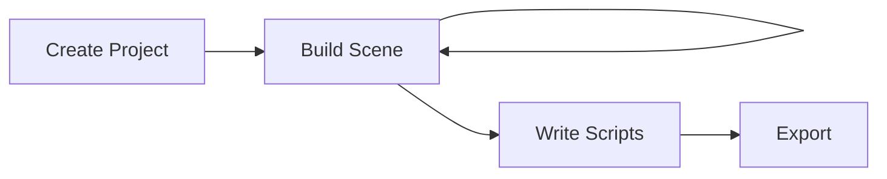

**Galacean Engine** is a web-first, mobile-first, open-source real-time interactive solution, built with a component-based architecture and written in [Typescript](https://www.typescriptlang.org/). It includes features such as [Rendering](/en/docs/graphics/renderer/renderer), [Physics](/en/docs/physics/overall), [Animation](/en/docs/animation/overview), [Interaction](/en/docs/input/input), and [XR](/en/docs/xr/overall). It also provides a comprehensive visual online editor with a complete workflow to help you create stunning 2D/3D interactive applications in the browser. It mainly consists of two parts:

- Editor: An online web interactive creation platform [Editor](https://galacean.antgroup.com/editor)
- Runtime: A web-first, mobile-first high-performance interactive runtime [Runtime](https://github.com/galacean/runtime), rich non-core features and business logic customization features [Toolkit](https://github.com/galacean/runtime-toolkit), and a series of secondary ecosystem packages.

## Editor

[Galacean Editor](https://galacean.antgroup.com/editor/projects) is an online web interactive creation platform. It helps you quickly create, edit, and export an interactive project. You can quickly upload assets, edit materials, adjust lighting, and create entities through the Galacean Editor to create complex scenes.

The overall process of creating an interactive project using the editor:



The editor allows better collaboration between technical and artistic team members. You can quickly start the development of your first project through business templates on the [editor homepage](https://galacean.antgroup.com/editor).

## Runtime

Core functionalities are provided by [Galacean Runtime](https://www.npmjs.com/package/@galacean/runtime), while advanced non-core and business logic customization features are provided by [Galacean Toolkit](https://github.com/galacean/runtime-toolkit). You can browse various engine [examples](/en/examples/latest/background) online through the browser.

### Core Packages

Includes the following sub-packages:

| Package | Description | Related Documentation |
| :-- | :-- | --- |
| [@galacean/engine](https://www.npmjs.com/package/@galacean/engine) | Core architecture logic and core functionalities | [API](/apis/galacean) |
| [@galacean/engine-physics-lite](https://www.npmjs.com/package/@galacean/engine-physics-lite) | Lightweight physics engine | [Doc](/en/docs/physics/overall) |
| [@galacean/engine-physics-physx](https://www.npmjs.com/package/@galacean/engine-physics-physx) | Full-featured physics engine | [Doc](/en/docs/physics/overall) |
| [@galacean/engine-shaderlab](https://www.npmjs.com/package/@galacean/engine-shaderlab) | Galacean Shader compiler | [Doc](/en/docs/graphics/shader/lab) |
| [@galacean/engine-xr](https://www.npmjs.com/package/@galacean/engine-xr) | XR logic package | [Doc](/en/docs/xr/overall) |
| [@galacean/engine-xr-webxr](https://www.npmjs.com/package/@galacean/engine-xr-webxr) | WebXR backend | [Doc](/en/docs/xr/overall) |

You can install it via [NPM](https://docs.npmjs.com/):

```bash
npm install --save @galacean/engine
```

Then import and use it in your project:

```typescript
import { WebGLEngine, Camera } from "@galacean/engine";
```

### Toolkit

Non-core functionalities and business logic customization features are provided by the galacean-toolkit package (for a complete list of features, please check [engine-toolkit](https://github.com/galacean/engine-toolkit/tree/main)):

| Package | Description | API |
| :-- | :-- | :-- |
| [@galacean/engine-toolkit-controls](https://www.npmjs.com/package/@galacean/engine-toolkit-controls) | Controllers | [Doc](/en/docs/graphics/camera/control/) |
| [@galacean/engine-toolkit-framebuffer-picker](https://www.npmjs.com/package/@galacean/engine-toolkit-framebuffer-picker) | Framebuffer Picker | [Doc](/en/docs/input/framebuffer-picker/) |
| [@galacean/engine-toolkit-stats](https://www.npmjs.com/package/@galacean/engine-toolkit-stats) | Engine Stats Panel | [Doc](/en/docs/performance/stats/) |
| ...... |  |  |

> In the same project, please ensure that the core engine package version is consistent and the major version of the toolkit is consistent. For example, with version 1.3.x of the engine, you need to use version 1.3.y of the toolkit.

### Secondary Ecosystem Packages

There are also some secondary ecosystem packages, which are introduced and used in the same way as the engine toolkit:

| Package | Description | API |
| :-- | :-- | :-- |
| [@galacean/engine-spine](https://www.npmjs.com/package/@galacean/engine-spine) | Spine Animation | [Doc](/en/docs/graphics/2D/spine/overview/) |
| [@galacean/engine-lottie](https://www.npmjs.com/package/@galacean/engine-lottie) | Lottie Animation | [Doc](/en/docs/graphics/2D/lottie/) |

> For version dependencies of secondary ecosystem packages, please refer to the corresponding documentation.

> [Click to learn more about Galacean's version management](/en/docs/basics/version/)

## Compatibility

Galacean Runtime runs in environments that support WebGL. So far, all major mobile and desktop browsers support this standard. You can check the compatibility of the runtime environment on [CanIUse](https://caniuse.com/?search=webgl).

For some functional modules that require additional compatibility considerations, the current adaptation solutions are as follows:

| Module | Compatibility Considerations | Specific Documentation |
| :-- | :-- | :-- |
| [Mouse and Touch](/en/docs/input) | [PointerEvent](https://caniuse.com/?search=PointerEvent) | For compatibility, please refer to [polyfill-pointer-event](https://github.com/galacean/polyfill-pointer-event) |
| [PhysX](/en/docs/physics/overall) | [WebAssembly](https://caniuse.com/?search=wasm) | In environments that do not support WebAssembly, it will degrade to the JS version, with slightly lower performance and performance compared to the WebAssembly version |

## Open Source Collaboration

**Galacean** is eager to collaborate with you to build an interactive engine. All development processes, including [planning](https://github.com/galacean/engine/projects?query=is%3Aopen), [milestones](https://github.com/galacean/engine/milestones), and [architecture design](https://github.com/galacean/engine/wiki/Physical-system-design), are publicly available in GitHub's project management. You can participate in the construction of the engine by [creating an issue](https://docs.github.com/zh/issues/tracking-your-work-with-issues/creating-an-issue) and [submitting a PR](https://docs.github.com/zh/pull-requests/collaborating-with-pull-requests/proposing-changes-to-your-work-with-pull-requests/creating-a-pull-request-from-a-fork). If you have any questions or need help, you can join the DingTalk group or seek help in the [discussion area](https://github.com/orgs/galacean/discussions).
```
