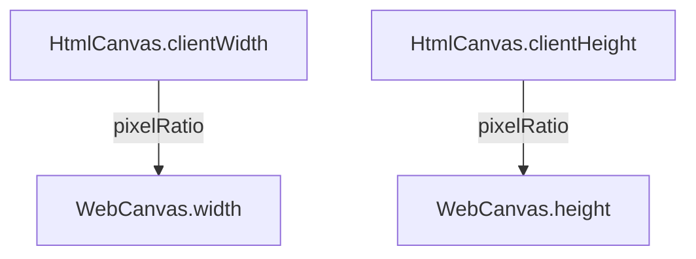

The Galacean Engine encapsulates canvases for different platforms. For example, [WebCanvas](/apis/rhi-webgl/WebCanvas) supports controlling [HTMLCanvasElement](https://developer.mozilla.org/en-US/en/docs/Web/API/HTMLCanvasElement) or [OffscreenCanvas](https://developer.mozilla.org/en-US/en/docs/Web/API/OffscreenCanvas) using [Engine](/apis/core/#Engine).


> Unless otherwise specified, the canvas in the documentation generally refers to `WebCanvas`.

## Basic Usage

### Creating a Canvas

Insert a `<canvas>` tag in HTML and specify an id:

```html
<canvas id="canvas" style="width: 500px; height: 500px" />
```

> Developers should ensure to check the height and width of the canvas to avoid rendering issues caused by a height or width value of **0**.

When creating a WebGLEngine instance, a WebCanvas instance is automatically created:

```typescript
const engine = await WebGLEngine.create({ canvas: "canvas" });

console.log(engine.canvas); // => WebCanvas instance
```

### Basic Adaptation

The canvas size is generally controlled by the **device pixel ratio**, using [WebCanvas](/apis/rhi-webgl/WebCanvas) as an example:



If developing by exporting an **NPM package** through an editor, controlling the **device pixel ratio** in the export configuration at [Project Export](/en/docs/assets-build) is sufficient.


Alternatively, adapt the canvas by actively calling `resizeByClientSize` in the code.

```typescript
// 使用设备像素比（ window.devicePixelRatio ）调整画布尺寸，
engine.canvas.resizeByClientSize();
// 自定义像素比调整画布尺寸
engine.canvas.resizeByClientSize(1.5);
```

> When the display size of the canvas changes (such as when the browser window changes), the image may stretch or compress. You can restore it to normal by calling `resizeByClientSize`. In general, this line of code should meet adaptation needs. If you have more complex adaptation requirements, please refer to the "Advanced Usage" section.

## Advanced Usage

Regarding adaptation, the key point to note is the **device pixel ratio**. For example, on an iPhoneX, the device pixel ratio `window.devicePixelRatio` is _3_, the window width `window.innerWidth` is _375_, and the physical screen pixel width is: 375 * 3 = *1125\*.

Rendering load and physical screen pixel height and width are directly proportional. The larger the physical pixels, the greater the rendering load and power consumption. It is recommended to set the height and width of the canvas using the API exposed by [WebCanvas](/apis/rhi-webgl/WebCanvas), and not to use native canvas APIs such as `canvas.width` or `canvas.style.width`.

> ⚠️ **Note**: Some front-end scaffolding tools may insert the following tag to modify the page's scaling factor:
>
> `<meta name="viewport" content="width=device-width, initial-scale=0.333333333">`
>
> This line of code changes the value of `window.innerWidth` from 375 to 1125.

In addition to automatic adaptation with `resizeByClientSize`, it is recommended to use the following two modes:

### Energy Saving Mode

Considering that mobile devices have high-definition screens (device pixel ratio is high), but the actual graphics card performance cannot meet the performance requirements of high-definition real-time rendering well (**the rendering area ratio of 3x screen and 2x screen is 9:4, and the 3x screen is more likely to cause the phone to heat up**), in this mode, the engine achieves adaptation by scaling and stretching the canvas. The code is as follows:

```typescript
const canvas = document.getElementById("canvas");
const webcanvas = new WebCanvas(canvas);
const pixelRatio = window.devicePixelRatio; // 如果已经设置 meta scale，请设置为 1
const scale = 3 / 2; // 3 倍高清屏按 2 倍屏来计算画布尺寸

/**
 * 设置节能模式，默认全屏，也可以自己设置任意高宽
 */
webcanvas.width = (window.innerWidth * pixelRatio) / scale;
webcanvas.height = (window.innerHeight * pixelRatio) / scale;
webcanvas.setScale(scale, scale); // 拉伸画布
```

If the canvas width and height have already been set through CSS (such as `width: 100vw; height: 100vh;`), you can achieve canvas scaling by passing parameters to `resizeByClientSize`:

```typescript
const canvas = document.getElementById("canvas");
const webcanvas = new WebCanvas(canvas);
const scale = 2 / 3; // 3 倍高清屏按 2 倍屏来计算画布尺寸

webcanvas.resizeByClientSize(scale); // 拉伸画布
```

### Fixed Width Mode

In some cases, such as when the design draft has a fixed width of 750, developers may choose to hardcode the canvas width to reduce adaptation costs. The code is as follows:

```typescript
import { WebCanvas } from "@galacean/engine";

const canvas = document.getElementById("canvas");
const webcanvas = new WebCanvas(canvas);
const fixedWidth = 750; // 固定 750 宽度

/**
 * 设置固定宽度模式
 */
const scale = window.innerWidth / fixedWidth;
webcanvas.width = fixedWidth;
webcanvas.height = window.innerHeight / scale;
webcanvas.setScale(scale, scale); // 拉伸画布
```
