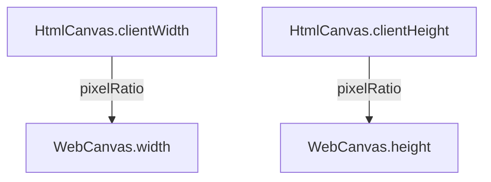

Galacean Engine encapsulates canvases for different platforms, such as [WebCanvas](/en/apis/rhi-webgl/#WebCanvas) which supports using [Engine](/en/apis/core/#Engine) to control [HTMLCanvasElement](https://developer.mozilla.org/en-US/docs/Web/API/HTMLCanvasElement) or [OffscreenCanvas](https://developer.mozilla.org/en-US/docs/Web/API/OffscreenCanvas).


> Unless otherwise specified, the canvas in the documentation generally refers to `WebCanvas`.

## Basic Usage

### Creating a Canvas

Insert a `<canvas>` tag in HTML and specify an id:

```html
<canvas id="canvas" style="width: 500px; height: 500px" />
```

> Developers should check the height and width of the canvas to avoid rendering issues caused by a height or width value of **0**.

When creating an instance of WebGLEngine, a WebCanvas instance is automatically created. The parameter `canvas` is the `id` of the _Canvas_ element.

```typescript
const engine = await WebGLEngine.create({ canvas: "canvas" });

console.log(engine.canvas); // => WebCanvas instance
```

### Basic Adaptation

The canvas size is generally controlled by the **device pixel ratio**, taking [WebCanvas](/en/apis/rhi-webgl/#WebCanvas) as an example:



If developing by exporting an **NPM package** through the editor, you only need to control the **device pixel ratio** in the [project export](/en/docs/platform/platform) rendering export configuration.


Or actively call `resizeByClientSize` in the code to adapt the canvas.

```typescript
// 使用设备像素比（ window.devicePixelRatio ）调整画布尺寸，
engine.canvas.resizeByClientSize();
// 自定义像素比调整画布尺寸
engine.canvas.resizeByClientSize(1.5);
```

> When the display size of the canvas changes (such as when the browser window changes), the image may appear stretched or compressed. You can call `resizeByClientSize` to restore it to normal. In most cases, this line of code can meet the adaptation needs. If you have more complex adaptation requirements, please read the "Advanced Usage" section.

## Advanced Usage

Regarding adaptation, the core point to note is the **device pixel ratio**. Taking iPhoneX as an example, the device pixel ratio `window.devicePixelRatio` is _3_, the window width `window.innerWidth` is _375_, and the screen physical pixel width is: 375 * 3 = *1125*.

Rendering pressure is proportional to the physical pixel height and width of the screen. The larger the physical pixels, the greater the rendering pressure, and the more power it consumes. It is recommended to set the height and width of the canvas through the API exposed by [WebCanvas](/en/apis/rhi-webgl/WebCanvas), rather than using the native canvas API, such as modifying `canvas.width` or `canvas.style.width`.

> ️ **Note**: Some front-end scaffolds insert the following tag to modify the page's zoom ratio:
>
> `<meta name="viewport" content="width=device-width, initial-scale=0.333333333">`
>
> This line of code will change the value of `window.innerWidth` from 375 to 1125.

除了 `resizeByClientSize` 自动适配，推荐使用以下两种模式：

### Energy-saving Mode

Considering that mobile devices, although having high-definition screens (high device pixel ratio), the actual GPU performance may not meet the performance requirements for high-definition real-time rendering (the rendering area ratio of 3x screens to 2x screens is 9:4, and 3x screens can easily cause the phone to overheat), in this mode, the engine achieves adaptation by scaling and stretching the canvas. The code is as follows:

```typescript
const canvas = document.getElementById("canvas");
const webcanvas = new WebCanvas(canvas);
const pixelRatio = window.devicePixelRatio; // 如果已经设置 meta scale，请设置为 1
const scale = 3 / 2; // 3 倍高清屏按 2 倍屏来计算画布尺寸

/**
 * 设置节能模式，默认全屏，也可以自己设置任意高宽
 */
webcanvas.width = (window.innerWidth * pixelRatio) / scale;
webcanvas.height = (window.innerHeight * pixelRatio) / scale;
webcanvas.setScale(scale, scale); // 拉伸画布
```

If the canvas height and width have already been set via CSS (e.g., `width: 100vw; height: 100vh;`), you can achieve canvas scaling by passing parameters to `resizeByClientSize`:

```typescript
const canvas = document.getElementById("canvas");
const webcanvas = new WebCanvas(canvas);
const scale = 2 / 3; // 3 倍高清屏按 2 倍屏来计算画布尺寸

webcanvas.resizeByClientSize(scale); // 拉伸画布
```

### Fixed Width Mode

In some cases, such as when the design draft has a fixed width of 750, developers might hardcode the canvas width to reduce adaptation costs. The code is as follows:

```typescript
import { WebCanvas } from "@galacean/engine";

const canvas = document.getElementById("canvas");
const webcanvas = new WebCanvas(canvas);
const fixedWidth = 750; // 固定 750 宽度

/**
 * 设置固定宽度模式
 */
const scale = window.innerWidth / fixedWidth;
webcanvas.width = fixedWidth;
webcanvas.height = window.innerHeight / scale;
webcanvas.setScale(scale, scale); // 拉伸画布
```
