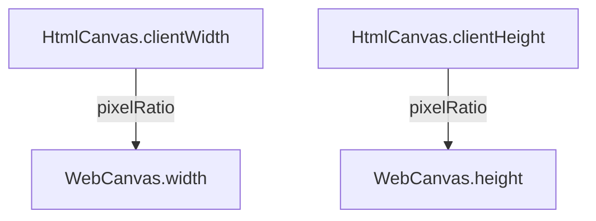

The engine encapsulates canvases for different platforms, such as [WebCanvas](/apis/rhi-webgl/#WebCanvas), allowing [Engine](/apis/core/#Engine) to control [HTMLCanvasElement](https://developer.mozilla.org/en-US/docs/Web/API/HTMLCanvasElement) or [OffscreenCanvas](https://developer.mozilla.org/en-US/docs/Web/API/OffscreenCanvas). Unless otherwise specified, canvases in the documentation generally refer to `WebCanvas`.

## Basic Usage

### Creating a Canvas

Insert a `<canvas>` tag in HTML and specify an id:

```html
<canvas id="canvas" style="width: 500px; height: 500px" />
```

> Developers should check the height and width of the canvas to avoid rendering issues caused by values of **0**.

When creating a WebGLEngine instance, a WebCanvas instance is automatically created. The `canvas` parameter is the _Canvas_ element's `id`.

```typescript
const engine = await WebGLEngine.create({ canvas: "canvas" });

console.log(engine.canvas); // => WebCanvas instance
```

### Basic Adaptation

Canvas size is generally controlled by the **device pixel ratio**. Taking [WebCanvas](/apis/rhi-webgl/#WebCanvas) as an example:



Call `resizeByClientSize` to adapt the canvas:

```typescript
// Adjust canvas size using the device pixel ratio (window.devicePixelRatio)
engine.canvas.resizeByClientSize();
// Adjust canvas size using a custom pixel ratio
engine.canvas.resizeByClientSize(1.5);
```

When the display size of the canvas changes (e.g., when the browser window changes), the image may appear stretched or compressed. You can restore it to normal by calling `resizeByClientSize`. In most cases, this line of code can meet the adaptation requirements. If you have more complex adaptation needs, please read the "Advanced Usage" section.

## Advanced Usage

Regarding adaptation, the key point is the **device pixel ratio**. Taking iPhone X as an example, the device pixel ratio `window.devicePixelRatio` is _3_, the window width `window.innerWidth` is _375_, and the physical screen pixel width is: 375 * 3 = *1125*.

Rendering pressure is proportional to the physical pixel width and height of the screen. The larger the physical pixel, the greater the rendering pressure and the more power it consumes. It is recommended to set the canvas width and height through APIs exposed by [WebCanvas](/apis/rhi-webgl/WebCanvas), rather than using native canvas APIs such as `canvas.width` or `canvas.style.width`.

> ⚠️ **Note**: Some front-end scaffolds may insert the following tag to modify the page's zoom ratio:
>
> `<meta name="viewport" content="width=device-width, initial-scale=0.333333333">`
>
> This line of code changes the value of `window.innerWidth` from 375 to 1125.

Apart from `resizeByClientSize`, which automatically adapts, the following two modes are recommended:

### Energy-Saving Mode

Considering that mobile devices, despite having high-definition screens (high device pixel ratio), may not have graphics card performance that meets the performance requirements for HD real-time rendering (the rendering area ratio of 3x screen to 2x screen is 9:4, and 3x screens can easily cause phones to overheat), the engine achieves adaptation by scaling the canvas in this mode. The code is as follows:

```typescript
const canvas = document.getElementById("canvas");
const webcanvas = new WebCanvas(canvas);
const pixelRatio = window.devicePixelRatio; // If meta scale is set, please set to 1
const scale = 3 / 2; // Calculate canvas size for 3x HD screen as if it were 2x

/**
 * Set energy-saving mode, defaults to full screen, but you can set any width and height
 */
webcanvas.width = (window.innerWidth * pixelRatio) / scale;
webcanvas.height = (window.innerHeight * pixelRatio) / scale;
webcanvas.setScale(scale, scale); // Scale canvas
```

If the canvas width and height have been set via CSS (e.g., `width: 100vw; height: 100vh;`), you can scale the canvas by passing parameters to `resizeByClientSize`:

```typescript
const canvas = document.getElementById("canvas");
const webcanvas = new WebCanvas(canvas);
const scale = 2 / 3; // Calculate canvas size for 3x HD screen as if it were 2x

webcanvas.resizeByClientSize(scale); // Scale canvas
```

### Fixed Width Mode

In certain situations, such as when a design draft has a fixed width of 750, developers might hard-code the canvas width to reduce adaptation costs. The code is as follows:

```typescript
import { WebCanvas } from "@galacean/engine";

const canvas = document.getElementById("canvas");
const webcanvas = new WebCanvas(canvas);
const fixedWidth = 750; // Fixed width of 750

/**
 * Set fixed width mode
 */
const scale = window.innerWidth / fixedWidth;
webcanvas.width = fixedWidth;
webcanvas.height = window.innerHeight / scale;
webcanvas.setScale(scale, scale); // Scale canvas
```