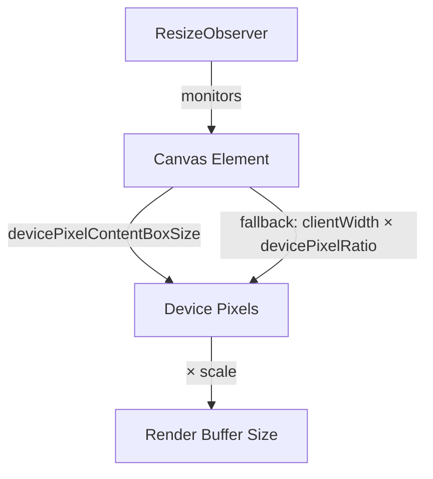

The engine encapsulates canvases for different platforms, such as [WebCanvas](/apis/rhi-webgl/#WebCanvas), allowing [Engine](/apis/core/#Engine) to control [HTMLCanvasElement](https://developer.mozilla.org/en-US/docs/Web/API/HTMLCanvasElement) or [OffscreenCanvas](https://developer.mozilla.org/en-US/docs/Web/API/OffscreenCanvas). Unless otherwise specified, canvases in the documentation generally refer to `WebCanvas`.

## Basic Usage

### Creating a Canvas

Insert a `<canvas>` tag in HTML and specify an id:

```html
<canvas id="canvas" style="width: 500px; height: 500px" />
```

> Developers should check the height and width of the canvas to avoid rendering issues caused by values of **0**.

When creating a WebGLEngine instance, a WebCanvas instance is automatically created. The `canvas` parameter is the _Canvas_ element's `id`.

```typescript
const engine = await WebGLEngine.create({ canvas: "canvas" });

console.log(engine.canvas); // => WebCanvas instance
```

### Auto Resolution (Default)

By default, the canvas render buffer automatically follows the display size, accounting for the device pixel ratio:

```typescript
// Canvas auto-resizes out of the box
const engine = await WebGLEngine.create({ canvas: "canvas" });
```

When the display size of the canvas changes (e.g., when the browser window changes), the render buffer resizes automatically so the image stays sharp. In most cases, the default behavior meets adaptation needs. If you have more complex requirements, read the "Advanced Usage" section.

### Auto Resolution with Custom Scale

Use `setAutoResolution(scale)` to control how the device pixel ratio is applied. The `scale` parameter defaults to `1` (native sharpness):

```typescript
// Native sharpness (1x device pixel ratio)
engine.canvas.setAutoResolution();

// Save GPU load — render at 70% of native resolution
engine.canvas.setAutoResolution(0.7);

// Supersample — render at 2x native resolution
engine.canvas.setAutoResolution(2);
```

Calling `setAutoResolution` switches the canvas back to auto-resize mode, overriding a previous `setResolution` call.

### Explicit Resolution Control

If you need manual control over the render buffer size, use `setResolution`:

```typescript
// Lock the render buffer to a fixed resolution, independent of display size
engine.canvas.setResolution(1920, 1080);
```

Once `setResolution` is called, the canvas stops following display size changes and stays at the specified resolution until `setAutoResolution` is called again. The `width` and `height` properties are read-only and reflect the current render buffer resolution.

## Advanced Usage

Regarding adaptation, the key point is the **device pixel ratio**. Taking iPhone X as an example, the device pixel ratio `window.devicePixelRatio` is _3_, the window width `window.innerWidth` is _375_, and the physical screen pixel width is: 375 * 3 = *1125*.

Rendering pressure is proportional to the physical pixel width and height of the screen. The larger the physical pixel, the greater the rendering pressure and the more power it consumes. It is recommended to set the canvas resolution through APIs exposed by [WebCanvas](/apis/rhi-webgl/WebCanvas), rather than using native canvas APIs such as `canvas.width` or `canvas.style.width`.

> **Note**: Some front-end scaffolds may insert the following tag to modify the page's zoom ratio:
>
> `<meta name="viewport" content="width=device-width, initial-scale=0.333333333">`
>
> This line of code changes the value of `window.innerWidth` from 375 to 1125.

### How Auto-Resolution Works


```mermaid
flowchart TD
    A[ResizeObserver] -->|monitors| B[Canvas Element]
    B -->|devicePixelContentBoxSize| C[Device Pixels]
    B -->|fallback: clientWidth × devicePixelRatio| C
    C -->|× scale| D[Render Buffer Size]
```

The engine uses a `ResizeObserver` to monitor the canvas element. On each resize, the observer captures the canvas's device-pixel dimensions, then the engine computes the render buffer size from one of two sources:

- **`devicePixelContentBoxSize` (Chrome/Edge/Firefox)**: Already represents exact device pixels, so only `scale` is applied
- **`clientWidth × devicePixelRatio` (Safari fallback)**: CSS pixels are multiplied by the device pixel ratio, then by `scale`

The resize is deferred to the next frame (`engine.update()`) to prevent tearing.

### Energy-Saving Mode

Considering that mobile devices, despite having high-definition screens (high device pixel ratio), may not have graphics card performance that meets the performance requirements for HD real-time rendering (the rendering area ratio of 3x screen to 2x screen is 9:4, and 3x screens can easily cause phones to overheat), use a scale factor below `1` to reduce GPU load:

```typescript
engine.canvas.setAutoResolution(2 / 3);
```

### Fixed Width Mode

In certain situations, such as when a design draft has a fixed width of 750, developers might hard-code the render resolution to reduce adaptation costs. The render resolution is fixed via `setResolution`, while the display size is left to CSS:

```typescript
import { WebCanvas } from "@galacean/engine";

const canvas = document.getElementById("canvas") as HTMLCanvasElement;
const webCanvas = new WebCanvas(canvas);
const fixedWidth = 750;

// Fix the render resolution; derive the height from the viewport ratio to avoid distortion
const fixedHeight = Math.round((fixedWidth * window.innerHeight) / window.innerWidth);
webCanvas.setResolution(fixedWidth, fixedHeight);
```

```css
/* The display size is controlled by CSS, filling the viewport */
#canvas {
  width: 100vw;
  height: 100vh;
}
```
