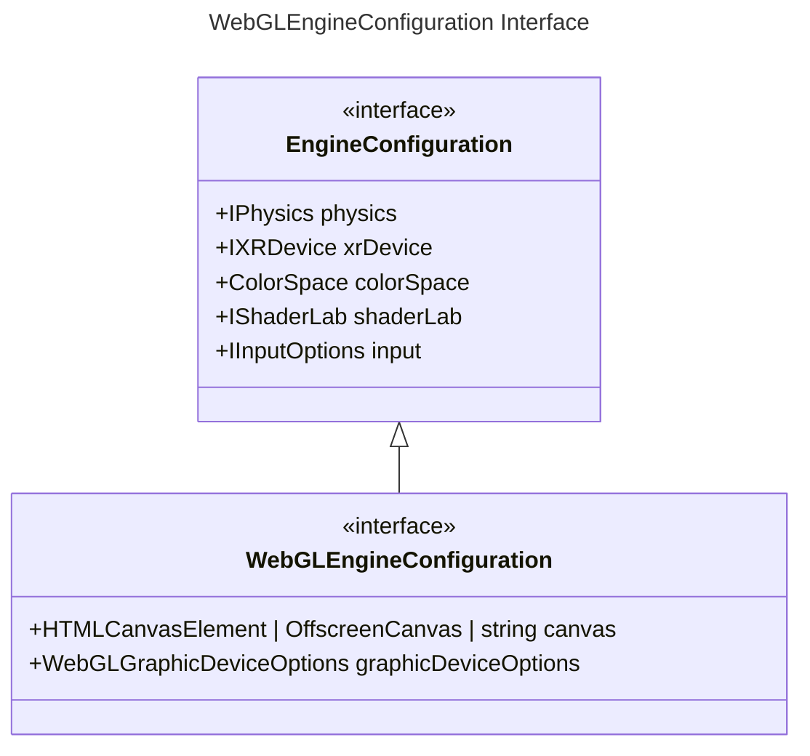

`Engine` plays the role of the main controller in the Galacean Engine, mainly including functions such as **canvas**, **render control**, and **engine subsystem management**:

- **[Canvas](/en/docs/core/canvas)**: Operations related to the main canvas, such as modifying the canvas width and height.
- **Render Control**: Controls the execution/pause/resume of rendering, vertical synchronization, and other functions.
- **Engine Subsystem Management**:
  - [Scene Management](/en/docs/core/scene)
  - [Resource Management](/en/docs/assets/overall)
  - [Physics System](/en/docs/physics/overall)
  - [Interaction System](/en/docs/input)
  - [XR System](/en/docs/xr/overall)
- **Execution Environment Context Management**: Controls the context management of execution environments such as WebGL.

## Initialization

To facilitate users to directly create a web engine, Galacean provides [WebGLEngine](/apis/rhi-webgl/WebGLEngine):

```typescript
const engine = await WebGLEngine.create({ canvas: "canvas" });
```

`WebGLEngine` supports WebGL1.0 and WebGL2.0. It can control all behaviors of the canvas, as well as resource management, scene management, execution/pause/resume, vertical synchronization, and other functions. `WebGLEngine.create`. Below is the type description of the configuration passed in when creating the engine:



Projects exported by the editor usually automatically set the relevant options configured by the editor. For example, developers can set the rendering configuration of the context in the [export interface](/en/docs/platform/platform):


Or select the physics backend and XR backend in the project settings interface of the editor:


You can also modify the code to change the engine configuration. Take **canvas transparency** as an example. By default, the engine enables the transparency channel of the canvas, which means the canvas will blend with the elements behind it. If you need to disable transparency, you can set it like this:

```typescript
const engine = await WebGLEngine.create({
  canvas: htmlCanvas,
  graphicDeviceOptions: { alpha: false }
});
```

Similarly, you can use `webGLMode` to control WebGL1/2. Properties other than `webGLMode` will be passed to the context. For details, refer to [getContext parameter explanation](https://developer.mozilla.org/en-US/docs/Web/API/HTMLCanvasElement/getContext#parameters).

For more related configuration information, refer to [Physics System](/en/docs/physics/overall), [Interaction System](/en/docs/input), [XR System](/en/docs/xr/overall).

## Properties

| Property Name | Property Description |
| --- | --- |
| [time](/apis/core/#Engine-time) | Engine time-related information. For details, refer to [Time](/en/docs/core/time/) |
| [vSyncCount](/apis/core/#Engine-vSyncCount) | Vertical synchronization refresh rate. The engine enables [vertical synchronization](https://baike.baidu.com/item/%E5%9E%82%E7%9B%B4%E5%90%8C%E6%AD%A5/7263524?fromtitle=V-Sync&fromid=691778) by default, and the refresh rate `vSyncCount` is `1` (consistent with the screen refresh rate). If `vSyncCount` is set to `2`, the engine updates once every 2 frames of screen refresh. |
| [resourceManager](/apis/core/#Engine-resourceManager) | Resource manager, generally used for [loading](/en/docs/assets/load/) and [releasing](/en/docs/assets/gc/) assets |
| [sceneManager](/apis/core/#Engine-sceneManager) | Scene manager. Galacean supports rendering multiple scenes simultaneously. The scene manager can be used to conveniently manage the addition, deletion, modification, and query of the current scene. For details, refer to [Scene](/en/docs/core/scene/) |
| [inputManager](/apis/core/#Engine-inputManager) | Interaction manager, generally used to obtain keyboard, touch, and scroll information. For details, refer to [Interaction](/en/docs/input/input/) |

### Refresh Rate

By default, the engine uses vertical synchronization mode and controls the rendering refresh rate with [vSyncCount](/apis/core/#Engine-vSyncCount). In this mode, the rendered frame will wait for the screen's vertical sync signal. [vSyncCount](/apis/core/#Engine-vSyncCount) represents the desired number of screen sync signals between rendered frames. The default value is 1, and this property must be an integer. For example, if we want to render 30 frames per second on a device with a screen refresh rate of 60 frames, we can set this value to 2.

Additionally, users can disable vertical synchronization by setting [vSyncCount](/apis/core/#Engine-vSyncCount) to 0 and then setting [targetFrameRate](/apis/core/#Engine-targetFrameRate) to the desired frame rate. In this mode, rendering does not consider the vertical sync signal. For example, 120 means 120 frames, i.e., the expectation is to refresh 120 times per second.

```typescript
// 垂直同步
engine.vSyncCount = 1;
engine.vSyncCount = 2;

// 非垂直同步
engine.vSyncCount = 0;
engine.targetFrameRate = 120;
```

> ⚠️ It is not recommended to use non-vertical synchronization

## Methods

| Method Name                           | Description        |
| ------------------------------------- | ------------------ |
| [run](/apis/core/#Engine-run)      | Execute engine rendering frame loop |
| [pause](/apis/core/#Engine-pause)  | Pause engine rendering frame loop   |
| [resume](/apis/core/#Engine-resume)| Resume engine rendering loop        |
| [destroy](/apis/core/#Engine-destroy)| Destroy the engine               |
