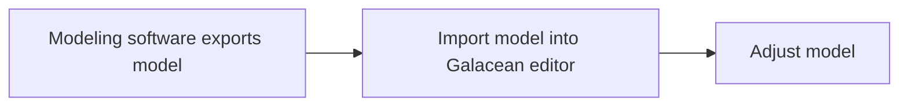

Models typically refer to 3D models created by designers using 3D modeling software, containing a series of [meshes](/en/docs/graphics/mesh/mesh/), [materials](/en/docs/graphics/material/material/), [textures](/en/docs/graphics/texture/texture/), and [animations](/en/docs/animation/overview/). In Galacean, they are also considered assets. The model asset workflow is usually as follows:

This chapter mainly addresses the following issues developers might encounter:

- Requirements for model formats. The editor currently supports importing models in `glTF` or `FBX` formats, but the editor will ultimately convert them into the [glTF](/en/docs/graphics/model/glTF/) format, which can also be parsed at runtime.
- [Importing models](/en/docs/graphics/model/importGlTF/) into the editor
- What are [model assets](/en/docs/graphics/model/assets/)
- [Loading and using models](/en/docs/graphics/model/use/)
- [Restoring artistic effects in the editor](/en/docs/graphics/model/restoration/)
- [Model optimization](/en/docs/graphics/model/opt/)

