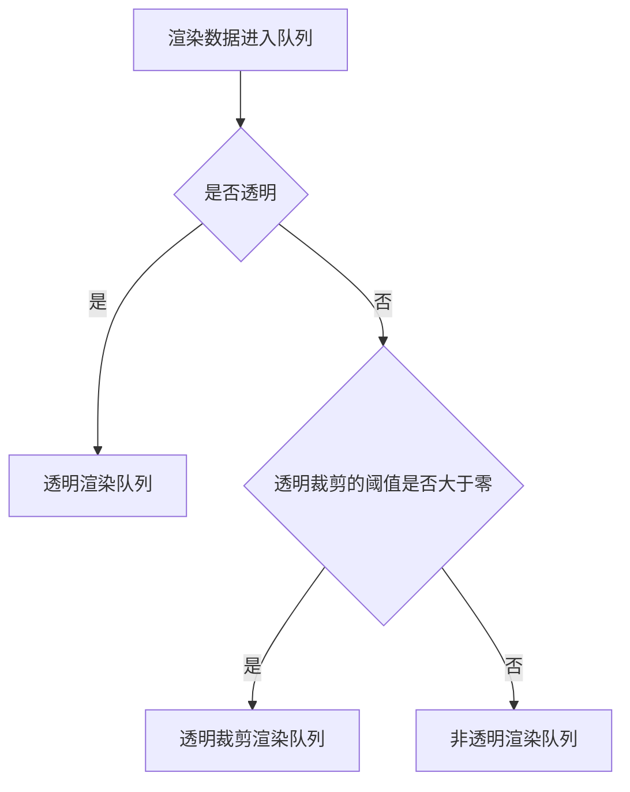
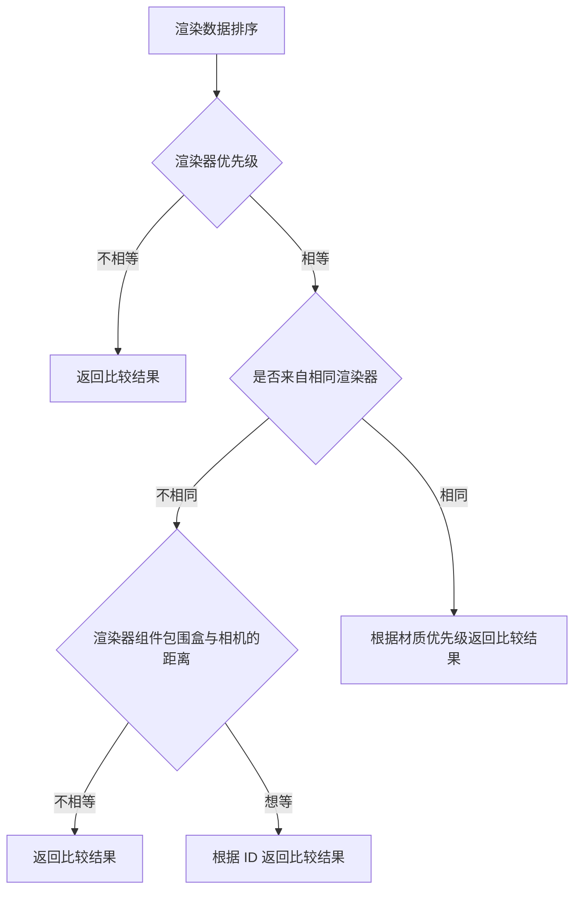

The rendering order of the renderer will affect the **performance** and **accuracy** of the rendering. In Galacean, for each camera, components are placed in the corresponding **render queue** according to a unified **determination rule**.

## Render Queue

Galacean has divided the rendering into three render queues, in the following order:

- Non-transparent render queue (**Opaque**)
- Transparent cutout render queue (**AlphaTest**)
- Transparent render queue (**Transparent**)

The assignment of the renderer to a queue is determined by whether the renderer material is **transparent** and the **threshold** of transparent cutout.

## Determination Rule

The determination rule for rendering order in Galacean is as follows:

### Renderer Priority

The engine provides a `priority` property for the renderer to modify the rendering order in the render queue. The default value is 0, the **smaller the priority (can be negative), the higher the priority** of rendering.

### Material Priority

The engine provides a `priority` property for the material to modify the rendering order of different rendering data from the same renderer in the render queue. The default value is 0, the **smaller the priority (can be negative), the higher the priority** of rendering.

### Distance from Renderer Component Bounds to Camera

The calculation of the distance from the renderer component bounds to the camera depends on the type of [camera](/en/docs/graphics-camera). In an orthographic camera, it is the distance between the center point of the renderer bounds and the camera along the camera's view direction. In a perspective camera, it is the direct distance from the center point of the renderer bounds to the camera position.

> It is important to note that the impact of distance on rendering order is different in different render queues. In the non-transparent render queue and transparent cutout render queue, the rendering order is **from near to far**, while in the transparent render queue, the rendering order is **from far to near**.

### Stability

Currently, when different renderers have the same `renderer priority` and `distance from renderer component bounds to camera`, Galacean ensures the stability of rendering order through **`renderer.instanceId`**, but it cannot guarantee the stability of rendering order within the **same renderer**.
