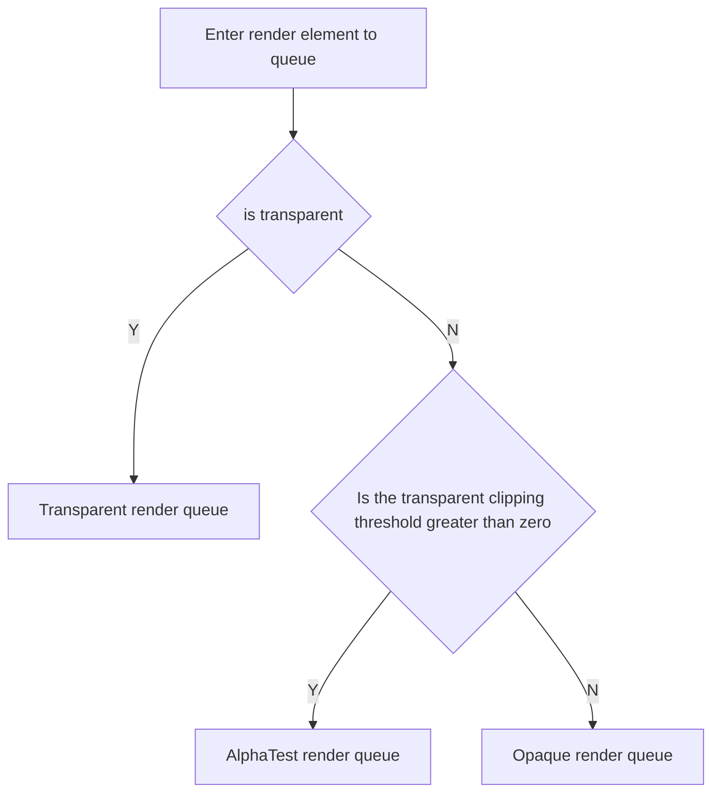
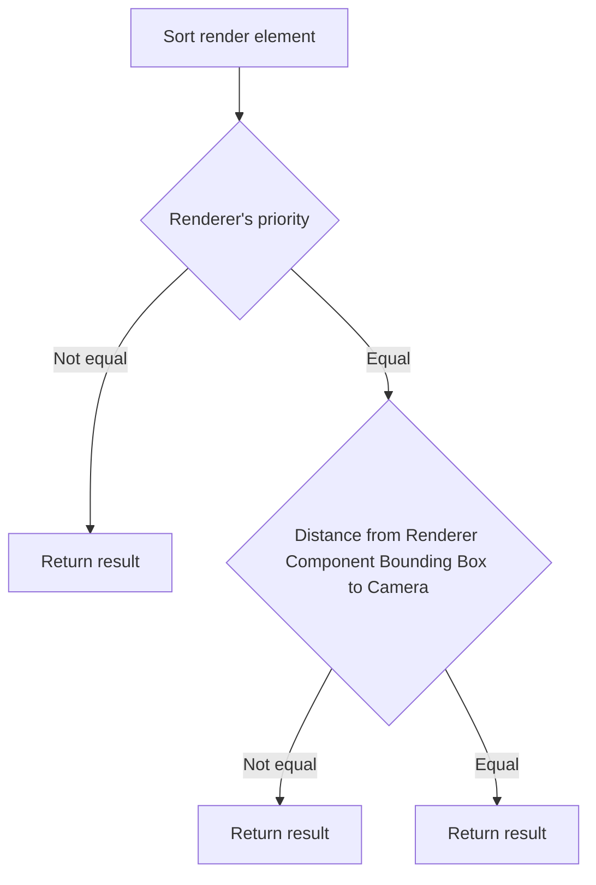

The render order of the renderer affects the **performance** and **accuracy** of rendering. In Galacean, for each camera, components are placed in the corresponding **render queue** according to a unified **determination rule**.

## Render Queue

Galacean is divided into three render queues, in the order of rendering:

- Opaque Render Queue (**Opaque**)
- Alpha Test Render Queue (**AlphaTest**)
- Transparent Render Queue (**Transparent**)

The queue to which the renderer is assigned is determined by whether the renderer material is **transparent** and the **alpha test threshold**.

## Determination Rules

The determination rules for render order in Galacean are as follows:

### Renderer Priority

The engine provides the `priority` property for the renderer to modify the render order in the render queue. The default value is 0. **The smaller the priority (it can be negative), the higher the rendering priority**.

### Distance from Renderer Component Bounding Box to Camera

The calculation method of the distance from the renderer component bounding box to the camera depends on the [camera](/en/docs/graphics/camera/camera/) type. In an orthographic camera, it is the distance from the center of the renderer bounding box to the camera along the camera view direction. In a perspective camera, it is the direct distance from the center of the renderer bounding box to the camera position.

> It should be noted that in different render queues, the rules for the impact of distance on render order are different. In the opaque render queue and alpha test render queue, the render order is **from near to far**, while in the transparent render queue, the render order is **from far to near**.

