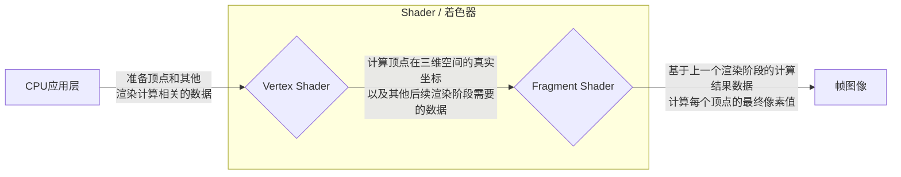

<Image src="https://gw.alipayobjects.com/zos/OasisHub/a3f74864-241e-4cd8-9ad4-733c2a0b2cc2/image-20240206153815596.png"  />

## Introduction to Shaders

A shader is a program that runs on the GPU, typically consisting of two "entry functions" known as the Vertex Shader and the Fragment Shader, corresponding to two different stages of the rendering pipeline. Below is a simplified illustration of the engine's rendering process (rendering pipeline), focusing on the shader part.

<figcaption style={{"text-align":"center", color: "#889096","font-size":"12px"}}>Simplified Rendering Pipeline</figcaption>

In this chapter, we will cover the following topics:
|Section|Content|
|:--:|:--:|
|[Shader Object](/en/docs/graphics/shader/class/)|Overview and basic usage of the Shader object in the engine|
|[Built-in Shaders](/en/docs/graphics/shader/builtins/intro/)|Common built-in shaders in the engine|
|[Shader Assets](/en/docs/graphics/shader/assets/)|How to create and modify Shader assets in the editor|
|[ShaderLab](/en/docs/graphics/shader/shaderLab/intro/)|A more convenient way to create Shaders|
