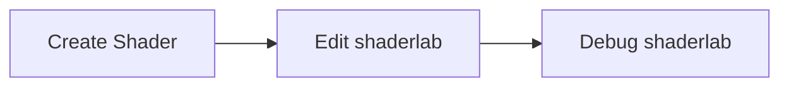

> In the [Custom Shader](/en/docs/graphics/shader/custom/) section, we learned how to create custom Shaders using the native WebGL GLSL language. In this section, we will introduce another way to create Shaders --- ShaderLab.

`ShaderLab` is a Shader packaging language tailored for the Galacean engine. It allows developers to write custom Shaders using the familiar [GLSL](https://www.khronos.org/files/opengles_shading_language.pdf) syntax while providing additional high-level abstractions and management features to enhance development efficiency. In the [Material Composition](/en/docs/graphics/material/composition/) section, we mentioned that before the introduction of ShaderLab, setting various [render states](/en/docs/graphics/material/composition/#渲染状态) required developers to manually call APIs. With ShaderLab, developers can directly set and specify render states in the "Shader" file. Additionally, they can define material rendering parameters bound to the Shader, which are mapped to the Inspector panel in the editor, making it easier for developers to adjust rendering effects in real-time.

Although ShaderLab introduces convenience for writing shaders, it does not replace GLSL but is compatible with it. Developers can write native GLSL code blocks within the ShaderLab framework, enjoying the advantages of both. The ShaderLab usage process is as follows:

Below is a simple example of using ShaderLab, which includes two Shaders. The `normal` Shader defines a vertex shader that only implements MVP transformation and a fragment shader that specifies the pixel color through a Uniform variable. Additionally, the `lines` Shader is a [shadertoy](https://www.shadertoy.com/view/DtXfDr) example modified using ShaderLab.

<playground src="shader-lab-simple.ts"></playground>
