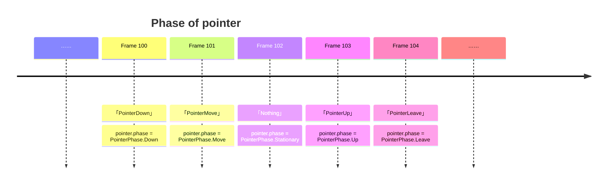

Galacean's touch is based on [Pointer](https://www.w3.org/TR/pointerevents3/), which smooths out the differences between [Mouse](https://developer.mozilla.org/zh-CN/docs/Web/API/MouseEvent) and [Touch](https://developer.mozilla.org/zh-CN/docs/Web/API/TouchEvent), making touch unified in both concept and interface.

## Pointer {/*examples*/}

In Galacean, whether it's a mouse on a PC, a stylus or a finger on a mobile device, when it performs the corresponding behavior within the touch range (**Down**, **Move**, etc.), it will be instantiated as a [Pointer](/en/apis/core/#Pointer). You can get all the currently active touch points in the [InputManager](/en/apis/core/#InputManager).


> It should be noted that each touch point is independent of each other, they respond to the corresponding events and callback the corresponding hook functions.

### Lifecycle {/*examples*/}

Each touch point will start its life in **PointerDown** or **PointerMove**, and leave the stage in **PointerLeave** or **PointerCancel**. In Galacean, you can get the real-time status of this touch point through `Pointer.phase`.



<playground src="input-log.ts"></playground>

### Touch Buttons {/*examples*/}

Referring to the [W3C standard](https://www.w3.org/TR/uievents/#dom-mouseevent-button) and [Microsoft related documentation](https://learn.microsoft.com/en-us/dotnet/api/system.windows.input.mousebutton?view=windowsdesktop-6.0), Galacean defines touch buttons as follows:

| Enumeration                                      | Explanation                                                      |
| :---------------------------------------------- | :--------------------------------------------------------------- |
| [None](/en/apis/core/#PointerButton-None)        | No touch button pressed                                          |
| [Primary](/en/apis/core/#PointerButton-Primary)  | The primary button of the device, usually the left button (mouse) or the only button on a single-button device (finger) |
| [Secondary](/en/apis/core/#PointerButton-Secondary) | The secondary button of the device, usually the right button (mouse) |
| [Auxiliary](/en/apis/core/#PointerButton-Auxiliary) | The auxiliary button of the device, usually the wheel (mouse)    |
| [XButton1](/en/apis/core/#PointerButton-XButton1) | The extended button of the device, usually the undo button (mouse) |
| [XButton2](/en/apis/core/#PointerButton-XButton2) | The extended button of the device, usually the redo button (mouse) |
| [XButton3](/en/apis/core/#PointerButton-XButton3) | Extended button                                                  |
| [XButton4](/en/apis/core/#PointerButton-XButton4) | Extended button                                                  |
| ……                                              | ……                                                               |

Combining touch buttons can easily detect the behavior of touch points triggered in this frame:

<playground src="input-pointerButton.ts"></playground>

### Touch Callbacks {/*examples*/}

You only need to add touch callbacks to an Entity with a Collider component to enable interaction with rendered objects. Touch callbacks are integrated into the engine's [script lifecycle](/en/docs/script/class/#脚本生命周期), allowing users to easily add the following events. The hook functions will carry the Pointer instance that triggered the callback.

| Interface                                           | Trigger Timing and Frequency                                               |
| :-------------------------------------------------- | :------------------------------------------------------------------------- |
| [onPointerEnter](/en/apis/core/#Script-onPointerEnter) | Triggered once when the touch point enters the Entity's collider range     |
| [onPointerExit](/en/apis/core/#Script-onPointerExit)   | Triggered once when the touch point leaves the Entity's collider range     |
| [onPointerDown](/en/apis/core/#Script-onPointerDown)   | Triggered once when the touch point is pressed within the Entity's collider range |
| [onPointerUp](/en/apis/core/#Script-onPointerUp)       | Triggered once when the touch point is released within the Entity's collider range |
| [onPointerClick](/en/apis/core/#Script-onPointerClick) | Triggered once when the touch point is pressed and released within the Entity's collider range |
| [onPointerDrag](/en/apis/core/#Script-onPointerDrag)   | Continuously triggered when the touch point is pressed within the Entity's collider range until the touch point is no longer pressed |

> ⚠️ Touch callbacks **depend on the physics engine**. Please ensure the physics engine is initialized before using this feature.

Example:

- The leftmost cube responds to Enter and Exit events, changing color when the mouse moves over it and when the mouse leaves.
- The middle cube responds to Drag events, allowing you to drag the cube anywhere in space with the mouse.
- The rightmost cube responds to Click events (first down, then up), changing color when the mouse clicks on it.

<playground src="input-pointer.ts"></playground>

### Raycasting {/*examples*/}

Touch callbacks are implemented based on raycasting. Customizing raycasting is also very simple, just follow these steps.

```mermaid
flowchart LR
   Add Collider Component --> Get Touch Point --> Get Ray from Canvas Coordinates --> Raycasting
```

Refer to [Collider Component](/en/docs/physics/collider/) for adding a collider component. The code logic for implementing the detection part is as follows:

```typescript
// 假设当前有一个活动的触控点
const pointer = inputManager.pointers[0];
// 通过触控点得到由相机发射的射线
const ray = camera.screenPointToRay(pointer.position, new Ray());
// 射线与场景的碰撞体进行碰撞检测
const hitResult = new HitResult();
if (scene.physics.raycast(ray, 100, hitResult)) {
  console.log("Hit entity", hitResult.entity);
}
```

The following example provides a more intuitive understanding of this process. The main camera is equipped with auxiliary lines, and the side view camera can fully observe the process of the main camera's raycasting detecting the collider.

<playground src="input-pointerRaycast.ts"></playground>

## Compatibility

As of February 2024, the compatibility of PointerEvent across different platforms has reached [96.35%](https://caniuse.com/?search=PointerEvent).

Design ideas can be referenced at: https://github.com/galacean/engine/wiki/Input-system-design.

> ⚠️ If you encounter compatibility issues on a platform, you can raise an issue at https://github.com/galacean/polyfill-pointer-event.

## QA

### Touch works fine on PC but behaves abnormally on mobile devices {/*examples*/}

On mobile devices, touch interactions trigger the default behavior of HTML elements. Once the default behavior is triggered, the touch interaction is removed from the element (PointerCancel). This can be resolved by setting the `touchAction` of the listening source. If the listening source is the default canvas:

```typescript
(engine.canvas._webCanvas as HTMLCanvasElement).style.touchAction = "none";
```

### Right-click operation fails, context menu pops up

This is caused by the default behavior triggered by the right-click. You can add the following code to prevent it:

```typescript
document.oncontextmenu = (e) => {
  e.preventDefault();
};
```
