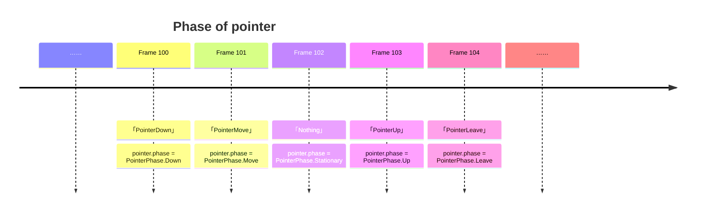
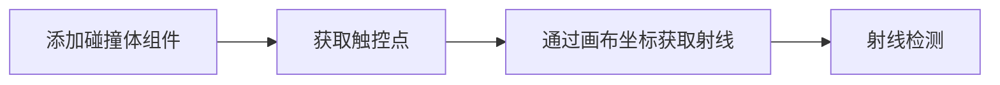

Galacean's touch is based on [PointerEvent](https://www.w3.org/TR/pointerevents3/), which bridges the gap between [MouseEvent](https://developer.mozilla.org/zh-CN/en/docs/Web/API/MouseEvent) and [TouchEvent](https://developer.mozilla.org/zh-CN/en/docs/Web/API/TouchEvent), unifying the concept and interface of touch.

## Pointer

In Galacean, whether it's a mouse on a PC, a stylus or finger on a mobile device, when it performs corresponding actions within the touch area (**Down**, **Move**, etc), it is instantiated as a [Pointer](/apis/core/#Pointer), and you can access all active touch points in the [InputManager](/apis/core/#InputManager).


> It is important to note that each touch point is independent, responding to events and invoking corresponding callback functions.

### Lifecycle

Each touch point begins its own life in **PointerDown** or **PointerMove**, fades away in **PointerLeave** or **PointerCancel**, and in Galacean, you can use `Pointer.phase` to get the current status of the touch point.



<playground src="input-log.ts"></playground>

### Touch Buttons

Referring to the [W3C standard](https://www.w3.org/TR/uievents/#dom-mouseevent-button) and [Microsoft documentation](https://learn.microsoft.com/en-us/dotnet/api/system.windows.input.mousebutton?view=windowsdesktop-6.0), Galacean defines touch buttons as follows:

| Enumeration                                      | Explanation                                                      |
| :---------------------------------------------- | :--------------------------------------------------------------- |
| [None](/apis/core/#PointerButton-None)           | No touch button pressed                                           |
| [Primary](/apis/core/#PointerButton-Primary)     | Primary button of the device, usually left button (mouse) or the only button on a single-button device (finger) |
| [Secondary](/apis/core/#PointerButton-Secondary) | Secondary button of the device, usually right button (mouse)     |
| [Auxiliary](/apis/core/#PointerButton-Auxiliary) | Auxiliary button of the device, usually the scroll wheel (mouse)  |
| [XButton1](/apis/core/#PointerButton-XButton1)   | Extended button of the device, usually the undo button (mouse)   |
| [XButton2](/apis/core/#PointerButton-XButton2)   | Extended button of the device, usually the redo button (mouse)   |
| [XButton3](/apis/core/#PointerButton-XButton3)   | Extended button                                                  |
| [XButton4](/apis/core/#PointerButton-XButton4)   | Extended button                                                  |
| ……                                              | ……                                                               |

结合触控按键可以方便地检测触控点在本帧触发的行为：

<playground src="input-pointerButton.ts"></playground>

### 触控回调

只需要为添加了 Collider 组件的 Entity 增加触控回调，就可以实现与渲染物体交互的能力。触控回调已经整合到引擎的[脚本组件生命周期](/en/docs/script#组件生命周期函数)中，用户可以很方便地添加以下事件，同时钩子函数中会携带触发此回调的 Pointer 实例。

| 接口                                               | 触发时机与频率                                                             |
| :------------------------------------------------- | :------------------------------------------------------------------------- |
| [onPointerEnter](/apis/core/#Script-onPointerEnter) | 当触控点进入 Entity 的碰撞体范围时触发一次                                 |
| [onPointerExit](/apis/core/#Script-onPointerExit)   | 当触控点离开 Entity 的碰撞体范围时触发一次                                 |
| [onPointerDown](/apis/core/#Script-onPointerDown)   | 当触控点在 Entity 的碰撞体范围内按下时触发一次                             |
| [onPointerUp](/apis/core/#Script-onPointerUp)       | 当触控点在 Entity 的碰撞体范围内松开时触发一次                             |
| [onPointerClick](/apis/core/#Script-onPointerClick) | 当触控点在 Entity 的碰撞体范围内按下并松开，在松开时触发一次               |
| [onPointerDrag](/apis/core/#Script-onPointerDrag)   | 当触控点在 Entity 的碰撞体范围内按下时**持续**触发，直至触控点解除按下状态 |

> ⚠️ 触控回调**依赖物理引擎**，使用此功能前请确保物理引擎已初始化完毕。

如下示例：

- 最左边的立方体添加了对 Enter 与 Exit 的响应，当鼠标移动到上方和鼠标移出时便会触发它颜色的改变。
- 中间的立方体添加了对 Drag 的响应，你可以用鼠标拖拽这个立方体在空间内任意移动。
- 最右边的立方体添加了对 Click 的响应（先 down 后 up ），当鼠标点击时会触发它颜色的改变。

<playground src="input-pointer.ts"></playground>

### 射线检测

触控回调是基于射线检测实现的，若要自定义射线检测也十分简单，只需按照如下步骤即可。



添加碰撞体组件可参考[物理相关文档](/en/docs/physics-collider)，实现检测部分的代码逻辑如下：

```typescript
// 假设当前有一个活动的触控点
const pointer = inputManager.pointers[0];
// 通过触控点得到由相机发射的射线
const ray = camera.screenPointToRay(pointer.position, new Ray());
// 射线与场景的碰撞体进行碰撞检测
const hitResult = new HitResult();
if (scene.physics.raycast(ray, 100, hitResult)) {
  console.log("Hit entity", hitResult.entity);
}
```

通过下方示例可以更直观地理解此过程，示例中为主相机添加了辅助线，侧视相机可以完整观察到主相机射线检测到碰撞体的过程。

<playground src="input-pointerRaycast.ts"></playground>

## 兼容性

截止 2024 年 2 月，不同平台对 PointerEvent 的兼容性已经达到了 [96.35%](https://caniuse.com/?search=PointerEvent) 。

设计思路可参考：https://github.com/galacean/engine/wiki/Input-system-design.

> ⚠️ 若遇到平台的兼容性问题，可以在 https://github.com/galacean/polyfill-pointer-event 提 issue 。

## QA

### 触控在 PC 端正常，但在移动端异常

在移动端，触控会触发 HTML 元素的默认行为，一旦触发默认行为，触控就会从元素上被移除（PointerCancel），可以通过设置监听源的 `touchAction` 解决，若触控的监听源为默认画布：

```typescript
(engine.canvas._webCanvas as HTMLCanvasElement).style.touchAction = "none";
```

### 右键操作失效，弹出菜单栏

这是由于右键触发系统默认行为导致的，可以加入下列代码阻止：

```typescript
document.oncontextmenu = (e) => {
  e.preventDefault();
};
```
