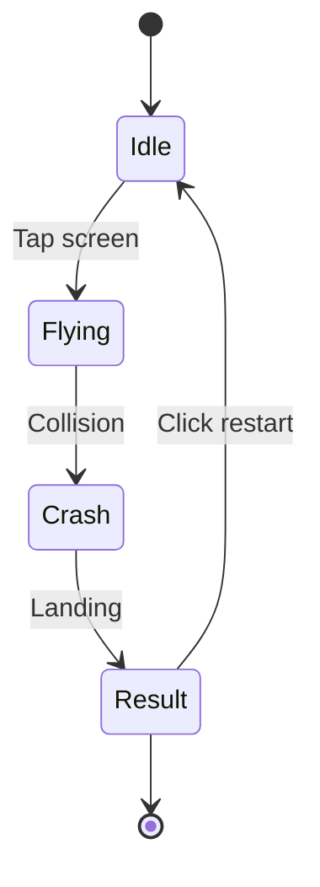
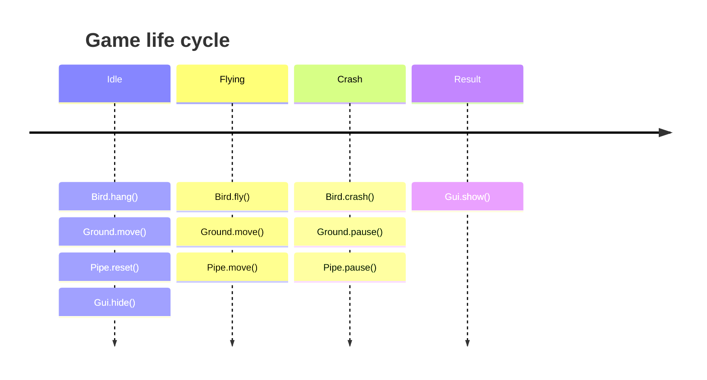
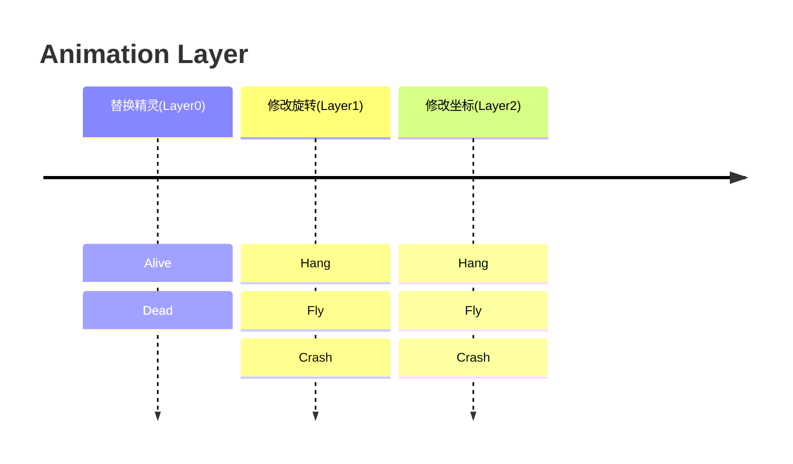

> I believe everyone is familiar with Flappy Bird. This article briefly describes how to replicate this 2D game using Galacean.
>
> Original game link: [http://flappybird.io/](http://flappybird.io/)

Flappy Bird is a 2D project. The 2D template provided on the editor's homepage is implemented step by step according to this document. Let's start by creating a `2D Project` using the editor's `New Project` feature. (If you encounter any issues, refer to **Home** -> **Templates** -> **Pixel Bird**)


## Prepare Resources

Flappy Bird relies on a set of images. You can download the image package to your local machine by clicking [here](https://github.com/galacean/galacean.github.io/files/13161928/fb.zip). After extracting, you will see the following images:

- Number images from 0 to 9 for scores
- Game background image
- Bird animation frame images
- Ground, pipes
- Game restart button


### Upload Resources

Go back to the scene editor, click the upload button on the resource panel , and select `Sprite`. This will open the file viewer of your operating system. Choose all the images from the FlappyBird directory. After uploading, as shown in the image below, the editor creates a [Texture](/en/docs/graphics-texture) resource and a [Sprite](/en/docs/graphics-2d-sprite) resource for each image (Sprites are distinguished from Texture resources by a gray rounded rectangle background). In the following steps, we will only focus on Sprite resources.


At this point, we have uploaded the resources. However, if you have a tendency for tidiness, seeing these scattered resources may trigger your urge to organize them. Let's create a folder and rename it to _Sprites_. Then, select all the recently uploaded resources and drag them into the _Sprites_ directory. This not only makes the resource panel more organized but also prepares us for creating a [Sprite Atlas](/en/docs/graphics-2d-spriteAtlas) resource in the next step.

### Create Sprite Atlas

To achieve better runtime performance, we choose to pack these Sprite resources into an Atlas resource. Click the  button and select `Sprite Atlas`. After creating it, select the Sprite Atlas and use the `Add to List` button on the **[Inspector Panel](/en/docs/interface/inspector)** to add all Sprite resources to the list.


点击 `Pack and Preview` button to see Atlas creation success:


Congratulations, you have completed the resource upload and management operations up to this point. Next, we will proceed to building the game scene.

## Build Scene

Building a 2D scene is as fun as playing a puzzle. First, let's try dragging the game background image from the resource panel into the scene. Don't worry if the dragging position is not accurate, as we can fine-tune it later in the **[Inspector Panel](/en/docs/interface/inspector)**.


Select the `Camera` node in the hierarchy panel to preview how the scene will render on various devices.

> If you find the screen too large or too small, you can adjust the `Orthographic Size` of the orthographic camera to scale it.


### Add the Bird

Similarly, drag the Sprite of the bird (`bird3-spr.png`) into the scene. The bird's "flying" animation is achieved through frame-by-frame animation, see [Sprite Sheet Animation](/en/docs/animation-sprite-sheet) for details.

### Add the Pipes

As the game progresses, pipes will repeatedly appear on the screen in pairs of upper and lower pipes. Here's a little trick: you can set the `Scale` value of the upper pipe to `-1` to elegantly achieve flipping.


During the game, the height at which pipes appear is random, but the assets we have on hand have fixed heights. No worries, just adjust the `Sprite Render Mode` to stretch without loss, allowing us to stretch certain assets without distortion.


Here's a little trick: setting the `pivot` property of the referenced `sprite` asset to `bottom` can avoid re-anchoring the position every time you adjust the height.


Considering that pipes will repeat, we can group a pair of pipes into a `PipeMother` group in the node tree and place it under the `Pipe` node. This way, by binding a script component to the Pipe later, we can access `PipeMother` to achieve pipe reuse.


### Add the Ground

We can achieve the effect of the ground being tiled on the ground and horizontally movable by combining `Sprite Render Mode` with `Animation Clip Editing`.

Here are the steps:

1. Create a node named `ground` in the node tree.

2. In the **[Inspector Panel](/en/docs/interface/inspector)**, add a `Sprite Renderer` component by clicking the `Add Component` button, set the `SpriteRenderer DrawMode Info` property to `Tiled`, and set the width to `8.14`.

```markdown
   

3. At this point, we have a fully tiled ground. Next, we can make it move by creating animation clips! See [Animation Clip Editing](/en/docs/animation-clip) for details.

   

### Adding a Mask

After adding the ground, we noticed that the left and right sides seem to be exposed! In such cases, you just need to add a mask to the sprite renderer. See [Sprite Mask Component](/en/docs/graphics-2d-spriteMask) for details.

   

### Adding GUI

The GUI includes score display and restart button. Drag two sprites, one for the score (`0.png`) and the other for the restart button (`restart.png`), into the scene and place them under a newly created `GUI` node.


With this, the interface is set up! Take a look at the complete structure of the node tree on the left. A good tree structure is important for managing complex scenes.

> If you need to handle the overlapping relationship between sprites, similar to the `z-index` property in CSS, you can set the `priority` property of the `Sprite Renderer` to control the rendering order. A higher value means it will be rendered later, thus covering other sprites.

### Adding Physical Feedback

In this project, we need to add physical feedback when **the bird touches the pipes or the ground** and **the player clicks the restart button**. Adding physical feedback only requires two steps:

- Adding colliders
- Handling collision callbacks

#### Adding Colliders

Colliders describe the pose and shape of objects, so when adding colliders, they should closely match the actual size of the objects being displayed. See [Colliders](/en/docs/physics-collider) for more information on using colliders. Here, we demonstrate adding a collider to the bird.


#### Handling Collision Callbacks

```typescript
/**
 * 挂载在小鸟节点上的脚本组件
 */
class Bird extends Script {
  onTriggerEnter(other: ColliderShape): void {
    // 与水管或地面发生了碰撞
  }
}

/**
 * 挂载在重开按钮节点上的脚本组件
 */
class Restart extends Script {
  onPointerClick() {
    // 点击了重开按钮
  }
}
```

## Writing Logic

Before formally writing the logic, we need to analyze the global flow of the game:

- State transitions and communication methods
- Behaviors of different instances in different states

### State Transitions and Communication Methods



We enumerate the **global states** and **transition conditions**, which can be imagined as an `information flow` shuttling between different instances. When the bird is in the preparation stage and **the screen is touched**, the information is parsed and passed to other instance objects. At this point, the ground starts playing a looping movement animation, the pipes start appearing and disappearing alternately. The transmission of the `information flow` can be achieved through an [event system](/en/docs/script-communication). Next, we simplify the logic by listening for screen touch events in `Bird`. Once a touch occurs, the `Idle` state switches to `Flying`, and other instances also listen for the corresponding state change.

```typescript
/**
 * 全局状态的枚举
 */
enum EnumState {
  Idle,
  Flying,
  Crash,
  Result,
}

/**
 * 对全局状态的控制与分发
 */
class GameCtrl extends EventDispatcher {
  private static _ins: GameCtrl;
  static get ins() {
    return (this._ins ||= new GameCtrl());
  }

  private _gameState: EnumState = EnumState.Idle;
  set gameState(value: EnumState) {
    if (this._gameState !== value) {
      console.log("GameCtrl：全局状态被改变");
      this._gameState = value;
      this.dispatch("State_Change", value);
    }
  }

  get gameState() {
    return this._gameState;
  }
}

/**
 * 挂载在小鸟节点上的脚本组件
 */
class Bird extends Script {
  onAwake(): void {
    GameCtrl.ins.on("State_Change", (state: EnumState) => {
      console.log("Bird：监听到了状态改变");
    });
  }

  onUpdate(deltaTime: number): void {
    const { ins } = GameCtrl;
    if (
      ins.gameState === EnumState.Idle &&
      this.engine.inputManager.isPointerDown()
    ) {
      console.log("Bird：按下屏幕，对局开始");
      ins.gameState = EnumState.Flying;
    }
  }
}

/**
 * 挂载在地面节点上的脚本组件
 */
class Ground extends Script {
  onAwake(): void {
    GameCtrl.ins.on("State_Change", (state: EnumState) => {
      console.log("Ground：监听到了状态改变");
    });
  }
}
```

Similarly, following the transition conditions of each state in the flowchart, complete the transitions between other states (`GameCtrl.ins.gameState = corresponding state`):

- `Flying` -> `Crash`: Bird collides with pipes or ground
- `Crash` -> `Result`: Bird lands (determined by Y-axis coordinate)
- `Result` -> `Idle`: Click the restart button

### Enhancing Behaviors

We have linked all global states and ensured that each instance can access the current state and listen for state changes. Now, we just need to make each instance display the corresponding behavior in different states.


```

After disassembling, it can be found that if we simply classify animations as idle animation, flying animation, and falling animation, considering that when idle, we need to play sprite switching and vertical easing animations, and when flying, we also need to play sprite switching and upward falling animations. The overlapping parts not only increase the workload during animation editing but also require additional consideration of whether the sprite switching animations between these two animations are natural. Therefore, we further atomize each animation state, split the parts of sprite switching and coordinate changes, and set them in different `Layers` separately. Different `Layers` are independent of each other and can play their animations simultaneously, set their overlay modes and weights. For more details, refer to the [animation component](/en/docs/animation-system).


Let each `Layer` control its own animation state separately for clearer logic.



#### Bird

```typescript
/**
 * 挂载在小鸟节点上的脚本组件
 */
class Bird extends Script {
  private _animator: Animator;

  onAwake() {
    this._animator = this.entity.getComponent(Animator);
    GameCtrl.ins.on("State_Change", (state: EnumState) => {
      const animator = this._animator;
      switch (state) {
        case EnumState.Idle:
          this._alive();
          this._hang();
          break;
        case EnumState.Flying:
          break;
        case EnumState.Crash:
          this._dead();
          this._crash();
          break;
        case EnumState.Result:
          break;
      }
    });
  }

  onUpdate(deltaTime: number): void {
    const { ins } = GameCtrl;
    if (
      ins.gameState === EnumState.Idle &&
      this.engine.inputManager.isPointerDown()
    ) {
      this._fly();
      ins.gameState = EnumState.Flying;
    }
  }

  onTriggerEnter(other: ColliderShape): void {
    GameCtrl.ins.gameState = EnumState.Crash;
  }

  private _alive(): void {
    // 帧动画-拍动翅膀
    animator.play("alive", 0);
  }

  private _dead(): void {
    // 停止拍动翅膀
    animator.play("dead", 0);
  }

  private _hang(): void {
    // 准备阶段
    animator.play("Hang", 1);
    animator.play("Hang", 2);
  }

  private _fly(): void {
    // 向上冲
    animator.play("Fly", 1);
    animator.play("Fly", 2);
  }

  private _crash(): void {
    // 坠落
    animator.play("Crash", 1);
    animator.play("Crash", 2);
  }
}
```

Since animation segment editing can only edit absolute coordinate or rotation changes, for example, each flight animation, its rotation change is absolute, but the coordinates are relative. Therefore, we can implement this in the `StateMachineScript`, using the `Fly` animation as an example:


Then open this script and add the free fall coordinate changes:

```typescript
export default class extends StateMachineScript {
  // 小鸟的位置
  private _position: Vector3;
  // 起始时间
  private _startTime = 0;
  // 起始位置
  private _startY = 0;
  // 起始速度
  private _startV = 10;
  // 最终匀速速度
  private _maxV = -8;
  // 重力加速度
  private _gravity = -35;
  // [0, _dividTime] 匀加速；[_dividTime, +∞] 匀速
  private _dividTime = 18 / 35;

  onStateEnter(
    animator: Animator,
    animatorState: AnimatorState,
    layerIndex: number
  ): void {
    this._startTime = animator.engine.time.elapsedTime;
    this._position = animator.entity.transform.position;
    this._startY = this._position.y;
  }

  onStateUpdate(
    animator: Animator,
    animatorState: AnimatorState,
    layerIndex: number
  ): void {
    const { engine } = animator;
    const { _maxV, _startV, _gravity, _dividTime, _position } = this;
    const subTime = engine.time.elapsedTime - this._startTime;
    if (subTime <= _dividTime) {
      _position.y =
        ((_startV + (_startV + subTime * _gravity)) * subTime) / 2 +
        this._startY;
    } else {
      _position.y =
        ((_maxV + _startV) * _dividTime) / 2 +
        _maxV * (subTime - _dividTime) +
        this._startY;
    }
  }
}
```

Similarly, when the bird falls, the `Crash` script also needs to be added:

```typescript
class extends StateMachineScript {
  // 是否已经落地
  private _bLanding: boolean = false;

  onStateEnter(
    animator: Animator,
    animatorState: AnimatorState,
    layerIndex: number
  ): void {
    this._bLanding = false;
  }

  onStateUpdate(
    animator: Animator,
    animatorState: AnimatorState,
    layerIndex: number
  ): void {
    if (this._bLanding) {
      return;
    }
    const { entity, engine } = animator;
    const { position } = entity.transform;
    // 地面高度
    if (position.y <= -3.1) {
      GameCtrl.ins.gameState = EnumState.Result;
      this._bLanding = true;
    } else {
      position.y -= engine.time.deltaTime;
    }
  }
}
```

Alright! The most complex part of this game has been successfully overcome. At this point, clicking on the screen triggers the bird to start the flying animation, while calculating the free fall position per frame. When the bird collides with an obstacle, it triggers the falling animation, while also calculating the falling position per frame.

#### Pipe

The pipe is more complex. At the start of the game, we move the pipe to the left. When the next pipe needs to be generated, we retrieve it from the pool. When the pipe moves out of the display area, we recycle it back to the pool.

```typescript
/**
 * 挂载在水管节点上的脚本组件
 */
class Pipe extends Script {
  // 水管池子
  private _pipePool = [];
  // 当前激活的水管
  private _pipes = [];
  // 水管母体
  private _pipeMother: Entity;
  // 是否停止
  private _isPaused: boolean = true;

  private _inv = 2.87;
  private _up = 4.48;
  private _down = -3.2;
  private _downLimit = -2.12 + 1.08;
  private _upLimit = 3.4 - 1.08;
  private _pipeHorizontalV = 3;
  private _leftDistance = 2;

  onAwake() {
    this._pipeMother = this.entity.children[0];
    this._pipeMother.parent = null;
    GameCtrl.ins.on("State_Change", (state: EnumState) => {
      switch (state) {
        case EnumState.Idle:
          this._reset();
          break;
        case EnumState.Flying:
          this._move();
          break;
        case EnumState.Crash:
          this._pause();
          break;
        default:
          break;
      }
    });
  }

  onUpdate(deltaTime: number) {
    if (this._isPaused) {
      return;
    }
    const { ins } = GameCtrl;
    const moveDistance = this._pipeHorizontalV * deltaTime;
    if ((this._leftDistance -= moveDistance) <= 0) {
      this._leftDistance = 4;
      this._generate();
    }
    const { _pipes: pipes } = this;
    for (let i = pipes.length - 1; i >= 0; i--) {
      const pipe = pipes[i];
      const { position } = pipe.transform;
      const posX = position.x - moveDistance;
      if (position.x >= 0 && posX < 0) {
        ins.score += 1;
      }
      if (posX <= -4.53) {
        pipes.splice(i, 1);
        pipe.parent = null;
        this._pipePool.push(pipe);
      } else {
        position.x = posX;
      }
    }
  }

  private _move() {
    this._isPaused = false;
  }

  private _pause() {
    this._isPaused = true;
  }

  private _reset() {
    const { _pipes: pipes } = this;
    for (let i = 0, n = pipes.length; i < n; i++) {
      const pipe = pipes[i];
      pipe.parent = null;
      this._pipePool.push(pipe);
    }
    pipes.length = 0;
    this._leftDistance = 2;
    this._isPaused = true;
  }

  private _getOrCreatePipe() {
    let pipe: Entity;
    if (this._pipePool.length > 0) {
      pipe = this._pipePool.pop();
    } else {
      pipe = this._pipeMother.clone();
    }
    this._pipes.push(pipe);
    const center =
      Math.random() * (this._upLimit - this._downLimit) + this._downLimit;

    const [upColliderShape, downColliderShape] = <BoxColliderShape[]>(
      pipe.getComponent(StaticCollider).shapes
    );

    const upPipe = pipe.findByName("up_pipe");
    const upRenderer = upPipe.getComponent(SpriteRenderer);
    const upHeight = this._up - center - this._inv / 2;
    upColliderShape.size.set(1.2, upHeight, 1);
    upColliderShape.position.set(0, 4.48 - upHeight / 2, 0);
    upRenderer.height = upHeight;
    const downPipe = pipe.findByName("down_pipe");
    const downRenderer = downPipe.getComponent(SpriteRenderer);
    const downHeight = center - this._down - this._inv / 2;
    downColliderShape.size.set(1.2, downHeight, 1);
    downColliderShape.position.set(0, downHeight / 2 - 3.2, 0);
    downRenderer.height = downHeight;
    pipe.transform.position.x = 4.53;
    this.entity.addChild(pipe);
  }
}
```

As seen above, the logic above complements the flowchart's code:

- When the state switches to `Idle`, the `Pipe._reset()` function is triggered, and all pipes on the field are recycled back to the pool.
- When the state switches to `Flying`, the `Pipe._move()` function is triggered, and the gears of the pipe's fate start turning. Within the frame loop, it checks whether a new pipe needs to be generated, whether an old pipe needs to be recycled. Generating a new pipe uses the engine's built-in [clone](/en/docs/core/clone) ability, which can fully replicate the structure and components of a node.
- When the state switches to `Crash`, the `Pipe._pause()` function is triggered, and the pipe stops moving.

#### Ground

The logic for the ground is relatively simple. We only need to move the ground when in the `Flying` state, and keep the ground stationary at other times.

```typescript
class Ground extends Script {
  private _animator: Animator;
  onAwake() {
    this._animator = this.entity.getComponent(Animator);
    GameCtrl.ins.on("State_Change", (state: EnumState) => {
      if (state === EnumState.Flying) {
        this._move();
      } else {
        this._pause();
      }
    });
    this._pause();
  }

  private _move() {
    this._animator.speed = 1;
  }

  private _pause() {
    this._animator.speed = 0;
  }
}
```

#### GUI

After implementing the above logic, the project should be able to run smoothly. At this point, we need to add a score display to make the game logic more complete. Similarly, analyze the timing of score changes and transmissions. When the bird passes through a pipe, it triggers the score increment. When the game restarts, it triggers the score reset. The information about score changes is passed to various instances. Following the example of `gameState`, we add a `score` property in `GameCtrl`.

```typescript
class GameCtrl extends EventDispatcher {
  private static _ins: GameCtrl;

  static get ins() {
    return (this._ins ||= new GameCtrl());
  }

  private _gameState: EnumState = EnumState.Idle;
  private _score: number = 0;
  set gameState(value: EnumState) {
    if (this._gameState !== value) {
      this._gameState = value;
      if (value === EnumState.Idle) {
        // 重开时重置分数
        this._reset();
      }
      this.dispatch("State_Change", value);
    }
  }

  get gameState() {
    return this._gameState;
  }

  set score(val: number) {
    this._score = val;
    this.dispatch("Score_Change", val);
  }

  get score() {
    return this._score;
  }

  private _reset() {
    this.score = 0;
  }
}
```

With this, the overall flow of score changes is also complete. Next, we just need to refine the logic for displaying the score:

- Hide the score when switching to `Idle` state.
- Display the score when switching to `Flying` state.

```typescript
class Score extends Script {
  // 数字精灵所在的图集
  private _atlas: SpriteAtlas;
  // 提供克隆的数字母体
  private _scoreMother: Entity;
  // 当前显示的数字节点数组
  private _scoreEntities: Entity[] = [];
  // 当前显示的数字精灵渲染器数组
  private _scoreRenderers: SpriteRenderer[] = [];
  // 每个数字之间的间隔（归一化）
  private _inv: number = 1.2;

  onAwake() {
    const { engine, entity } = this;
    const { ins } = GameCtrl;
    this._scoreEntities[0] = this._scoreMother =
      entity.findByName("scoreMother");

    this._scoreRenderers[0] =
      this._scoreEntities[0].getComponent(SpriteRenderer);

    // 通过相对路径获取精灵图集资产
    engine.resourceManager
      .load({ type: AssetType.SpriteAtlas, url: "/Assets/atlas/SpriteAtlas" })
      .then((atlas: SpriteAtlas) => {
        this._atlas = atlas;
      });

    ins.on("State_Change", (state: EnumState) => {
      switch (state) {
        case EnumState.Idle:
          this._hide();
          break;
        case EnumState.Flying:
          this._show(ins.score);
          break;
      }
    });

    ins.on("Score_Change", (num: number) => {
      if (ins.gameState !== EnumState.Idle) {
        this._show(num);
      }
    });
  }

  private _show(num: number): void {
    const {
      _scoreEntities: entities,
      _scoreRenderers: renderers,
      _scoreMother: mother,
    } = this;
    const score = num.toFixed(0);
    const needCount = score.length;
    const currCount = entities.length;
    const n = Math.max(needCount, currCount);
    const width = needCount * this._inv;
    for (let i = 0; i < n; i++) {
      if (i >= needCount) {
        entities[i] && (entities[i].isActive = false);
      } else {
        let entity: Entity;
        let renderer: SpriteRenderer;
        if (entities[i]) {
          entity = entities[i];
          renderer = renderers[i];
        } else {
          entity = entities[i] = mother.clone();
          renderer = renderers[i] = entity.getComponent(SpriteRenderer);
          this.entity.addChild(entity);
        }
        entity.isActive = true;
        entity.transform.position.x = this._inv * (i + 0.5) - width / 2;
        renderer.priority = 10;
        renderer.sprite = this._atlas?.getSprite(
          "Assets/sprites/" + score[i] + "-spr.png"
        );
      }
    }
  }

  private _hide(): void {
    const { _scoreEntities: entities } = this;
    for (let i = 0, n = entities.length; i < n; i++) {
      entities[i].isActive = false;
    }
  }
}
```

The Restart button is relatively simple:

```typescript
class Restart extends Script {
  private collider: StaticCollider;
  private spriteRenderer: SpriteRenderer;

  onAwake() {
    const { entity } = this;
    this.collider = entity.getComponent(StaticCollider);
    this.spriteRenderer = entity.getComponent(SpriteRenderer);
    GameCtrl.ins.on("State_Change", (state: EnumState) => {
      switch (state) {
        case EnumState.Result:
          this.show();
          break;
        default:
          this.hide();
          break;
      }
    });

    this.hide();
  }

  hide() {
    this.collider.enabled = this.spriteRenderer.enabled = false;
  }

  show() {
    this.collider.enabled = this.spriteRenderer.enabled = true;
  }

  onPointerClick() {
    GameCtrl.ins.gameState = EnumState.Idle;
  }
}
```

With this, all the game logic has been perfected. Click on preview to test for any bugs! If you have any questions about certain steps in between, you can refer to the template implemented based on this document by going to **Home** -> **Template** -> **Pixel Bird** in the editor. If you have any other suggestions for this document, feel free to share your ideas.
