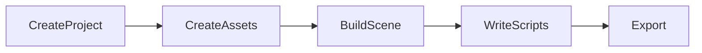

**Galacean Engine** is a real-time interactive solution that is web-first, mobile-first, and open-source, built with a component-based architecture and written in [Typescript](https://www.typescriptlang.org/). It includes functionalities for [rendering](/en/docs/graphics-renderer), [physics](/en/docs/physics-overall), [animation](/en/docs/animation-system), and [input](/en/docs/input), and provides a visual online editor with a complete workflow to help you create stunning 2D/3D interactive applications in the browser. It mainly consists of two parts:

- Editor: An online web interactive creation platform [Editor](https://galacean.antgroup.com/editor)
- Runtime: A high-performance interactive runtime that is web-first and mobile-first [Runtime](https://github.com/galacean/runtime), a series of non-core functionalities and custom business logic functionalities [Toolkit](https://github.com/galacean/runtime-toolkit)

## Editor

[Galacean Editor](https://antg.antgroup.com/editor) is an online web interactive creation platform. It can help you quickly create, edit, and export an interactive project. You can quickly upload interactive assets, create and edit materials, adjust lighting, create entities, and create complex scenes using Galacean Editor.

The overall process of creating an interactive project using the editor:



The editor allows technical and artistic colleagues to collaborate better, and you can quickly start developing your first project through project templates on the [editor homepage](https://galacean.antgroup.com/editor).

## Runtime

Core functionalities are provided by [Galacean Engine](https://www.npmjs.com/package/@galacean/runtime), and advanced functionalities for non-core and custom business logic are provided by [Galacean Toolkit](https://github.com/galacean/runtime-toolkit). You can browse various [examples](https://antg.antgroup.com/#/examples/latest/background) of the engine online through the browser.

### Core Packages

Including the following sub-packages:

| Feature                                                                                         | Explanation             | API                          |
| :---------------------------------------------------------------------------------------------- | :---------------------- | ---------------------------- |
| [@galacean/engine](https://www.npmjs.com/package/@galacean/engine)                             | Core architecture logic and core functionalities | [API](/apis/core)            |
| [@galacean/engine-physics-lite](https://www.npmjs.com/package/@galacean/engine-physics-lite)   | Lightweight physics engine | [API](/apis/physics-lite)    |
| [@galacean/engine-physics-physx](https://www.npmjs.com/package/@galacean/engine-physics-physx) | Full-featured physics engine | [API](/apis/physics-physx)   |
| [@galacean/engine-draco](https://www.npmjs.com/package/@galacean/engine-draco)                 | Draco model compression | [API](/apis/draco)           |

You can install via [NPM](https://docs.npmjs.com/):

```bash
npm install --save @galacean/engine
```

Then import and use in your project:

```typescript
import { WebGLEngine, Camera } from "@galacean/engine";
```

If you just want to quickly create a demo locally, we recommend using [create-galacean-app](https://github.com/galacean/create-galacean-app), which provides some common frameworks such as [React](https://reactjs.org/), [Vue](https://vuejs.org/), etc.

### Toolkits

Non-core features and custom business logic functions are provided by the galacean-toolkit package (for a complete list of features, please refer to [engine-toolkit](https://github.com/galacean/engine-toolkit/tree/main)):

| Feature                                                                                                                 | Explanation | API                                    |
| :---------------------------------------------------------------------------------------------------------------------- | :---------- | :------------------------------------- |
| [@galacean/engine-toolkit-controls](https://www.npmjs.com/package/@galacean/engine-toolkit-controls)                     | Controller  | [Doc](/en/docs/graphics-camera-control)  |
| [@galacean/engine-toolkit-framebuffer-picker](https://www.npmjs.com/package/@galacean/engine-toolkit-framebuffer-picker) | Framebuffer Picker | [Doc](/en/docs/input-framebuffer-picker) |
| [@galacean/engine-toolkit-stats](https://www.npmjs.com/package/@galacean/engine-toolkit-stats)                           | Engine Stats Panel | [Doc](/en/docs/performance-stats)        |
| ......                                                                                                                  |             |                                        |

You can install via [NPM](https://docs.npmjs.com/):

```bash
npm install --save @galacean/engine-toolkit-controls
```

Then import and use in your project:

```typescript
import { OrbitControl } from " @galacean/engine-toolkit-controls";
```

> In the same project, please ensure that the version of the engine core package is consistent and the major version of the toolkit package is consistent. For example, if using version 1.0.x of the engine, you need to use version 1.0.y of the toolkit package.

There are also some second-party ecosystem packages with similar import and usage methods as the engine toolkits:

| Feature                                                                             | Explanation | API                             |
| :----------------------------------------------------------------------------------- | :---------- | :------------------------------ |
| [@galacean/engine-spine](https://www.npmjs.com/package/@galacean/engine-spine)       | Spine Animation | [Doc](/en/docs/graphics-2d-spine) |
| [@galacean/engine-lottie](https://www.npmjs.com/package/@galacean/engine-lottie)     | Lottie Animation | [Doc](/en/docs/graphics-lottie)   |

### Compatibility

It can run in environments that support WebGL. So far, all mainstream mobile and desktop browsers support this standard. You can check the compatibility of the runtime environment on [CanIUse](https://caniuse.com/?search=webgl).

In addition, **Galacean Engine** also supports running in [Alipay/Taobao Mini Programs](/en/docs/assets-build), and developers in the community have contributed an adaptation solution for [WeChat Mini Programs/Games](https://github.com/deepkolos/platformize). For some feature modules that require additional compatibility considerations, the current adaptation solutions are as follows:

| Module                            | Compatibility Considerations                                | Specific Documentation                                                                   |
| :-------------------------------- | :---------------------------------------------------------- | :---------------------------------------------------------------------------------------- |
| [Mouse and Touch](/en/docs/input)    | [PointerEvent](https://caniuse.com/?search=PointerEvent)     | For compatibility, refer to [polyfill-pointer-event](https://github.com/galacean/polyfill-pointer-event) |
| [PhysX](/en/docs/physics-overall)   | [WebAssembly](https://caniuse.com/?search=wasm)              | The runtime environment needs to support WebAssembly                                       |

### Version Management

Taking `@galacean/engine` as an example, you can view all available versions on [Github](https://github.com/galacean/engine/releases) or [NPM](https://www.npmjs.com/package/@galacean/engine?activeTab=versions), where:

- **alpha**: Internal testing version used for early feature development, containing new features within milestones but with lower stability, for example [1.0.0-alpha.6](https://www.npmjs.com/package/@galacean/engine/v/1.0.0-alpha.6)
- **beta**: Public testing version with internal testing mostly completed, stronger stability but may still have some issues and defects, for example [1.0.0-beta.8](https://www.npmjs.com/package/@galacean/engine/v/1.0.0-beta.8)
- **stable**: Official stable version that has undergone long-term testing and validation, recommended for production with no major defects, for example [0.9.8](https://www.npmjs.com/package/@galacean/engine/v/0.9.8)

Each milestone version update is accompanied by a [version upgrade guide](https://github.com/galacean/engine/wiki/Migration-Guide), which includes the content of this update and any BreakChanges, allowing you to iterate version updates based on this document.

If your project is currently developed using an older version of Oasis and you wish to upgrade to Galacean, you can refer to the [galacean-codemod](https://github.com/crazylxr/galacean-codemod) tool provided by [@crazylxr](https://github.com/crazylxr).

## Open Source Collaboration

**Galacean** is eager to collaborate with you on the interactive engine. All development processes, including [planning](https://github.com/galacean/engine/projects?query=is%3Aopen), [milestones](https://github.com/galacean/engine/milestones), and [architecture design](https://github.com/galacean/engine/wiki/Physical-system-design), are publicly available on GitHub's project management. You can participate in the engine's construction by [creating issues](https://docs.github.com/zh/issues/tracking-your-work-with-issues/creating-an-issue) and [submitting PRs](https://docs.github.com/zh/pull-requests/collaborating-with-pull-requests/proposing-changes-to-your-work-with-pull-requests/creating-a-pull-request-from-a-fork). If you have any questions or need help, you can join the DingTalk group or seek help in the [discussion area](https://github.com/orgs/galacean/discussions). 

{ /*examples*/ }

Please paste the Markdown content you need to be translated.
