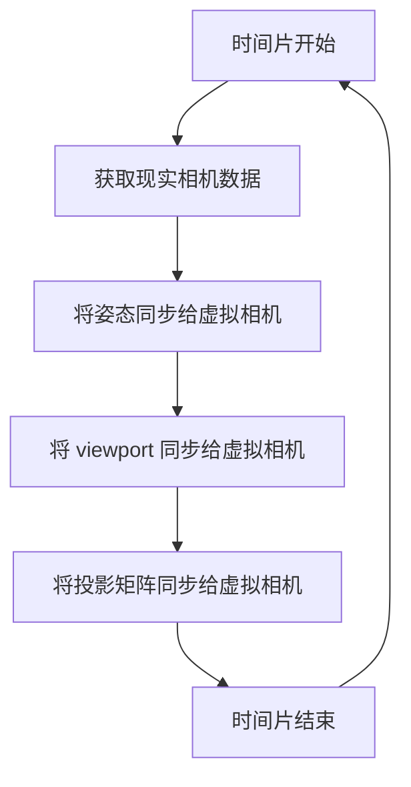

The Camera Manager is a part of the XRManager instance, which you can access through `xrManager.cameraManager`.

## Properties

| Property        | Type   | Description              |
| :-------------- | :----- | :----------------------- |
| fixedFoveation  | number | Sets the fixed foveation for the camera |

## Methods

| Method         | Description                                             |
| :------------- | :------------------------------------------------------ |
| attachCamera   | Binds the camera in the virtual world to the camera in the real world |
| detachCamera   | Unbinds the camera in the virtual world from the camera in the real world |

## Update Process

Simply synchronizing the parameters and poses of the `real camera` to the `virtual camera` allows the `real scene` and `virtual scene` to stay **synchronized**.

