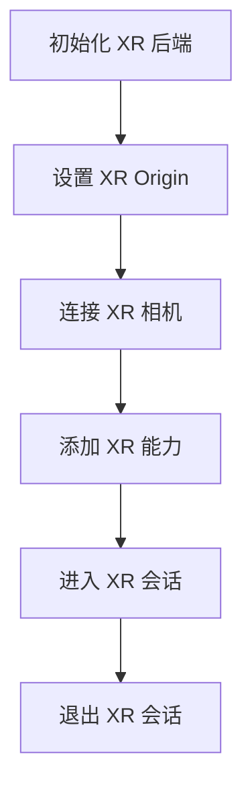

The XR Manager is a subordinate of the Engine instance, which you can access through `engine.xrManager`. It plays a central role in XR, mainly managing:

- Orchestrating the overall XR process
- [XR Camera](/en/docs/xr-camera)
- [XR Session](/en/docs/xr-session)
- [XR Input](/en/docs/xr-input)
- [XR Features](/en/docs/xr-features)

## Properties

| Property | Type                        | Description                                    |
| :------- | :-------------------------- | :--------------------------------------------- |
| origin   | [Entity](/apis/core/#Entity) | The origin point at XR initialization, connecting the virtual world with the real world |

> If you place the origin node at position `(1, 1, 1)` in the editor, you can understand that when the XR space unfolds, the reference origin of your coordinates in the real world is `(1, 1, 1)`. They establish the connection through a fixed transformation formula.

## Methods

| Method             | Description         |
| :----------------- | :------------------ |
| isSupportedFeature | Whether a feature is supported |
| addFeature         | Add a specific XR feature |
| getFeature         | Get a specific XR feature |
| getFeatures        | Get all XR features |
| enterXR            | Enter XR session     |
| exitXR             | Exit XR session     |

## Overall Process

Based on the above properties and methods, let's outline the overall process of XR:

