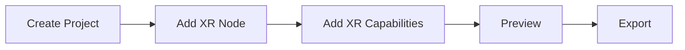

This document describes how to quickly develop XR interactions in both the editor and ProCode scenarios.

## Editor

The process for developing XR interactions in the editor is as follows:



### Create Project

On the **[Home Page](/en/docs/interface/intro/#%E9%A6%96%E9%A1%B5)** click **Create Project**, then in **[Project Settings](/en/docs/interface/menu/#项目设置)** select the physics backend as `WebXR`.


### Add XR Node

In the **[Hierarchy Panel](/en/docs/interface/hierarchy/)** add an XR node.


> Adding an XR node will automatically create and select `origin` and `camera`, so there should be no other `Camera` components in the scene unless intentionally added.

> Multiple XR nodes can be added to the scene, but at any given time, only one XR node will be active.

### Preview

If you have followed the [Debug XR Project](/en/docs/xr/quickStart/debug/) requirements using Chrome and the [Immersive Web Emulator](https://chromewebstore.google.com/detail/immersive-web-emulator/cgffilbpcibhmcfbgggfhfolhkfbhmik) plugin, you can preview directly.


### XR Capabilities

To achieve stunning mixed reality effects, additional capabilities are often added to XR interactions.

#### Anchor Tracking

Add the `XR Anchor Manage` component to any active Entity to add anchor tracking capabilities to XR.

| Attribute   | Description                                                                 |
| :---------- | :-------------------------------------------------------------------------- |
| Anchor List | List of tracked anchors, determined by Position and RotationQuaternion in real space |
| Prefab      | If a prefab is set, it will be instantiated and attached to the tracked anchor when the anchor is tracked |


#### Image Tracking

Add the `XR Image Manage` component to any active Entity to add image tracking capabilities to XR.

| Attribute  | Description                                                               |
| :--------- | :------------------------------------------------------------------------ |
| Image List | List of tracked images, add `ReferenceImageAssets` to determine the tracked image information |
| Prefab     | If a prefab is set, it will be instantiated and attached to the tracked anchor when the anchor is tracked |


Among them, the tracked image is an asset in the editor. You can upload the tracked image by right-clicking on the blank space of the **[Asset Panel](/en/docs/assets/interface/)** → **Upload** → **XRReferenceImage** → **select the corresponding image**.

| Attribute | Description |
| :-------- | :---------- |
| name      | The name of the tracked image (unique), which can be used to identify the tracked image |
| Prefab    | If a prefab is set, the prefab will be instantiated and attached to the tracked image when the image is tracked |

> Image tracking cannot be debugged on the editor side. It needs to be exported and previewed on a mobile device for debugging.

#### Plane Tracking

Add the `XR Plane Manage` component to any active Entity to enable plane tracking for XR.

| Attribute       | Description |
| :-------------- | :---------- |
| Detection Mode  | The type of plane detection, including `None`, `Horizontal`, `Vertical`, `EveryThing`. It can determine the type of plane to be tracked. The default is `EveryThing`, but in `WebXR`, it usually detects horizontal planes |
| Prefab          | If a prefab is set, the prefab will be instantiated and attached to the tracked plane when the plane is tracked |


### Note

It should be noted that `WebXR` requires entering the XR context through a button click on the page. If it is an XR project, the editor will automatically add a button to assist developers in previewing during preview. However, after the project is exported, this step needs to be added by the developer. Simply add the following code in the `onClick` callback of the `Button`:

```typescript
// XR 管理器
const xrManager = engine.xrManager;
// 开启的 XR 会话模式
const xrMode = XRSessionMode.AR;
engine.xrManager.sessionManager.isSupportedMode(xrMode).then(
  () => {
    // 点击进入 XR 会话
    htmlButton.onclick = () => {
      xrManager.enterXR(xrMode);
    };
  },
  (error) => {
    // 不支持该模式
    console.error(error);
  }
);
```

## Script Development

Before entering pure code development, please first understand some [XR Managers](/en/docs/xr/system/manager/) content. Below is the simplest example to enable AR interaction:

<playground src="xr-ar-simple.ts"></playground>
