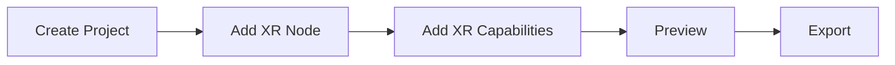

---
order: 0  
title: Developing XR Interactions  
type: XR  
label: XR  
---  

This document explains how to quickly develop XR interactions in both the editor and ProCode environments.  

## Editor  

The workflow for developing XR interactions in the editor is as follows:  



### Create Project  

Click **Create Project** on the **[Home Page](/en/docs/interface/intro/#%E9%A6%96%E9%A1%B5)**, then select `WebXR` as the physics backend in **[Project Settings](/en/docs/interface/sidebar/#%E9%A1%B9%E7%9B%AE%E8%AE%BE%E7%BD%AE)**.  

<Image src="https://mdn.alipayobjects.com/huamei_yo47yq/afts/img/A*n0b_Sa89AKoAAAAAAAAAAAAADhuCAQ/original" alt="image.png" style={{zoom:"50%"}} />  

### Add XR Node  

Add an XR node in the **[Hierarchy Panel](/en/docs/interface/hierarchy/)**.  

<Image src="https://mdn.alipayobjects.com/huamei_yo47yq/afts/img/A*qGeqSa-gx8EAAAAAAAAAAAAADhuCAQ/original" alt="image.png" style={{zoom:"50%"}} />  

> Adding an XR node automatically creates and selects `origin` and `camera`. Therefore, no other `Camera` components should exist in the scene unless intentionally added.  

> Multiple XR nodes can be added to a scene, but only one XR node will be active at any given time.  

### Preview  

If you've followed the [XR Debugging Guide](/en/docs/xr/quickStart/debug/) and installed Chrome with the [Immersive Web Emulator](https://chromewebstore.google.com/detail/immersive-web-emulator/cgffilbpcibhmcfbgggfhfolhkfbhmik) extension, you can preview directly now.  

<Image src="https://mdn.alipayobjects.com/huamei_yo47yq/afts/img/A*aiw2Tq994REAAAAAAAAAAAAADhuCAQ/original" alt="image.png" style={{zoom:"50%"}} />  

### XR Capabilities  

To achieve immersive mixed reality effects, additional capabilities can be added to XR interactions.  

#### Anchor Tracking  

Add the `XR Anchor Manager` component to any active entity to enable anchor tracking in XR.  

| Property        | Description                                                                 |
| :-------------- | :-------------------------------------------------------------------------- |
| Anchor List     | List of anchors to track, defined by Position and RotationQuaternion        |
| Prefab          | If set, this prefab will be instantiated and attached to the tracked anchor |

<Image src="https://mdn.alipayobjects.com/huamei_yo47yq/afts/img/A*QJgzSasSHmQAAAAAAAAAAAAADhuCAQ/original" alt="image.png" style={{zoom:"50%"}} />  

#### Image Tracking  

Add the `XR Image Manager` component to any active entity to enable image tracking in XR.  

| Property       | Description                                                                 |
| :------------- | :-------------------------------------------------------------------------- |
| Image List     | List of reference images for tracking                                       |
| Prefab         | If set, this prefab will be instantiated when the image is tracked          |

<Image src="https://mdn.alipayobjects.com/huamei_yo47yq/afts/img/A*QJgzSasSHmQAAAAAAAAAAAAADhuCAQ/original" alt="image.png" style={{zoom:"50%"}} />  

To upload reference images:  
Right-click in the **[Asset Panel](/en/docs/assets/interface/)** → **Upload** → **XRReferenceImage** → Select the target image.  

| Property   | Description                                                                 |
| :--------- | :-------------------------------------------------------------------------- |
| Name       | Unique identifier for the tracked image                                     |
| Prefab     | If set, this prefab will be instantiated when the image is tracked          |  

> Image tracking cannot be debugged in the editor. Mobile preview and debugging are required after export.  

#### Plane Tracking  

Add the `XR Plane Manager` component to any active entity to enable plane tracking in XR.  

| Property       | Description                                                                 |
| :------------- | :-------------------------------------------------------------------------- |
| Detection Mode | Plane detection mode (`None`, `Horizontal`, `Vertical`, `Everything`)       |
| Prefab         | If set, this prefab will be instantiated when a plane is detected           |

<Image src="https://mdn.alipayobjects.com/huamei_yo47yq/afts/img/A*10GkTo4k-CcAAAAAAAAAAAAADhuCAQ/original" alt="image.png" style={{zoom:"50%"}} />  

### Notes  

Note that `WebXR` requires entering the XR context via a button click on the page. For XR projects, the editor automatically adds a button during preview. After export, developers must manually implement this:  

```typescript
// XR Manager  
const xrManager = engine.xrManager;  
// Target XR session mode  
const xrMode = XRSessionMode.AR;  
engine.xrManager.sessionManager.isSupportedMode(xrMode).then(  
  () => {  
    // Enter XR session on button click  
    htmlButton.onclick = () => {  
      xrManager.enterXR(xrMode);  
    };  
  },  
  (error) => {  
    // Mode not supported  
    console.error(error);  
  }  
);  
```