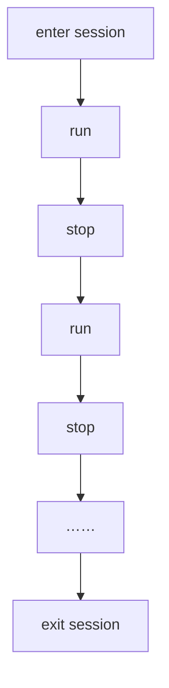

The session manager is subordinate to the XRManager instance, which you can access through `xrManager.sessionManager`.

## Properties

| Property           | Type           | Description               |
| :----------------- | :------------- | :------------------------ |
| mode               | XRSessionMode  | (Read-only) Get the current session type   |
| state              | XRSessionState | (Read-only) Get the current session state  |
| supportedFrameRate | Float32Array   | (Read-only) Get the hardware-supported frame rate |
| frameRate          | number         | (Read-only) Get the hardware running frame rate |

## Methods

| Method           | Description              |
| :--------------   | :-------------------     |
| isSupportedMode  | Get whether the session type is supported |
| run              | Run the session          |
| stop             | Stop the session         |

> After entering an XR session, developers can run or stop the session at any time. It is important to note that this state does not affect the engine's `run` and `pause`.

