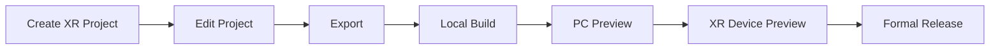

The process of developing XR interaction is as follows:



The editing process of the project is no different from other projects. This article will take the XR template as an example, focusing on the difficulties of XR projects, **Local Build**, **PC Preview**, and **XR Device Preview**.

## Preparations

Since we are introducing WebXR for the backend, taking an AR project as an example, the required operating environment and XR devices are as follows:

- PC browser that supports WebXR (this article uses Mac Chrome)
- Terminal and browser that support WebXR (this article uses an Android device and the Chrome app on an Android device)
- Android phone needs to install [Google Play Services for AR](https://play.google.com/store/apps/details?id=com.google.ar.core&hl=en_US&pli=1)

> `Google Play Services for AR` is an augmented reality platform (ARCore) developed by Google. Some phones come with this app pre-installed. If not, you can search for it in the app store. The image below shows the search result in the Xiaomi app store.


### PC Debugging

For PC Chrome, it is recommended to install [Immersive Web Emulator](https://chromewebstore.google.com/detail/immersive-web-emulator/cgffilbpcibhmcfbgggfhfolhkfbhmik), a tool developed by Meta that allows you to easily debug WebXR on Chrome. As shown in the image below, we use this tool to simulate XR devices for debugging on PC Chrome.


> The left side of the image above shows the XR business panel view, and the right side shows the developer tools.

### Mobile Debugging

After confirming the installation of `Google Play Services for AR` on an Android device, you can use Chrome to open the [AR sample](https://immersive-web.github.io/webxr-samples/immersive-ar-session.html) for testing.

## XR Template

After preparing the above, you can quickly create an XR project by clicking on **Templates** -> **XR Template** in the **Menu View** on the **Editor Homepage**.


## PC Preview

Build the project with the following command to debug on PC:

```bash
npm install
npm run https
```

Then open the corresponding URL in Chrome to debug the XR project.


> WebXR is only available in a secure environment (HTTPS), so enabling HTTPS is required when building and debugging the project.

### Debugging

As mentioned above, with the installation of `Immersive Web Emulator`, open the developer tools by pressing `F12` and `F12`.

## Mobile Preview

Before the project is officially released, you can test it on both your phone and computer within the same local network.


### Debugging

Please refer to [Remote Debugging Android Devices](https://developer.chrome.com/en/docs/devtools/remote-debugging?hl=zh-cn)

> Before debugging, make sure the phone has **`Developer Options`** enabled and **`USB Debugging`** allowed.

## Best Practices

Due to the challenges of XR debugging, we recommend completing most of the work and validation in PC preview and debugging stages, which can significantly improve development efficiency.
