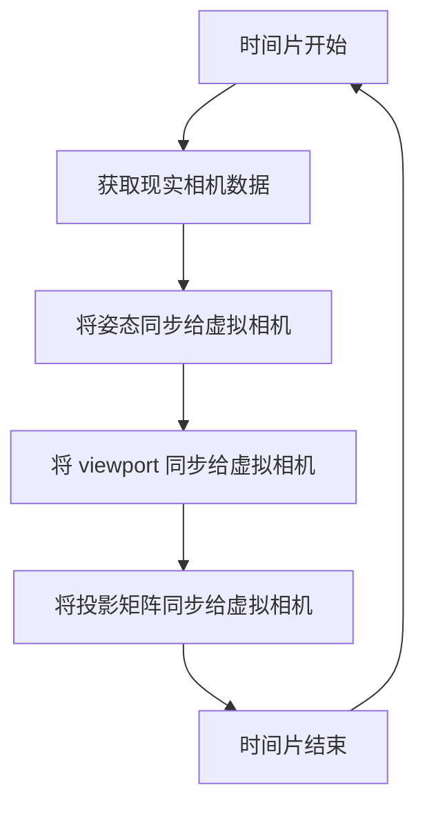

The Camera Manager is a part of the XRManager instance, which you can access via `xrManager.cameraManager`.

## Properties

| Property | Type | Description |
| :-- | :-- | :-- |
| fixedFoveation | number | Sets the fixed foveation of the camera. For more details, refer to [fixedFoveation](https://developer.mozilla.org/en-US/docs/Web/API/XRProjectionLayer/fixedFoveation) |

## Methods

| Method         | Description                                         |
| :----------- | :------------------------------------------- |
| attachCamera | Binds the virtual world's camera to the real world's camera     |
| detachCamera | Unbinds the virtual world's camera from the real world's camera |

> When the XR session type is AR, the type of camera to bind is `XRTrackedInputDevice.Camera`

> When the XR session type is VR, the types of cameras to bind are `XRTrackedInputDevice.LeftCamera` and `XRTrackedInputDevice.RightCamera`

## Update Process

Simply synchronize the parameters and pose of the `real camera` completely with the `virtual camera`, and the `real scene` and `virtual scene` can remain **synchronized**.

