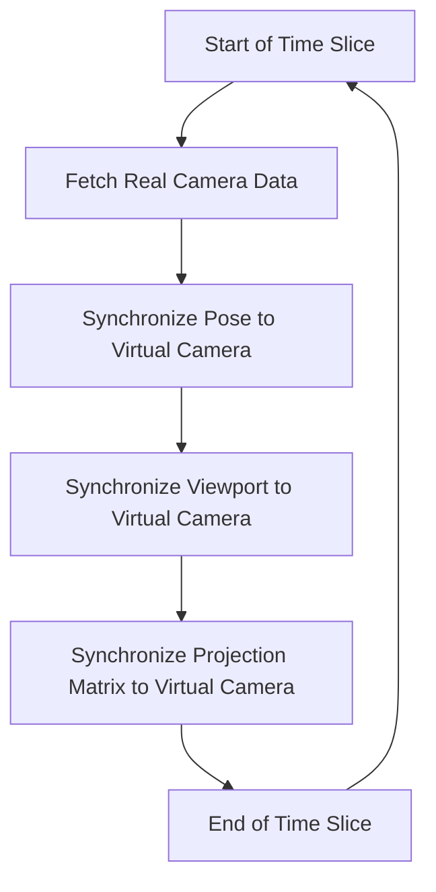

---
order: 4  
title: Camera Manager  
type: XR  
label: XR  
---  

The camera manager is part of the `XRManager` instance and can be accessed via `xrManager.cameraManager`.  

## Properties  

| Property           | Type   | Description                                                                 |
| :----------------- | :----- | :-------------------------------------------------------------------------- |
| fixedFoveation     | number | Sets a fixed foveation value for the camera. See [fixedFoveation](https://developer.mozilla.org/en-US/docs/Web/API/XRProjectionLayer/fixedFoveation) for details. |

## Methods  

| Method             | Description                                           |
| :----------------- | :---------------------------------------------------- |
| attachCamera       | Binds the virtual world camera to the real-world camera. |
| detachCamera       | Unbinds the virtual world camera from the real-world camera. |

> For AR sessions, bind to `XRTrackedInputDevice.Camera`.  
> For VR sessions, bind to `XRTrackedInputDevice.LeftCamera` and `XRTrackedInputDevice.RightCamera`.  

## Update Process  

To maintain **synchronization** between the real and virtual scenes, simply mirror the real camera's parameters and pose to the virtual camera.  

