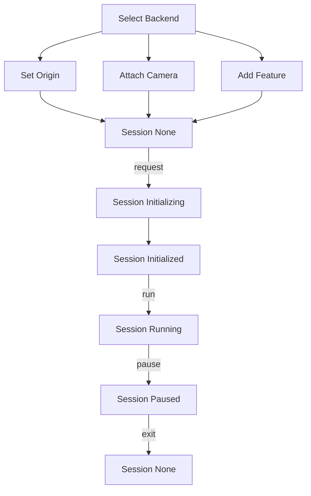

## Properties  

| Property       | Type                            | Description                                                                 |
| :------------- | :------------------------------ | :-------------------------------------------------------------------------- |  
| sessionManager | [XRSessionManager](/en/docs/xr/system/session/) | Session manager for managing the XR session lifecycle and context. Use it to monitor session state changes. |  
| inputManager   | [XRInputManager](/en/docs/xr/system/input/)   | Input manager for handling all XR inputs (controllers, HMDs, cameras, etc.). Use it to access device information. |  
| cameraManager  | [XRCameraManager](/en/docs/xr/system/camera/)  | Camera manager for connecting virtual and real-world cameras in XR space. |  
| features       | [XRFeature](/en/docs/xr/system/features/)      | All enabled XR features.                                                  |  
| origin         | [Entity](/apis/core/#Entity)                | The origin point during XR initialization, bridging the virtual and real worlds. |  

> If the `origin` node is placed at **scene position** `(1, 1, 1)`, and the tracked camera position is `(x, y, z)` when entering XR, the camera's world position in the scene becomes `(1 + x, 1 + y, 1 + z)`. This transformation aligns the origin's local coordinates with world coordinates.  

---

## Methods  

| Method               | Description                                                                 |  
| :------------------- | :-------------------------------------------------------------------------- |  
| isSupportedFeature   | Checks if a specific feature is supported. Developers can use this to verify environment compatibility before usage. |  
| addFeature           | Adds a specific XR feature, similar to attaching a component to a node.     |  
| getFeature           | Retrieves a specific XR feature, similar to fetching a component from a node. |  
| enterXR              | Enters an XR session. Choose the session type (`AR` or `VR`). If `autoRun` is not explicitly specified, XR logic will automatically start after session entry. |  
| exitXR               | Exits the XR session. All XR logic stops, added features are destroyed, and configurations are not saved. |  

---

## Overall Workflow  

Based on the above properties and methods, the XR workflow is structured as follows:  

