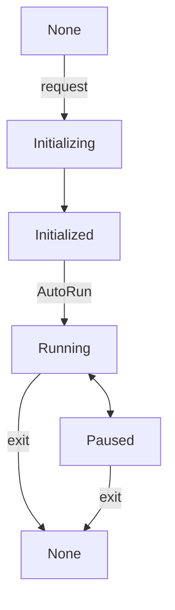

The session manager is subordinate to the XRManager instance, which you can access via `xrManager.sessionManager`.

## Properties

| Property           | Type           | Description                |
| :----------------- | :------------- | :------------------------- |
| mode               | XRSessionMode  | (Read-only) Get the current session type   |
| state              | XRSessionState | (Read-only) Get the current session state   |
| supportedFrameRate | Float32Array   | (Read-only) Get the frame rates supported by the hardware |
| frameRate          | number         | (Read-only) Get the frame rate at which the hardware is running |

## Methods

| Method                     | Description                                                                            |
| :------------------------- | :-------------------------------------------------------------------------------------- |
| isSupportedMode            | Check if the session type is supported. Developers can determine if the current environment supports it before starting a session. The parameter is `AR` or `VR`. |
| addStateChangedListener    | Add a listener for session state changes. When the state changes, the callback will be executed and the latest session state will be passed as a parameter. |
| removeStateChangedListener | Remove the listener for session state changes.                                          |
| run                        | Run the session.                                                                        |
| stop                       | Stop the session.                                                                       |

> There are five states in an XR session: `None`, `Initializing`, `Initialized`, `Running`, and `Paused`. The state transitions are shown in the diagram below. After entering an XR session, developers can run or stop the session at any time, and this state does not affect the engine's `run` and `pause`.

