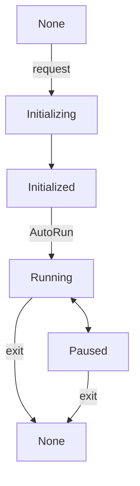

## Properties  

| Property               | Type           | Description                                                                 |  
| :--------------------- | :------------- | :-------------------------------------------------------------------------- |  
| mode                   | XRSessionMode  | (Read-only) Gets the current session mode                                   |  
| state                  | XRSessionState | (Read-only) Gets the current session state                                  |  
| supportedFrameRate     | Float32Array   | (Read-only) Gets the hardware-supported frame rates                         |  
| frameRate              | number         | (Read-only) Gets the hardware-running frame rate                            |  

---

## Methods  

| Method                       | Description                                                                 |  
| :--------------------------- | :-------------------------------------------------------------------------- |  
| isSupportedMode              | Checks if a session mode is supported. Developers can use this to verify environment compatibility before starting a session. Parameters: `AR` or `VR` |  
| addStateChangedListener      | Adds a listener for session state changes. The callback will be triggered when the state changes, with the latest session state as the parameter. |  
| removeStateChangedListener   | Removes a session state change listener                                     |  
| run                          | Runs the session                                                            |  
| stop                         | Stops the session                                                           |  

> The XR session has five states: `None`, `Initializing`, `Initialized`, `Running`, and `Paused`. The state transitions are shown in the diagram below. After entering an XR session, developers can run or stop the session at any time. This state does not affect the engine's `run` and `pause` states.  

