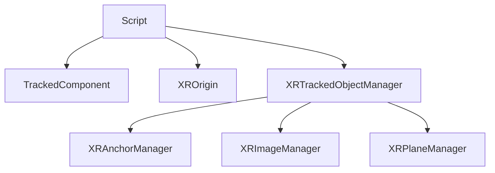

## Inheritance Hierarchy  



> All are high-level features implemented via scripts, providing **high-level abstractions** for **@galacean/engine-xr** core operations.  

---

## XROrigin  

| Property   | Type           | Description                                                                 |  
| :--------- | :------------- | :-------------------------------------------------------------------------- |  
| mode       | XRSessionMode  | XR session mode. For `AR`, specify `XRTrackedInputDevice.Camera`. For `VR`, specify `XRTrackedInputDevice.LeftCamera` and `XRTrackedInputDevice.RightCamera`. |  
| origin     | Entity         | Sets the `XRManager.origin`                                                 |  
| camera     | Entity         | Connects the virtual camera to the device camera (typically AR camera)      |  
| leftCamera | Entity         | Connects to the left eye of HMD devices                                     |  
| rightCamera| Entity         | Connects to the right eye of HMD devices                                    |  

---

## TrackedComponent  

| Property               | Type              | Description                                                                 |  
| :--------------------- | :---------------- | :-------------------------------------------------------------------------- |  
| data                   | XRTracked         | Tracking result data containing ID, pose, and status                        |  
| destroyedOnRemoval     | boolean           | Whether to remove the entity when tracking is lost (typically `true`)       |  

---

## XRTrackedObjectManager  

| Property | Type    | Description                                                                 |  
| :------- | :------ | :-------------------------------------------------------------------------- |  
| prefab   | boolean | Whether to remove the entity when tracking is lost (typically `true`)       |  

| Method                         | Description                                           |  
| :----------------------------- | :---------------------------------------------------- |  
| getTrackedComponentByTrackId   | Retrieve the component attached to a tracked object by its unique ID |  

---

## XRAnchorManager  

| Property | Type        | Description             |  
| :------- | :---------- | :---------------------- |  
| anchors  | Anchor Array | Specifies anchor poses to track |  

---

## XRImageManager  

| Property           | Type                      | Description             |  
| :----------------- | :------------------------ | :---------------------- |  
| trackingImages     | XRReferenceImage Array    | Specifies images to track |  

---

## XRPlaneManager  

| Property          | Type         | Description             |  
| :---------------- | :----------- | :---------------------- |  
| detectionMode     | XRPlaneMode  | Specifies plane detection type |  

---

### Example Usage  

```typescript
const scene = sceneManager.scenes[0];
const origin = scene.addRootEntity("origin");
const camera = origin.createChild("camera");
camera.addComponent(Camera);
const xrOrigin = origin.addComponent(XROrigin);

// Set mode, origin, and camera
xrOrigin.mode = XRSessionMode.AR;
xrOrigin.origin = origin;
xrOrigin.camera = camera;

// Add plane detection manager and configure detection mode
const xrPlaneManager = origin.addComponent(XRPlaneManager);
xrPlaneManager.detectionMode = XRPlaneMode.EveryThing;

// When a plane is tracked, retrieve the component by ID
xrManager
  .getFeature(XRPlaneTracking)
  .addChangedListener(
    (added: readonly XRTrackedPlane[], updated: readonly XRTrackedPlane[], removed: readonly XRTrackedPlane[]) => {
      added.forEach((plane) => {
        console.log("component", xrPlaneManager.getTrackedComponentByTrackId(plane.id));
      });
    }
  );
```