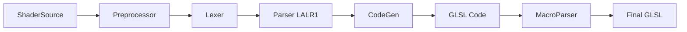
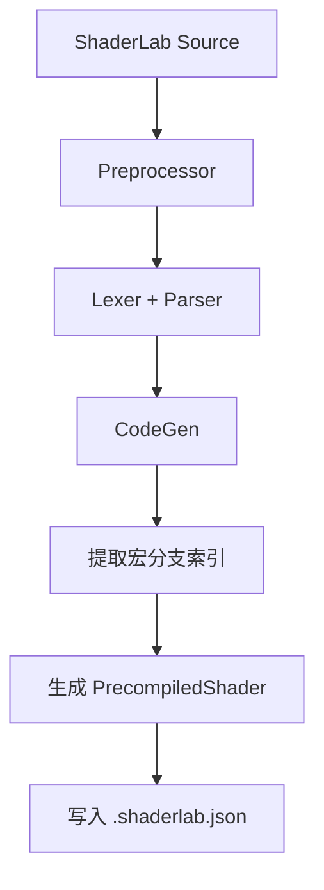

# ShaderLab 预编译优化 RFC

## 1. 背景与问题分析

### 1.1 编译流程

ShaderLab 编译系统采用多阶段流水线设计：



各阶段职责：

| 阶段 | 职责 | 时机 |
|------|------|------|
| Preprocessor | 展开 `#include`，收集 `#define` | 构建时 |
| Lexer | 词法分析，生成 tokens | 构建时 |
| Parser | LALR(1) 语法分析，构建 AST | 构建时 |
| CodeGen | 遍历 AST，生成 GLSL 代码（保留宏分支） | 构建时 |
| MacroParser | 运行时根据宏选择代码分支 | 运行时 |

### 1.2 问题清单

#### 问题 1：运行时 MacroParser 重复词法分析（P0）

**描述**：每次变种展开都要重新扫描整个代码字符串，PBR Shader 典型有 50-100 个宏变种，每个变种 MacroParser 耗时 4-8ms，总展开时间 200-800ms。

**伪代码案例**：
```typescript
// 当前实现：每次变种都重新扫描
class MacroParser {
  static parse(source: string, macros: ShaderMacro[]): string {
    // 第1次变种：扫描整个 source
    const tokens1 = lexer.scan(source);
    // 第2次变种：重新扫描整个 source（重复工作！）
    const tokens2 = lexer.scan(source);
    // ...第N次变种
  }
}

// 期望实现：只扫描一次，复用索引
class MacroParser {
  static parse(source: string, macros: ShaderMacro[], branchIndex: MacroBranchIndex): string {
    // 使用预构建的索引直接定位分支
    return expandWithIndex(source, branchIndex, macros);
  }
}
```

#### 问题 2：构建时编译结果无法序列化（P0）

**描述**：每次页面加载都要重新执行 Parser + CodeGen（50-80ms），无法利用构建时已完成的工作。

**伪代码案例**：
```typescript
// 当前实现：每次页面加载都重新编译
function loadPage() {
  const shader = Shader.create(PBRSource); // 50-80ms
  // Parser + CodeGen 每次都要执行
}

// 期望实现：构建时编译，运行时直接加载
function buildTime() {
  const precompiled = shaderLab.precompile(PBRSource); // 构建时执行
  fs.writeFile('pbr.shader.json', JSON.stringify(precompiled));
}

function loadPage() {
  const data = fs.readFile('pbr.shader.json');
  const shader = Shader.loadPrecompiled(JSON.parse(data)); // 5ms
}
```

#### 问题 3：#include 重复展开（P1）

**描述**：目前 `#include` 的片段在 AST 阶段全部展开，相同文件被多次 include 时会重复生成 AST 树和代码。

**伪代码案例**：
```glsl
// Common.glsl 被多个文件引用
// ForwardPassPBR.glsl
#include "Common.glsl"
#include "Lighting.glsl"  // Lighting.glsl 内部也 #include "Common.glsl"

// 当前实现：Common.glsl 被解析两次
// Parser 生成 Common.glsl 的 AST（第1次）
// Parser 生成 Common.glsl 的 AST（第2次，重复！）

// 期望实现：Common.glsl 只解析一次
// Parser 缓存: Map<string, AST> = { "Common.glsl": ast }
// 第2次遇到时直接复用缓存
```

#### 问题 4：顶点、片元代码重复生成（P2）

**描述**：顶点着色器和片元着色器的代码生成阶段存在重复逻辑，应该可以公用部分 codeGen。

**伪代码案例**：
```typescript
// 当前实现：顶点和片元各自执行完整的代码生成
class GLESVisitor {
  visitShaderProgram(node, vertexEntry, fragmentEntry) {
    // 顶点阶段
    const vertexCode = this._vertexMain(vertexEntry, data);
    // 顶点阶段又会调用 _getGlobalSymbol, _getCustomStruct

    // 片元阶段
    const fragmentCode = this._fragmentMain(fragmentEntry, data);
    // 片元阶段又会调用 _getGlobalSymbol, _getCustomStruct（重复！）
  }
}

// 期望实现：提取公共逻辑
class GLESVisitor {
  visitShaderProgram(node, vertexEntry, fragmentEntry) {
    // 公共部分只执行一次
    const globalSymbols = this._collectGlobalSymbols(data);

    // 顶点阶段使用缓存
    const vertexCode = this._vertexMain(vertexEntry, data, globalSymbols);
    // 片元阶段使用缓存
    const fragmentCode = this._fragmentMain(fragmentEntry, data, globalSymbols);
  }
}
```

#### 问题 5：TreeShaking 粒度不够细（P1）

**描述**：目前 TreeShaking 处理了所有宏分支的全局变量/函数，应该可以优化到只针对实际会使用的宏分支。

**伪代码案例**：
```glsl
// 源码
uniform float unusedUniform;  // 只在 #ifdef NEVER_DEFINED 分支中使用
uniform float usedUniform;    // 在 main 中使用

void main() {
  #ifdef NEVER_DEFINED
    unusedUniform;  // 这个分支永远不会执行
  #endif
  gl_FragColor = vec4(usedUniform);
}

// 当前实现（运行时不知道宏状态）
uniform float unusedUniform;  // 被保留（因为在某个宏分支中）
uniform float usedUniform;
void main() {
  gl_FragColor = vec4(usedUniform);
}

// 期望实现（构建时分析宏依赖）
// 分析：NEVER_DEFINED 未定义时，unusedUniform 永远不会被使用
// 输出（NEVER_DEFINED 未定义时）：
uniform float usedUniform;
void main() {
  gl_FragColor = vec4(usedUniform);
}
```

#### 问题 6：Symbol Lookup 无缓存（P2）

**描述**：同一个作用域下重复 lookup symbol，没有缓存机制。

**伪代码案例**：
```glsl
// 源码
sampler2D shadowMap;
float sampleShadow() {
  // 以下每一行都会触发 symbol table lookup
  float a = SAMPLE(shadowMap);  // lookup "shadowMap"
  float b = SAMPLE(shadowMap);  // 又一次 lookup "shadowMap"（重复！）
  float c = SAMPLE(shadowMap);  // 又一次 lookup "shadowMap"（重复！）
}

// 当前实现
class SymbolTableStack {
  lookup(symbol: string): SymbolInfo {
    // 每次都要遍历作用域链查找
    for (let i = this.stack.length - 1; i >= 0; i--) {
      if (this.stack[i].has(symbol)) return this.stack[i].get(symbol);
    }
  }
}

// 期望实现
class SymbolTableStack {
  private lookupCache = new Map<string, SymbolInfo>();

  lookup(symbol: string): SymbolInfo {
    if (this.lookupCache.has(symbol)) {
      return this.lookupCache.get(symbol);  // 命中缓存
    }
    // 未命中时查找并缓存
    const result = this.doLookup(symbol);
    this.lookupCache.set(symbol, result);
    return result;
  }
}
```

#### 问题 7：Preprocessor 阶段未去除注释（P2）

**描述**：可以在 Preprocessor 阶段顺便去除代码注释，减少后续处理的数据量。

**伪代码案例**：
```glsl
// 源码（包含大量注释）
// 这是材质参数说明
// 支持多种纹理类型
// 作者：xxx
// 日期：2024
uniform sampler2D baseTexture; /* 基础纹理 */
uniform vec4 baseColor; // 基础颜色

// 当前实现：注释保留到后续所有阶段
// Lexer 需要跳过注释
// Parser 需要从 AST 中剔除注释节点
// 整个过程都携带无用数据

// 期望实现：Preprocessor 阶段去除
class Preprocessor {
  parse(source: string): string {
    // 去除 // 注释
    const noLineComment = source.replace(/\/\/.*$/gm, '');
    // 去除 /* */ 注释
    const noComment = noLineComment.replace(/\/\*[\s\S]*?\*\//g, '');
    return noComment;
  }
}
// 后续阶段处理的数据量减少
```

## 2. 解决方案

### 2.1 方案一：预编译序列化（对应问题 2）

**优先级**：P0

**目标**：构建时执行完整编译，序列化为可快速加载的格式，运行时跳过 Parser + CodeGen。

**数据结构**：

```typescript
interface PrecompiledShader {
  version: number;
  hash: string;
  passes: PrecompiledPass[];
}

interface PrecompiledPass {
  name?: string;
  vertex: PrecompiledStage;
  fragment: PrecompiledStage;
}

interface PrecompiledStage {
  source: string;
  macroBranches: MacroBranchInfo[];
}
```

**流程**：



**API**：

```typescript
class ShaderLab {
  precompile(source: string, basePath: string): PrecompiledShader;
  loadPrecompiled(data: PrecompiledShader): IShaderProgramSource;
}
```

**测试文件**：`tests/src/shader-lab/precompile-serialization.test.ts`

### 2.2 方案二：宏分支索引（对应问题 1）

**优先级**：P0

**目标**：构建时提取宏分支位置索引，运行时 MacroParser 利用索引直接定位代码片段，避免重复词法分析。

**数据结构**：

```typescript
interface MacroBranchInfo {
  type: 'ifdef' | 'ifndef' | 'if';
  macroName: string;
  range: { start: number; end: number };
  trueBranch: { start: number; end: number };
  falseBranch?: { start: number; end: number };
  nested: MacroBranchInfo[];
}
```

**测试文件**：`tests/src/shader-lab/macro-branch-index.test.ts`

### 2.3 方案三：Include AST 缓存（对应问题 3）

**优先级**：P1

**目标**：对 `#include` 的文件缓存其 AST，避免重复解析相同文件。

**实现**：

```typescript
class ShaderTargetParser {
  private includeASTCache = new Map<string, TreeNode>();

  parseInclude(includePath: string): TreeNode {
    if (this.includeASTCache.has(includePath)) {
      return this.includeASTCache.get(includePath);
    }
    const ast = this.doParse(includePath);
    this.includeASTCache.set(includePath, ast);
    return ast;
  }
}
```

**测试文件**：`tests/src/shader-lab/include-ast-cache.test.ts`

### 2.4 方案四：顶点片元 CodeGen 合并（对应问题 4）

**优先级**：P2

**目标**：顶点着色器和片元着色器的代码生成阶段公用部分逻辑。

**实现**：提取公共的 `_collectGlobalSymbols` 方法，缓存全局符号收集结果。

**测试文件**：`tests/src/shader-lab/vertex-fragment-codegen-merge.test.ts`

### 2.5 方案五：宏分支级别 TreeShaking（对应问题 5）

**优先级**：P1

**目标**：针对确定的宏分支进行精确的 TreeShaking。

**实现**：

```typescript
interface SymbolUsageInfo {
  symbol: string;
  usedInMacros: string[];  // 在哪些宏中被使用
}

class TreeShakingOptimizer {
  analyzeMacroBranches(ast: ASTNode): SymbolUsageInfo[] {
    // 分析每个符号被哪些宏分支引用
  }

  shakeByMacros(symbols: SymbolUsageInfo[], activeMacros: string[]): string[] {
    // 根据当前宏集合，返回需要保留的符号
  }
}
```

**测试文件**：`tests/src/shader-lab/macro-level-treeshaking.test.ts`

### 2.6 方案五：Symbol Lookup 缓存（对应问题 6）

**优先级**：P2

**目标**：同一个作用域下缓存 lookup 结果。

**实现**：

```typescript
class SymbolTableStack {
  private lookupCache = new Map<string, SymbolInfo>();

  lookup(symbol: string): SymbolInfo {
    if (this.lookupCache.has(symbol)) {
      return this.lookupCache.get(symbol);
    }
    const result = this.doLookup(symbol);
    this.lookupCache.set(symbol, result);
    return result;
  }

  // 作用域变化时清除缓存
  pushScope(): void {
    this.stack.push(new SymbolTable());
    this.lookupCache.clear();
  }
}
```

**测试文件**：`tests/src/shader-lab/symbol-lookup-cache.test.ts`

### 2.7 方案六：Preprocessor 去除注释（对应问题 7）

**优先级**：P2

**目标**：在 Preprocessor 阶段去除代码注释。

**实现**：

```typescript
class Preprocessor {
  static parse(source: string, ...): string {
    // 1. 去除注释
    const noComment = this.removeComments(source);
    // 2. 展开 include
    const expanded = this.expandIncludes(noComment);
    return expanded;
  }

  private static removeComments(source: string): string {
    // 去除 // 注释
    const noLineComment = source.replace(/\/\/.*$/gm, '');
    // 去除 /* */ 注释
    return noLineComment.replace(/\/\*[\s\S]*?\*\//g, '');
  }
}
```

**测试文件**：`tests/src/shader-lab/preprocessor-remove-comments.test.ts`

## 3. 实施计划

### 阶段 1：建立基准测试

**目标**：建立可量化的性能测试基线

**任务**：
- 编写编译性能基准测试
- 测量各阶段耗时基线
- 测量不同复杂度 Shader 数据

**测试文件**：
- `tests/src/shader-lab/benchmark-compile-perf.test.ts`
- `tests/src/shader-lab/benchmark-macro-parse-perf.test.ts`

**验收标准**：
- 测试必须跑通
- 输出各阶段耗时报告
- 支持对比优化前后数据

### 阶段 2：预编译序列化

**目标**：实现构建时预编译和运行时加载

**任务**：
- 定义 `PrecompiledShader` 数据结构
- 实现 `ShaderLab.precompile()`
- 实现宏分支索引提取逻辑
- 实现 JSON 序列化/反序列化
- 修改 `Shader.create()` 支持加载预编译数据

**测试文件**：`tests/src/shader-lab/precompile-serialization.test.ts`

**验收标准**：
- 预编译数据可以正确序列化和反序列化
- 运行时加载结果与实时编译一致
- 首次加载耗时降低 80% 以上

### 阶段 3：MacroParser 优化

**目标**：优化运行时宏展开性能

**任务**：
- 实现宏分支索引提取
- 改造 MacroParser 使用索引加速

**测试文件**：`tests/src/shader-lab/macro-branch-index.test.ts`

**验收标准**：
- 变种展开耗时降低 60% 以上
- 所有现有 Shader 正确运行

### 阶段 4：构建工具集成

**目标**：开发构建插件支持预编译

**任务**：
- 开发 Vite 插件
- 开发 Rollup 插件
- 处理 watch 模式增量编译

**测试文件**：
- `tests/src/shader-lab/build-tool-vite-plugin.test.ts`
- `tests/src/shader-lab/build-tool-rollup-plugin.test.ts`

**验收标准**：
- 插件可以正确预编译 Shader
- watch 模式下修改 Shader 文件触发增量编译

### 阶段 5：其他优化

**目标**：实施其他独立优化项

**任务**：
- Include AST 缓存
- 顶点片元 CodeGen 合并
- 宏分支级别 TreeShaking
- Symbol Lookup 缓存
- Preprocessor 去除注释

**测试文件**：
- `tests/src/shader-lab/include-ast-cache.test.ts`
- `tests/src/shader-lab/vertex-fragment-codegen-merge.test.ts`
- `tests/src/shader-lab/macro-level-treeshaking.test.ts`
- `tests/src/shader-lab/symbol-lookup-cache.test.ts`
- `tests/src/shader-lab/preprocessor-remove-comments.test.ts`

**验收标准**：
- 所有优化项有对应的测试
- 测试跑通且性能有提升

## 4. 预期效果汇总

| 优化项 | 现状 | 目标 | 提升 |
|--------|------|------|------|
| 首次加载 | 80ms | 5ms | 94% |
| 变种展开 | 8ms/个 | 2ms/个 | 75% |
| 100 变种总耗时 | 880ms | 205ms | 77% |
| Symbol Lookup | 无缓存 | 有缓存 | 30-50% |

## 5. 附录

### 5.1 核心源码文件

| 文件 | 说明 |
|------|------|
| `packages/shader-lab/src/ShaderLab.ts` | 编译入口 |
| `packages/shader-lab/src/Preprocessor.ts` | 预处理器 |
| `packages/shader-lab/src/parser/ShaderTargetParser.ts` | Parser |
| `packages/shader-lab/src/codeGen/GLESVisitor.ts` | CodeGen |
| `packages/shader-lab/src/macroProcessor/MacroParser.ts` | 宏展开器 |

### 5.2 RFC 改造测试目录结构

```
tests/src/shader-lab/
├── benchmark-compile-perf.test.ts
├── benchmark-macro-parse-perf.test.ts
├── precompile-serialization.test.ts
├── macro-branch-index.test.ts
├── include-ast-cache.test.ts
├── vertex-fragment-codegen-merge.test.ts
├── macro-level-treeshaking.test.ts
├── symbol-lookup-cache.test.ts
├── preprocessor-remove-comments.test.ts
├── build-tool-vite-plugin.test.ts
└── build-tool-rollup-plugin.test.ts
```

注意：这些测试文件专门用于 RFC 改造验收，与原有 `ShaderLab.test.ts` 区分。
