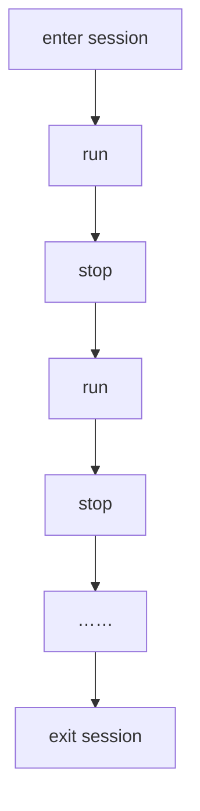

会话管理器从属于 XRManager 实例，你可以通过 `xrManager.sessionManager` 获取。

## 属性

| 属性               | 类型           | 解释                     |
| :----------------- | :------------- | :----------------------- |
| mode               | XRSessionMode  | (只读)获取当前会话类型   |
| state              | XRSessionState | (只读)获取当前会话状态   |
| supportedFrameRate | Float32Array   | (只读)获取硬件支持的帧率 |
| frameRate          | number         | (只读)获取硬件运行的帧率 |

## 方法

| 方法            | 解释                 |
| :-------------- | :------------------- |
| isSupportedMode | 获取是否支持会话类型 |
| run             | 运行会话             |
| stop            | 停止会话             |

> 在进入 XR 会话后，开发者可以随时运行或停止会话，需要注意的是，这个状态不影响引擎的 `run` 和 `pause` 。

