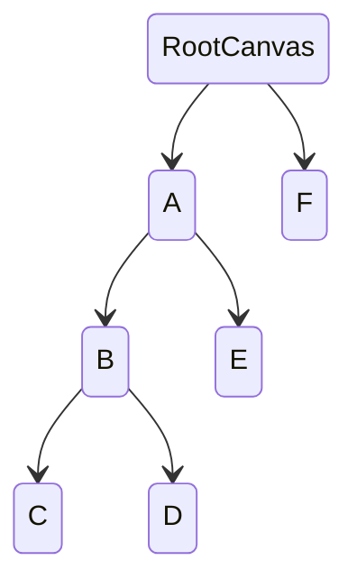

UI 事件遵循引擎的事件系统，在此基础之上，UI 组件派发的事件还额外支持冒泡机制。

## 冒泡

当前版本仅支持冒泡流程：

| 接口                                                        | 是否冒泡率 |
| :---------------------------------------------------------- | :--------- |
| [onPointerEnter](/apis/core/#Script-onPointerEnter)         | 不冒泡     |
| [onPointerExit](/apis/core/#Script-onPointerExit)           | 不冒泡     |
| [onPointerDown](/apis/core/#Script-onPointerDown)           | 冒泡       |
| [onPointerUp](/apis/core/#Script-onPointerUp)               | 冒泡       |
| [onPointerClick](/apis/core/#Script-onPointerClick)         | 冒泡       |
| [onPointerBeginDrag](/apis/core/#Script-onPointerBeginDrag) | 冒泡       |
| [onPointerDrag](/apis/core/#Script-onPointerDrag)           | 冒泡       |
| [onPointerEndDrag](/apis/core/#Script-onPointerEndDrag)     | 冒泡       |
| [onPointerDrop](/apis/core/#Script-onPointerDrop)           | 冒泡       |

如下图所示，如果 C 节点触发 `pointerup` 事件, 将会沿着 C --> B --> A --> RootCanvas 路径一路派发此事件。

## 脚本开发

<Playground href="/embed/ui-Event" />
