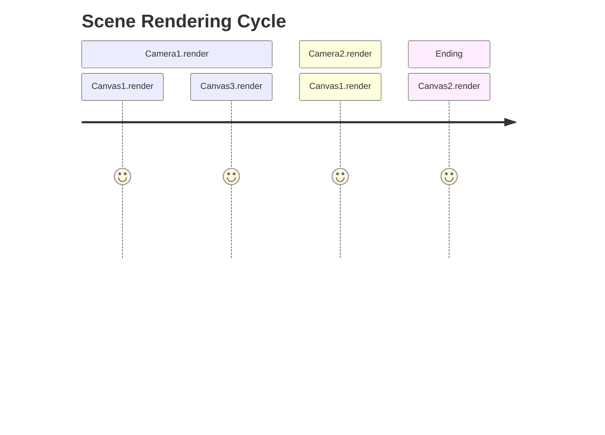
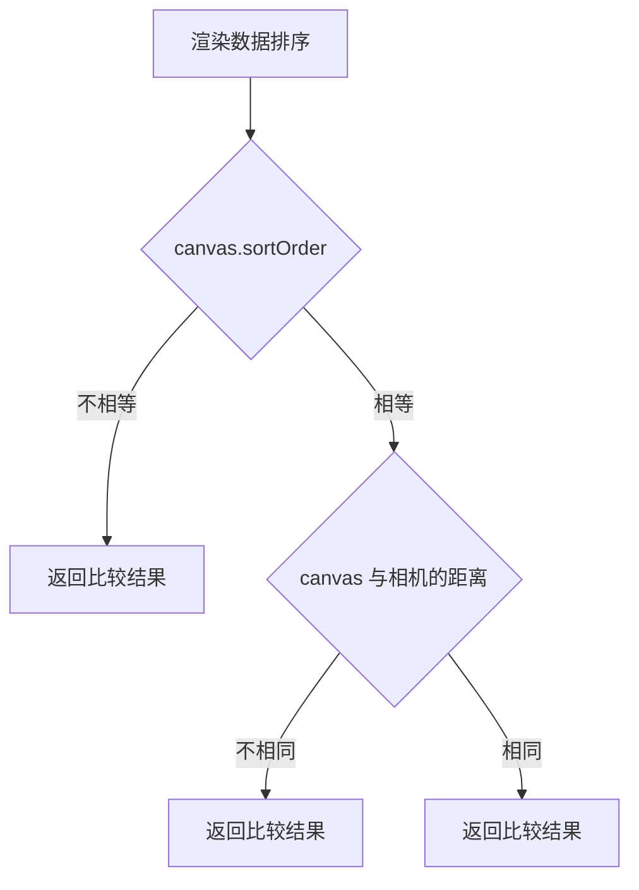
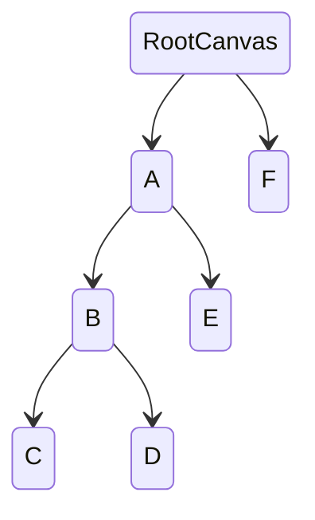

UI 组件的渲染顺序遵从两个规则：

- 不同的 `UICanvas` 依据 `RendererMode` 类型遵从特定的渲染顺序
- 从属于 `UICanvas` 的 `UIRenderer` 则依据**深度优先且从父到子、从左到右**的次序进行渲染

## UICanvas

假设当前运行时：
- 包含一个场景 `Scene` 
- 场景 `Scene ` 包含两个相机 `Camera1` 与 `Camera2`
- 场景 `Scene ` 包含三个画布，其中
    - `Canvas1` 的渲染模式为 `WorldSpace`
    - `Canvas2` 的渲染模式为 `ScreenSpace-Overlay`
    - `Canvas3` 的渲染模式为 `ScreenSpace-Camera`，且对应的渲染相机为 `Camera1`

需要注意的是：
- 渲染模式为 `ScreenSpace-Camera` 和的画布只会在其对应的相机中渲染，且它与渲染模式为 `ScreenSpace-Overlay` 的画布一样，都遵循通用的相机裁剪规则。
- 渲染模式为 `ScreenSpace-Overlay` 的画布在没有相机的情况下依旧可以被渲染。
- 同个相机下，`UICanvas` 之间的渲染排序遵循如下规则，overlay 的画布仅通过 `sortOrder` 决定渲染顺序。

## UIRenderer 渲染顺序

如上图所示，根画布下的渲染顺序依次为 A -> B -> C -> D -> E -> F 需要注意的是，设置`UIRenderer.priority` 并不会改变它的渲染顺序。

