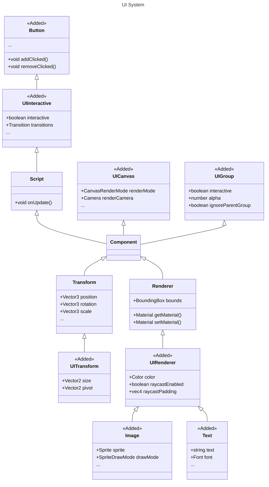

## 系统设计

## 模块管理

| 包                                                                       | 解释         | 相关文档              |
| :----------------------------------------------------------------------- | :----------- | --------------------- |
| [@galacean/engine-ui](https://www.npmjs.com/package/@galacean/engine-xr) | 核心架构逻辑 | [API](/apis/galacean) |

> `@galacean/engine-ui` 是实现 **UI** 必须引入的依赖

> 需遵守[版本依赖规则](/docs/basics/version/#版本依赖)，即 `@galacean/engine-ui` 的版本需与 `@galacean/engine` 保持一致。
