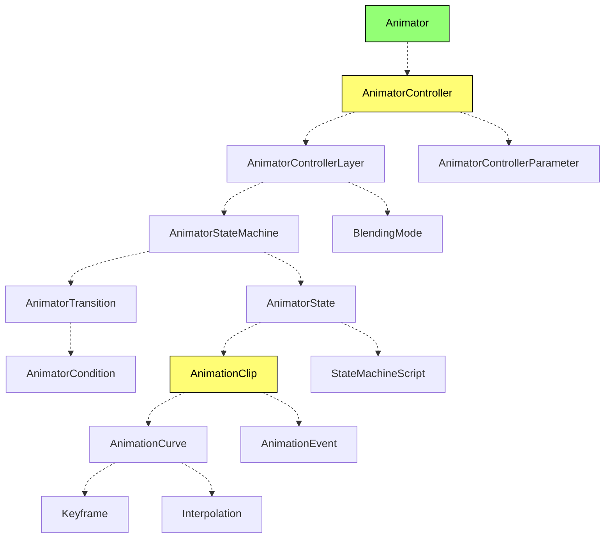

### 动画系统的构成

| 概念 | 解释 |
| --- | --- |
| [Animator](/apis/core/#Animator) | 动画控制器组件，用于控制动画的播放。`Animator` 组件读取 `AnimatorController` 作为动画数据。 |
| [AnimatorController](/apis/core/#AnimatorController) | 用于存储 `Animator` 组件的动画数据。一个 `AnimatorController` 包含多个 `AnimatorControllerLayer`，用于分层播放或动画叠加。 |
| [AnimatorControllerParameter](/apis/core/#AnimatorControllerParameter) | 动画控制器中使用的变量，使用户可以通过在脚本中通过 `Animator` 设置参数的值以控制动画状态的切换。 |
| [AnimatorControllerLayer](/apis/core/#AnimatorControllerLayer) | 存储该层的动画状态机数据，混合模式以及混合的权重。|
| [AnimatorStateMachine](/apis/core/#AnimatorStateMachine) | 每个 AnimatorControllerLayer 中有一个 AnimatorStateMachine，用于控制动画状态的播放及状态间的切换及过渡。 |
| [BlendingMode](/apis/core/#AnimatorControllerLayer-blendingMode) | 动画层的混合模式，默认为 `AnimatorLayerBlendingMode.Override` 既覆盖模式，可以通过将下面的层设置为 `AnimatorLayerBlendingMode.Additive` 实现动画叠加的效果。 |
| [AnimatorState](/apis/core/#AnimatorState) | AnimatorState 是 AnimatorStateMachine 的基本构成。可以控制 AnimationClip 的速度，是否循环，开始结束时间。每个 AnimatorState 需绑定一个 AnimationClip，当处于该状态时，则会播放该 AnimationClip。 |
| [AnimationClip](/apis/core/#AnimationClip) | 动画片段，存储设计师制作的基于关键帧的动画数据。一个 `AnimationClip` 一般对应一个模型的特定动作，每个 AnimationClip 包含多个 AnimationCurve。 |
| [StateMachineScript](/apis/core/#StateMachineScript) | 你可以为每个 `AnimatorState` 添加状态机脚本，它可以让你在动画状态机的不同事件（如状态进入、退出、更新等）中接收到回调 |
| [AnimatorTransition](/apis/core/#AnimatorTransition) | AnimatorTransition 定义了状态机何时以及如何从一个状态过渡到另一个状态。通过它可以设置两个动画状态的过渡开始时间 `exitTime`，目标状态的开始时间 `offset` 及过渡时长 `duration`。 `conditions`, 转换到下一个状态的条件集合|
| [AnimatorCondition](/apis/core/#AnimatorCondition) | 它用于定义从一个 `AnimatorState` 转换到另一个 `AnimatorState` 的条件。|
| [AnimationCurve](/apis/core/#AnimationCurve) | 一个模型拥有多个骨骼，模型动画中每个骨骼实体的指定属性的动画关键帧数据存储于 AnimationCurve 中。一个 AnimationCurve 中包含多个 Keyframe 既关键帧数据。 |
| [AnimationEvent](/apis/core/#AnimationEvent) | AnimationEvent 可以让你在指定时间调用其同一实体绑定的脚本的回调函数. |
| [Keyframe](/apis/core/#KeyFrame) | 存储动画关键帧数据，既指定时间实体的属性的值应是多少。 |
| [Interpolation](/apis/core/#AnimationCurve-interpolation) | 动画曲线中关键帧的插值方式。既当时间在两个关键帧间时，属性的值该如何计算。 |