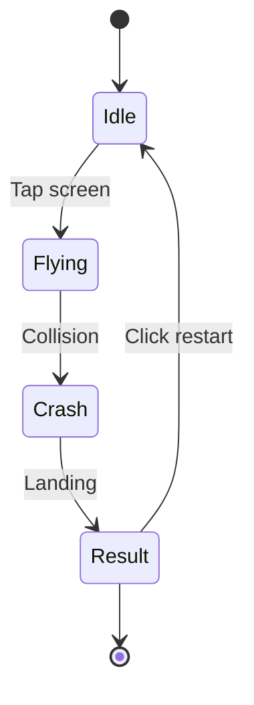
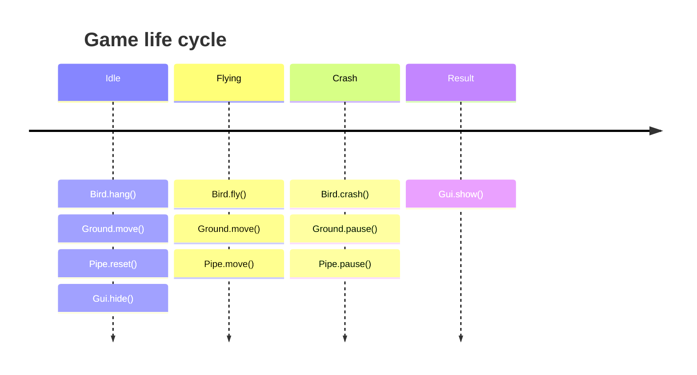
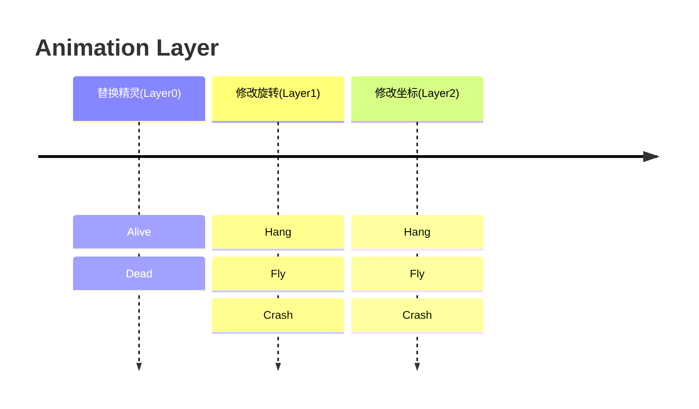

> 相信大家对 Flappy Bird 都不陌生，本文简单描述下如何用 Galacean 复刻这个 2D 游戏。
>
> 原游戏链接：[http://flappybird.io/](http://flappybird.io/)

Flappy Bird 是一个 2D 项目，编辑器首页自带的 2D 模版便是按照此文档一步一步实现的，我们先通过编辑器的 `New Project` 创建一个 `2D Project`。（若遇到问题，可参照**首页**->**模版**->**像素小鸟**）


## 准备资源

Flappy Bird 依赖的资源是一堆图片，点击[这里](https://github.com/galacean/galacean.github.io/files/13161928/fb.zip)可以下载图片包到本地。解压之后看到以下图片：

- 0-9 的分数数字图
- 游戏背景图
- 小鸟的动画帧图
- 草地、管道
- 游戏重新开始按钮


### 上传资源

回到场景编辑器，点击资源面板上的上传按钮 ，选择 `Sprite`，此时会唤起操作系统的文件查看器，选中所有 FlappyBird 目录下的图片。上传之后，如下图所示，编辑器为每张图片创建了一个 [Texture](/docs/graphics/texture/texture/) 资源和 一个 [Sprite](/docs/graphics/2D/sprite) 资源（为了和 Texture 资源作区分，Sprite 对象带灰色圆角矩形背景）。在接下来的操作中，我们只需要关心 Sprite 资源。


到这里，我们已经把资源上传完，但是有洁癖的你看到这散乱的资源可能已经按耐不住整理的冲动了。让我们创建一个文件夹，并重命名为 _Sprites_，把刚上传的资源批量选中后拖到 _Sprites_ 目录中。这样做的目的不仅是让资源面板更加整洁，还为我们下一步创建 [Atlas 图集](/docs/graphics/2D/spriteAtlas)资源做好了准备。

### 创建图集

为了达到更好的运行时性能，我们选择把这些 Sprite 资源打包到一个 Atlas 资源。我们点击  按钮选择 `Sprite Atlas`，创建后选中它，通过 **[检查器面板](/docs/interface/inspector)** 上的 `Add to List` 按钮把所有 Sprite 资源都添加到列表中。


点击 `Pack and Preview` 按钮可以看到 Atlas 创建成功：


恭喜你，到这里你已经完成了资源上传和管理的操作。接下去我们进行游戏场景搭建的环节。

## 搭建场景

搭建 2D 场景就像玩拼图一样充满乐趣。首先，我们试着把游戏背景图从资源面板拖动场景中。不要怕拖的位置不准，只要拖到大概的位置，我们后面可以在 **[检查器面板](/docs/interface/inspector)** 中精细调整。


选中层级树面板中的 `Camera` 节点，可以预览场景在各种设备上渲染的样子。

> 如果你发现画面太大或太小，可以调整正交相机的 `Orthographic Size` 来实现缩放。


### 加上小鸟

同样，我们把小鸟的 Sprite（`bird3-spr.png`）也拖到场景中。小鸟“飞”的动画是通过序列帧实现的，详见[帧动画](/docs/animation/sprite-sheet/)。

### 加上管道

随着游戏的进行，管道会在画面中重复出现，并且是上下成对出现。这里有个小技巧，可以把上面的管道的 `Scale` 值设成 `-1`，这样就优雅地实现了翻转。


在游戏过程中，产生管道的高度也是随机的，但是我们手上的资产高度却是固定的。不用急，只需要调整一下`精灵渲染模式`即可，这样可以让我们`无损`拉伸某些资产哦。


这里有个小技巧，将引用 `sprite` 资产的 `pivot` 属性设置为 `buttom` 就可以避免每次调整高度的时候重新锚定位置了。


考虑到管道会重复出现，我们在节点树中把一对管道设置成一个 `PipeMother` 的组，并把它放到 `Pipe` 节点下。这样，后面通过在 Pipe 上绑定脚本组件就可以获取 `PipeMother` 以实现管道的复用。


### 加上草地

我们可以通过结合`精灵渲染模式`与 `动画片段编辑` 来实现草地来实现草地在地上平铺且能水平移动的效果。

步骤如下：

1. 在节点树中创建一个节点，命名为 `ground`。

2. 在 **[检查器面板](/docs/interface/inspector)** 中通过 `Add Component` 按钮添加 `Sprite Renderer` 组件，并且把 `SpriteRenderer DrawMode Info` 属性设置成 `Tiled`，并将宽度设置为 `8.14`

   

3. 此时就得到了一个平铺完毕的地面，接下来我们可以通过创建动画片段来让它动起来！详见[动画片段编辑](/docs/animation/clip)。

   

### 添加遮罩

添加完地面后发现，左右显示好像穿帮了！对于这种情况，只需要为精灵渲染器增加遮罩就好了，详见[精灵遮罩组件](/docs/graphics/2D/spriteMask)

   

### 加上 GUI

GUI 包括分数显示和重新开始按钮。我们分数（ `0.png`） 和重新开始按钮（ `restart.png`） 两个精灵拖到场景中，并放到新建的 `GUI` 节点下。


至此，界面搭建完毕！观察一下左侧的节点树的完整结构，好的树结构对复杂场景管理来说很重要。

> 如果你在上述过程中需要处理精灵之间的遮盖关系，就像 CSS 里的 `z-index` 属性一样，你可以通过 `Sprite Renderer` 的 `priority` 属性来设置，值越大越后渲染，即越能遮住其他精灵。

### 增加物理反馈

在此项目中，我们需要为**小鸟在触碰到水管或地面**和**鼠标在点击重开按钮**时增加物理反馈，增加物理反馈只需要两步：

- 添加碰撞体
- 处理碰撞回调

#### 添加碰撞体

碰撞体描述了事物的位姿形态，因此在添加碰撞体时应该尽量贴合物体实际显示的大小。关于碰撞器的使用详见[碰撞器](/docs/physics/collider)，此处演示为小鸟添加碰撞体。


#### 处理碰撞回调

```typescript
/**
 * 挂载在小鸟节点上的脚本组件
 */
class Bird extends Script {
  onTriggerEnter(other: ColliderShape): void {
    // 与水管或地面发生了碰撞
  }
}

/**
 * 挂载在重开按钮节点上的脚本组件
 */
class Restart extends Script {
  onPointerClick() {
    // 点击了重开按钮
  }
}
```

## 编写逻辑

正式编写逻辑前，需要对游戏进行全局链路分析：

- 状态切换与通信方式
- 不同状态下各个实例对应的表现

### 状态切换与通信方式



我们枚举了**全局状态**与**切换条件**，可以将它们想象成穿梭在不同实例之间的`信息流`，当小鸟在准备阶段时**按下屏幕**，信息被解析并传递给其他实例对象，此时地面开始播放循环移动动画，水管开始交替出现并消失，`信息流`的传递可以用[事件系统](/docs/script/communication)实现，下面我们简化逻辑，在 `Bird` 中监听屏幕点击事件，一旦点击发生，`Idle` 状态就会切换至 `Flying` ，并且其他实例也会监听到对应状态改变。

```typescript
/**
 * 全局状态的枚举
 */
enum EnumState {
  Idle,
  Flying,
  Crash,
  Result,
}

/**
 * 对全局状态的控制与分发
 */
class GameCtrl extends EventDispatcher {
  private static _ins: GameCtrl;
  static get ins() {
    return (this._ins ||= new GameCtrl());
  }

  private _gameState: EnumState = EnumState.Idle;
  set gameState(value: EnumState) {
    if (this._gameState !== value) {
      console.log("GameCtrl：全局状态被改变");
      this._gameState = value;
      this.dispatch("State_Change", value);
    }
  }

  get gameState() {
    return this._gameState;
  }
}

/**
 * 挂载在小鸟节点上的脚本组件
 */
class Bird extends Script {
  onAwake(): void {
    GameCtrl.ins.on("State_Change", (state: EnumState) => {
      console.log("Bird：监听到了状态改变");
    });
  }

  onUpdate(deltaTime: number): void {
    const { ins } = GameCtrl;
    if (
      ins.gameState === EnumState.Idle &&
      this.engine.inputManager.isPointerDown()
    ) {
      console.log("Bird：按下屏幕，对局开始");
      ins.gameState = EnumState.Flying;
    }
  }
}

/**
 * 挂载在地面节点上的脚本组件
 */
class Ground extends Script {
  onAwake(): void {
    GameCtrl.ins.on("State_Change", (state: EnumState) => {
      console.log("Ground：监听到了状态改变");
    });
  }
}
```

同理，依照流程图中各个状态的切换条件，完善其他状态之间的切换（`GameCtrl.ins.gameState = 对应状态`）：

- `Flying` -> `Crash` ：小鸟与水管或地面发生碰撞
- `Crash` -> `Result` ：小鸟落地（判断 Y 轴坐标即可）
- `Result` -> `Idle` ：点击重新开始按钮

### 完善表现

我们已经将全局的状态都串联起来，并且保证各个实例都能获取当前状态并监听到状态的改变，接下来只需要让各个实例在不同状态下展示对应的表现即可。



经过拆解可以发现，如果我们简单地将动画分类为待机动画，飞行动画与坠落动画，考虑到待机的时候要播放精灵切换和上下缓动的动画，飞行的时候也需要播放精灵切换与抬头坠落的动画，他们重合的部分不仅会增加动画编辑时的工作量，还需要额外考虑这两个动画衔接时其中的精灵切换动画是否自然，因此我们更进一步，将各个动画状态原子化，拆分其中精灵切换与坐标改变的部分，并分别设置在不同的 `Layer` 中，不同的 `Layer` 相互独立，并可同时播放各自的动画，设置各自的叠加模式与权重，详情可参考[动画组件](/docs/animation/system/)。


让各个 `Layer` 分别控制各自的动画状态，可以逻辑更加清晰。



#### 小鸟

```typescript
/**
 * 挂载在小鸟节点上的脚本组件
 */
class Bird extends Script {
  private _animator: Animator;

  onAwake() {
    this._animator = this.entity.getComponent(Animator);
    GameCtrl.ins.on("State_Change", (state: EnumState) => {
      const animator = this._animator;
      switch (state) {
        case EnumState.Idle:
          this._alive();
          this._hang();
          break;
        case EnumState.Flying:
          break;
        case EnumState.Crash:
          this._dead();
          this._crash();
          break;
        case EnumState.Result:
          break;
      }
    });
  }

  onUpdate(deltaTime: number): void {
    const { ins } = GameCtrl;
    if (
      ins.gameState === EnumState.Idle &&
      this.engine.inputManager.isPointerDown()
    ) {
      this._fly();
      ins.gameState = EnumState.Flying;
    }
  }

  onTriggerEnter(other: ColliderShape): void {
    GameCtrl.ins.gameState = EnumState.Crash;
  }

  private _alive(): void {
    // 帧动画-拍动翅膀
    animator.play("alive", 0);
  }

  private _dead(): void {
    // 停止拍动翅膀
    animator.play("dead", 0);
  }

  private _hang(): void {
    // 准备阶段
    animator.play("Hang", 1);
    animator.play("Hang", 2);
  }

  private _fly(): void {
    // 向上冲
    animator.play("Fly", 1);
    animator.play("Fly", 2);
  }

  private _crash(): void {
    // 坠落
    animator.play("Crash", 1);
    animator.play("Crash", 2);
  }
}
```

由于动画片段编辑只能编辑绝对的坐标或旋转变化，例如每次飞行的动画，他的旋转变化是绝对的，但坐标却是相对的，因此我们可以在 `StateMachineScript` 中实现，以 `Fly` 动画为例：


然后打开这个脚本，并在其中添加上自由落体的坐标变化：

```typescript
export default class extends StateMachineScript {
  // 小鸟的位置
  private _position: Vector3;
  // 起始时间
  private _startTime = 0;
  // 起始位置
  private _startY = 0;
  // 起始速度
  private _startV = 10;
  // 最终匀速速度
  private _maxV = -8;
  // 重力加速度
  private _gravity = -35;
  // [0, _dividTime] 匀加速；[_dividTime, +∞] 匀速
  private _dividTime = 18 / 35;

  onStateEnter(
    animator: Animator,
    animatorState: AnimatorState,
    layerIndex: number
  ): void {
    this._startTime = animator.engine.time.elapsedTime;
    this._position = animator.entity.transform.position;
    this._startY = this._position.y;
  }

  onStateUpdate(
    animator: Animator,
    animatorState: AnimatorState,
    layerIndex: number
  ): void {
    const { engine } = animator;
    const { _maxV, _startV, _gravity, _dividTime, _position } = this;
    const subTime = engine.time.elapsedTime - this._startTime;
    if (subTime <= _dividTime) {
      _position.y =
        ((_startV + (_startV + subTime * _gravity)) * subTime) / 2 +
        this._startY;
    } else {
      _position.y =
        ((_maxV + _startV) * _dividTime) / 2 +
        _maxV * (subTime - _dividTime) +
        this._startY;
    }
  }
}
```

同理，在小鸟坠落时也需要添加 `Crash` 脚本：

```typescript
class extends StateMachineScript {
  // 是否已经落地
  private _bLanding: boolean = false;

  onStateEnter(
    animator: Animator,
    animatorState: AnimatorState,
    layerIndex: number
  ): void {
    this._bLanding = false;
  }

  onStateUpdate(
    animator: Animator,
    animatorState: AnimatorState,
    layerIndex: number
  ): void {
    if (this._bLanding) {
      return;
    }
    const { entity, engine } = animator;
    const { position } = entity.transform;
    // 地面高度
    if (position.y <= -3.1) {
      GameCtrl.ins.gameState = EnumState.Result;
      this._bLanding = true;
    } else {
      position.y -= engine.time.deltaTime;
    }
  }
}
```

OK！这个游戏中最复杂的部分已经被我们成功攻克了，此时点击屏幕，小鸟触发飞行动画，同时每帧计算自由落体的位置，触碰到障碍物后，小鸟触发坠落动画，同时每帧计算坠落的位置。

#### 水管

水管较为复杂，在对局开始时，我们让水管向左移动，当需要生成下个水管时，从池子中获取，当水管移动超出显示区域时，回收水管到池子中。

```typescript
/**
 * 挂载在水管节点上的脚本组件
 */
class Pipe extends Script {
  // 水管池子
  private _pipePool = [];
  // 当前激活的水管
  private _pipes = [];
  // 水管母体
  private _pipeMother: Entity;
  // 是否停止
  private _isPaused: boolean = true;

  private _inv = 2.87;
  private _up = 4.48;
  private _down = -3.2;
  private _downLimit = -2.12 + 1.08;
  private _upLimit = 3.4 - 1.08;
  private _pipeHorizontalV = 3;
  private _leftDistance = 2;

  onAwake() {
    this._pipeMother = this.entity.children[0];
    this._pipeMother.parent = null;
    GameCtrl.ins.on("State_Change", (state: EnumState) => {
      switch (state) {
        case EnumState.Idle:
          this._reset();
          break;
        case EnumState.Flying:
          this._move();
          break;
        case EnumState.Crash:
          this._pause();
          break;
        default:
          break;
      }
    });
  }

  onUpdate(deltaTime: number) {
    if (this._isPaused) {
      return;
    }
    const { ins } = GameCtrl;
    const moveDistance = this._pipeHorizontalV * deltaTime;
    if ((this._leftDistance -= moveDistance) <= 0) {
      this._leftDistance = 4;
      this._generate();
    }
    const { _pipes: pipes } = this;
    for (let i = pipes.length - 1; i >= 0; i--) {
      const pipe = pipes[i];
      const { position } = pipe.transform;
      const posX = position.x - moveDistance;
      if (position.x >= 0 && posX < 0) {
        ins.score += 1;
      }
      if (posX <= -4.53) {
        pipes.splice(i, 1);
        pipe.parent = null;
        this._pipePool.push(pipe);
      } else {
        position.x = posX;
      }
    }
  }

  private _move() {
    this._isPaused = false;
  }

  private _pause() {
    this._isPaused = true;
  }

  private _reset() {
    const { _pipes: pipes } = this;
    for (let i = 0, n = pipes.length; i < n; i++) {
      const pipe = pipes[i];
      pipe.parent = null;
      this._pipePool.push(pipe);
    }
    pipes.length = 0;
    this._leftDistance = 2;
    this._isPaused = true;
  }

  private _getOrCreatePipe() {
    let pipe: Entity;
    if (this._pipePool.length > 0) {
      pipe = this._pipePool.pop();
    } else {
      pipe = this._pipeMother.clone();
    }
    this._pipes.push(pipe);
    const center =
      Math.random() * (this._upLimit - this._downLimit) + this._downLimit;

    const [upColliderShape, downColliderShape] = <BoxColliderShape[]>(
      pipe.getComponent(StaticCollider).shapes
    );

    const upPipe = pipe.findByName("up_pipe");
    const upRenderer = upPipe.getComponent(SpriteRenderer);
    const upHeight = this._up - center - this._inv / 2;
    upColliderShape.size.set(1.2, upHeight, 1);
    upColliderShape.position.set(0, 4.48 - upHeight / 2, 0);
    upRenderer.height = upHeight;
    const downPipe = pipe.findByName("down_pipe");
    const downRenderer = downPipe.getComponent(SpriteRenderer);
    const downHeight = center - this._down - this._inv / 2;
    downColliderShape.size.set(1.2, downHeight, 1);
    downColliderShape.position.set(0, downHeight / 2 - 3.2, 0);
    downRenderer.height = downHeight;
    pipe.transform.position.x = 4.53;
    this.entity.addChild(pipe);
  }
}
```

可以看到，上方的逻辑就是对流程图的代码完善：

- 当状态切换为 `Idle` 时，`Pipe._reset()` 函数被触发，场上所有的水管都被回收至池中
- 当状态切换为 `Flying` 时，`Pipe._move()` 函数被触发，水管命运的齿轮开始转动，帧循环中判断是否需要生成新的水管，是否需要回收旧的水管，生成新水管使用了引擎自带的 [clone](/docs/core/clone) 能力，可以完整复刻节点的结构与组件。
- 当状态切换为 `Crash` 时，`Pipe._pause()` 函数被触发，水管停止移动。

#### 地面

地面的逻辑相对简单，只需要在 `Flying` 时让地面移动，其余的时间让地面保持静止即可。

```typescript
class Ground extends Script {
  private _animator: Animator;
  onAwake() {
    this._animator = this.entity.getComponent(Animator);
    GameCtrl.ins.on("State_Change", (state: EnumState) => {
      if (state === EnumState.Flying) {
        this._move();
      } else {
        this._pause();
      }
    });
    this._pause();
  }

  private _move() {
    this._animator.speed = 1;
  }

  private _pause() {
    this._animator.speed = 0;
  }
}
```

#### GUI

在实现完上述逻辑后，项目基本可以正常运行了，此时我们需要为游戏加上分数显示让他的逻辑更加完整，同样分析分数的改变与传递时机，小鸟通过水管时会触发分数的叠加，对局重开时会触发分数的重置，分数的改变信息会传递给各个实例，参考 `gameState` 依葫芦画瓢，我们在 `GameCtrl` 中添加 `score` 属性。

```typescript
class GameCtrl extends EventDispatcher {
  private static _ins: GameCtrl;

  static get ins() {
    return (this._ins ||= new GameCtrl());
  }

  private _gameState: EnumState = EnumState.Idle;
  private _score: number = 0;
  set gameState(value: EnumState) {
    if (this._gameState !== value) {
      this._gameState = value;
      if (value === EnumState.Idle) {
        // 重开时重置分数
        this._reset();
      }
      this.dispatch("State_Change", value);
    }
  }

  get gameState() {
    return this._gameState;
  }

  set score(val: number) {
    this._score = val;
    this.dispatch("Score_Change", val);
  }

  get score() {
    return this._score;
  }

  private _reset() {
    this.score = 0;
  }
}
```

这样一来，分数变化整体的流程也完善了，接下来只需要完善分数的展示逻辑即可：

- 切换至 `Idle` 状态时，隐藏分数
- 切换至 `Flying` 状态时，展示分数

```typescript
class Score extends Script {
  // 数字精灵所在的图集
  private _atlas: SpriteAtlas;
  // 提供克隆的数字母体
  private _scoreMother: Entity;
  // 当前显示的数字节点数组
  private _scoreEntities: Entity[] = [];
  // 当前显示的数字精灵渲染器数组
  private _scoreRenderers: SpriteRenderer[] = [];
  // 每个数字之间的间隔（归一化）
  private _inv: number = 1.2;

  onAwake() {
    const { engine, entity } = this;
    const { ins } = GameCtrl;
    this._scoreEntities[0] = this._scoreMother =
      entity.findByName("scoreMother");

    this._scoreRenderers[0] =
      this._scoreEntities[0].getComponent(SpriteRenderer);

    // 通过相对路径获取精灵图集资产
    engine.resourceManager
      .load({ type: AssetType.SpriteAtlas, url: "/Assets/atlas/SpriteAtlas" })
      .then((atlas: SpriteAtlas) => {
        this._atlas = atlas;
      });

    ins.on("State_Change", (state: EnumState) => {
      switch (state) {
        case EnumState.Idle:
          this._hide();
          break;
        case EnumState.Flying:
          this._show(ins.score);
          break;
      }
    });

    ins.on("Score_Change", (num: number) => {
      if (ins.gameState !== EnumState.Idle) {
        this._show(num);
      }
    });
  }

  private _show(num: number): void {
    const {
      _scoreEntities: entities,
      _scoreRenderers: renderers,
      _scoreMother: mother,
    } = this;
    const score = num.toFixed(0);
    const needCount = score.length;
    const currCount = entities.length;
    const n = Math.max(needCount, currCount);
    const width = needCount * this._inv;
    for (let i = 0; i < n; i++) {
      if (i >= needCount) {
        entities[i] && (entities[i].isActive = false);
      } else {
        let entity: Entity;
        let renderer: SpriteRenderer;
        if (entities[i]) {
          entity = entities[i];
          renderer = renderers[i];
        } else {
          entity = entities[i] = mother.clone();
          renderer = renderers[i] = entity.getComponent(SpriteRenderer);
          this.entity.addChild(entity);
        }
        entity.isActive = true;
        entity.transform.position.x = this._inv * (i + 0.5) - width / 2;
        renderer.priority = 10;
        renderer.sprite = this._atlas?.getSprite(
          "Assets/sprites/" + score[i] + "-spr.png"
        );
      }
    }
  }

  private _hide(): void {
    const { _scoreEntities: entities } = this;
    for (let i = 0, n = entities.length; i < n; i++) {
      entities[i].isActive = false;
    }
  }
}
```

Restart 按钮相对来说比较简单：

```typescript
class Restart extends Script {
  private collider: StaticCollider;
  private spriteRenderer: SpriteRenderer;

  onAwake() {
    const { entity } = this;
    this.collider = entity.getComponent(StaticCollider);
    this.spriteRenderer = entity.getComponent(SpriteRenderer);
    GameCtrl.ins.on("State_Change", (state: EnumState) => {
      switch (state) {
        case EnumState.Result:
          this.show();
          break;
        default:
          this.hide();
          break;
      }
    });

    this.hide();
  }

  hide() {
    this.collider.enabled = this.spriteRenderer.enabled = false;
  }

  show() {
    this.collider.enabled = this.spriteRenderer.enabled = true;
  }

  onPointerClick() {
    GameCtrl.ins.gameState = EnumState.Idle;
  }
}
```

至此，所有的游戏逻辑都已完善，点击预览快试试有没有 Bug 吧！如果对中间某些步骤有疑问，可以通过在编辑器 **首页**->**模版**->**像素小鸟** 对照依照此文档实现的模版，如果对此文档有其他建议，欢迎提出您的想法。
