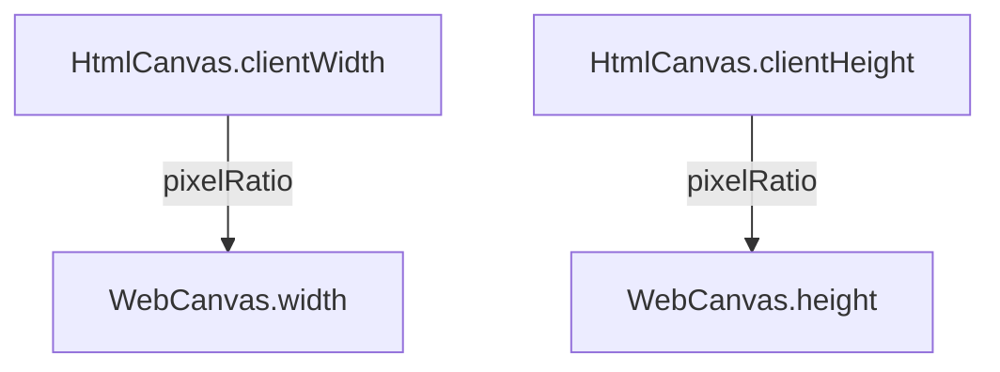

Galacean Engine 封装了不同平台的画布，如 [WebCanvas](/apis/rhi-webgl/WebCanvas)  支持用 [Engine](/apis/core/#Engine) 控制 [HTMLCanvasElement](https://developer.mozilla.org/en-US/docs/Web/API/HTMLCanvasElement) 或者 [OffscreenCanvas](https://developer.mozilla.org/en-US/docs/Web/API/OffscreenCanvas) 。


> 若无特殊说明，文档中画布一般都为 `WebCanvas` 。

## 基础使用

### 创建画布

在 HTML 中插入一个 `<canvas>` 标签，指定一个 id：

```html
<canvas id="canvas" style="width: 500px; height: 500px" />
```

> 开发者要注意检查 canvas 的高度和宽度，避免出现高度或宽度的值为 **0** 导致渲染不出来。

创建 WebGLEngine 实例的时候会自动创建一个 WebCanvas 实例。其中，参数 `canvas` 是 _Canvas_ 元素的 `id`。

```typescript
const engine = await WebGLEngine.create({ canvas: "canvas" });

console.log(engine.canvas); // => WebCanvas 实例
```

### 基础适配

画布尺寸一般通过**设备像素比**控制，以 [WebCanvas](/apis/rhi-webgl/WebCanvas) 为例：



若通过编辑器导出 **NPM package** 进行开发，只需在[项目导出](/docs/assets-build)渲染导出配置处控制**设备像素比**即可。


或在代码中主动调用 `resizeByClientSize` 适配画布。

```typescript
// 使用设备像素比（ window.devicePixelRatio ）调整画布尺寸，
engine.canvas.resizeByClientSize();
// 自定义像素比调整画布尺寸
engine.canvas.resizeByClientSize(1.5);
```

> 当画布的显示尺寸发生变化时（比如浏览器窗口发生变化时），画面可能出现拉伸或压缩，可以通过调用 `resizeByClientSize` 来恢复正常。一般情况下这行代码已经可以满足适配的需求，如果你有更复杂的适配需求，请阅读“高级使用”部分。

## 高级使用

关于适配，核心要注意的点是**设备像素比**，以 iPhoneX 为例，设备像素比 `window.devicePixelRatio` 为 _3_，  窗口宽度 `window.innerWidth` 为 _375_，屏幕物理像素宽度则为：375 * 3 = *1125\*。

渲染压力和屏幕物理像素高宽成正比，物理像素越大，渲染压力越大，也就越耗电。画布的高宽建议通过 [WebCanvas](/apis/rhi-webgl/WebCanvas) 暴露的 API 设置，不建议使用原生 canvas 的 API ，如 `canvas.width` 或 `canvas.style.width` 这些方法修改。

> ️ **注意**：有些前端脚手架会插入以下标签修改页面的缩放比：
>
> `<meta name="viewport" content="width=device-width, initial-scale=0.333333333">`
>
> 这行代码会把 `window.innerWidth` 的值从 375 修改为 1125。

除了 `resizeByClientSize` 自动适配，推荐使用以下两种模式：

### 节能模式

考虑到移动端设备虽然是高清屏幕（设别像素比高）但实际显卡性能并不能很好地满足高清实时渲染的性能要求的情况（**3 倍屏和 2 倍屏渲染面积比是 9:4，3 倍屏较容易造成手机发烫**），此模式下引擎通过对画布缩放拉伸来达到适配的目的。代码如下：

```typescript
const canvas = document.getElementById("canvas");
const webcanvas = new WebCanvas(canvas);
const pixelRatio = window.devicePixelRatio; // 如果已经设置 meta scale，请设置为 1
const scale = 3 / 2; // 3 倍高清屏按 2 倍屏来计算画布尺寸

/**
 * 设置节能模式，默认全屏，也可以自己设置任意高宽
 */
webcanvas.width = (window.innerWidth * pixelRatio) / scale;
webcanvas.height = (window.innerHeight * pixelRatio) / scale;
webcanvas.setScale(scale, scale); // 拉伸画布
```

如果已经通过 CSS 设置了画布高宽（比如 `width: 100vw; height: 100vh;`），那么可以通过 `resizeByClientSize` 传参实现画布的缩放：

```typescript
const canvas = document.getElementById("canvas");
const webcanvas = new WebCanvas(canvas);
const scale = 2 / 3; // 3 倍高清屏按 2 倍屏来计算画布尺寸

webcanvas.resizeByClientSize(scale); // 拉伸画布
```

### 固定宽度模式

某些情况下，比如设计稿固定 750 宽度的情况，开发者有可能会写死画布宽度来降低适配成本。代码如下：

```typescript
import { WebCanvas } from "@galacean/engine";

const canvas = document.getElementById("canvas");
const webcanvas = new WebCanvas(canvas);
const fixedWidth = 750; // 固定 750 宽度

/**
 * 设置固定宽度模式
 */
const scale = window.innerWidth / fixedWidth;
webcanvas.width = fixedWidth;
webcanvas.height = window.innerHeight / scale;
webcanvas.setScale(scale, scale); // 拉伸画布
```
