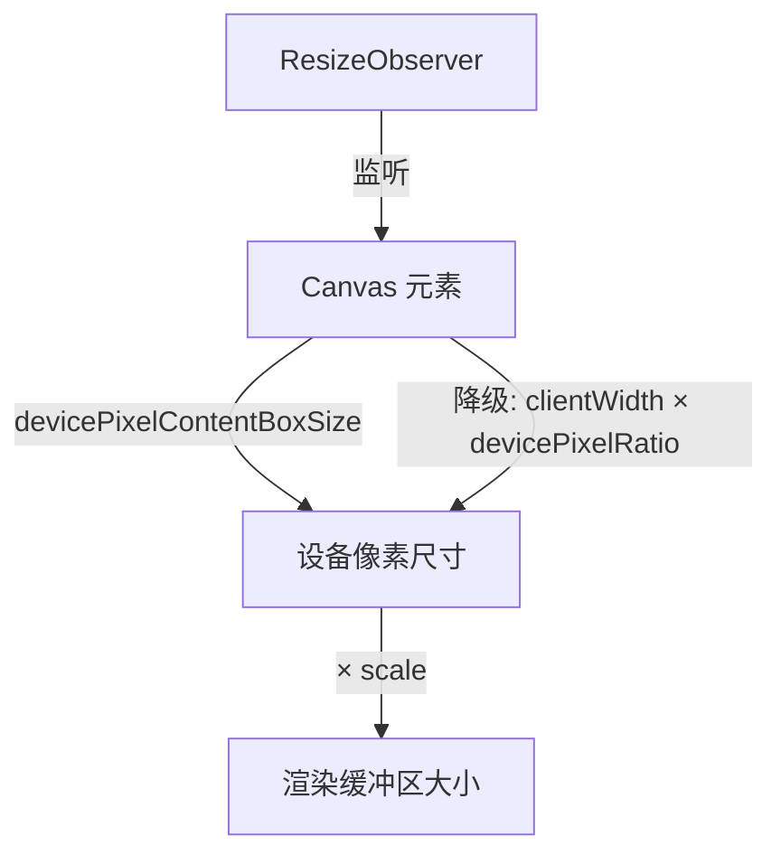

引擎封装了不同平台的画布，如 [WebCanvas](/apis/rhi-webgl/#WebCanvas) 支持用 [Engine](/apis/core/#Engine) 控制 [HTMLCanvasElement](https://developer.mozilla.org/en-US/docs/Web/API/HTMLCanvasElement) 或者 [OffscreenCanvas](https://developer.mozilla.org/en-US/docs/Web/API/OffscreenCanvas) 。若无特殊说明，文档中画布一般都为 `WebCanvas` 。

## 基础使用

### 创建画布

在 HTML 中插入一个 `<canvas>` 标签，指定一个 id：

```html
<canvas id="canvas" style="width: 500px; height: 500px" />
```

> 开发者要注意检查 canvas 的高度和宽度，避免出现高度或宽度的值为 **0** 导致渲染不出来。

创建 WebGLEngine 实例的时候会自动创建一个 WebCanvas 实例。其中，参数 `canvas` 是 _Canvas_ 元素的 `id`。

```typescript
const engine = await WebGLEngine.create({ canvas: "canvas" });

console.log(engine.canvas); // => WebCanvas 实例
```

### 自动分辨率（默认）

默认情况下，画布会自动跟随显示尺寸调整渲染缓冲区，并适配设备像素比，无需手动干预：

```typescript
// 画布自动适配尺寸，开箱即用
const engine = await WebGLEngine.create({ canvas: "canvas" });
```

当画布的显示尺寸发生变化时（比如浏览器窗口发生变化），画布会自动调整渲染缓冲区大小，画面始终保持清晰。一般情况下默认行为已经可以满足适配需求，如果你有更复杂的适配需求，请阅读"高级使用"部分。

### 自定义缩放比例

使用 `setAutoResolution(scale)` 控制设备像素比的缩放倍率。`scale` 参数默认为 `1`（原生清晰度）：

```typescript
// 原生清晰度（1x 设备像素比）
engine.canvas.setAutoResolution();

// 降低 GPU 负载 — 以原生 70% 分辨率渲染
engine.canvas.setAutoResolution(0.7);

// 超采样 — 以原生 2x 分辨率渲染
engine.canvas.setAutoResolution(2);
```

调用 `setAutoResolution` 会将画布切回自动适配模式，覆盖之前 `setResolution` 的设置。

### 手动控制分辨率

如果需要对渲染缓冲区大小进行精确控制，可使用 `setResolution`：

```typescript
// 将渲染缓冲区锁定为固定分辨率，不再跟随显示尺寸变化
engine.canvas.setResolution(1920, 1080);
```

调用 `setResolution` 后，画布不再跟随显示尺寸变化，始终保持在指定的分辨率，直到再次调用 `setAutoResolution` 恢复自动适配。`width` 和 `height` 属性为只读，反映当前渲染缓冲区的实际分辨率。

## 高级使用

关于适配，核心要注意的点是**设备像素比**，以 iPhoneX 为例，设备像素比 `window.devicePixelRatio` 为 _3_，窗口宽度 `window.innerWidth` 为 _375_，屏幕物理像素宽度则为：375 * 3 = *1125*。

渲染压力和屏幕物理像素高宽成正比，物理像素越大，渲染压力越大，也就越耗电。画布的高宽建议通过 [WebCanvas](/apis/rhi-webgl/WebCanvas) 暴露的 API 设置，不建议使用原生 canvas 的 API，如 `canvas.width` 或 `canvas.style.width` 这些方法修改。

> **注意**：有些前端脚手架会插入以下标签修改页面的缩放比：
>
> `<meta name="viewport" content="width=device-width, initial-scale=0.333333333">`
>
> 这行代码会把 `window.innerWidth` 的值从 375 修改为 1125。

### 自动分辨率工作原理



引擎通过 `ResizeObserver` 监听 canvas 元素的尺寸变化。每次尺寸变化时，observer 捕获 canvas 的设备像素尺寸，然后引擎从以下两种来源之一计算渲染缓冲区大小：

- **`devicePixelContentBoxSize`（Chrome/Edge/Firefox）**：已直接表示设备像素，只需乘以 `scale`
- **`clientWidth × devicePixelRatio`（Safari 降级方案）**：CSS 像素先乘以设备像素比，再乘以 `scale`

尺寸更新推迟到下一帧（`engine.update()` 时）执行，避免画面撕裂。

### 节能模式

考虑到移动端设备虽然是高清屏幕（设备像素比高）但实际显卡性能并不能很好地满足高清实时渲染的性能要求的情况（**3 倍屏和 2 倍屏渲染面积比是 9:4，3 倍屏较容易造成手机发烫**），可以通过缩放倍率来降低 GPU 负载：

```typescript
engine.canvas.setAutoResolution(2 / 3);
```

### 固定宽度模式

某些情况下，比如设计稿固定 750 宽度的情况，开发者有可能会写死画布宽度来降低适配成本：

```typescript
import { WebCanvas } from "@galacean/engine";

const canvas = document.getElementById("canvas") as HTMLCanvasElement;
const webCanvas = new WebCanvas(canvas);
const fixedWidth = 750;

const scale = window.innerWidth / fixedWidth;
webCanvas.setResolution(fixedWidth, Math.round(window.innerHeight / scale));
webCanvas.setScale(scale, scale);
```
