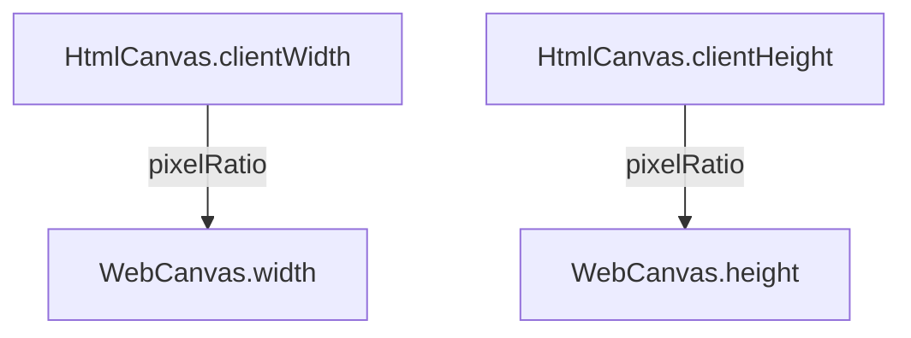

`Engine` 在扮演着总控制器的角色，主要包含了**画布**、**渲染控制**和**引擎子系统管理**等功能：

- **[画布](/docs/core/canvas)**：主画布相关的操作，如修改画布宽高等。
- **渲染控制**： 控制渲染的执行/暂停/继续、垂直同步等功能。
- **引擎子系统管理**： [场景管理](/docs/core/scene)、[资源管理](/docs/assets/overall)、[物理系统](/docs/physics/overall) 、[交互系统](/docs/input/input/)、[XR 系统](/docs/xr/overall)
- **执行环境的上下文管理**：控制 WebGL 等执行环境的上下文管理。

## 初始化

为了方便用户直接创建 web 端 engine，我们提供了 [WebGLEngine](/apis/rhi-webgl/#WebGLEngine)，支持 WebGL1.0 和 WebGL2.0。

```typescript
const engine = await WebGLEngine.create({
  canvas: "canvas-id",
  colorSpace: {...},
  graphicDeviceOptions: {...}，
  gltf: {...},
  ktx2Loader: {...}                                   
});
```

下方是创建引擎时传入[配置](/apis/galacean/#WebGLEngineConfiguration)的类型说明：

| 配置                                                         | 解释                                                         |
| ------------------------------------------------------------ | ------------------------------------------------------------ |
| canvas                                                       | 可以是画布 ID（ `string`） 或画布对象（`HTMLCanvasElement |OffscreenCanvas`）。 |
| [graphicDeviceOptions](/apis/galacean/#WebGLGraphicDeviceOptions) | 图形设备相关配置，比如 `webGLMode` 可以用 控制 WebGL1/2。除 `webGLMode` 外的属性将透传给上下文，详情可参考 [getContext 参数释义](https://developer.mozilla.org/en-US/docs/Web/API/HTMLCanvasElement/getContext#parameters)。 |
| [colorSpace](/apis/galacean/#ColorSpace)                     | 颜色空间, `ColorSpace.Gamma` 或 `ColorSpace.Linear`。        |
| gltf                                                         | gltf Loader 配置，`workerCount` 用来配置 meshOpt 的 worker 数量：`{ meshOpt: { workerCount: number } }` 。 |
| ktx2Loader                                                   | KTX2 Loader 配置，`workerCount` 用来配置 ktx2 解码器的worker 数量：`{ priorityFormats: Array<KTX2TargetFormat>; transcoder: KTX2Transcoder; workerCount: number }`。如果 workCount 大于 0，将会创建 worker 线程，等于 0 则只用主线程。 |


更多相关配置信息，可参考[物理系统](/docs/physics/overall)、[交互系统](/docs/input/input/)、[XR 系统](/docs/xr/overall)。

## 属性

| 属性名称 | 属性释义 |
| --- | --- |
| [time](/apis/core/#Engine-time) | 引擎时间相关信息，详情可参考[时间](/docs/core/time/) |
| [vSyncCount](/apis/core/#Engine-vSyncCount) | 垂直同步刷新率，引擎默认开启[垂直同步](https://baike.baidu.com/item/%E5%9E%82%E7%9B%B4%E5%90%8C%E6%AD%A5/7263524?fromtitle=V-Sync&fromid=691778)且刷新率 `vSyncCount` 为`1` （与屏幕刷新率保持一致）。若 `vSyncCount` 设置为`2`，则屏幕每刷新 2 帧，引擎更新 1 次。 |
| [resourceManager](/apis/core/#Engine-resourceManager) | 资源管理器，一般通过它进行资产的[加载](/docs/assets/load/)和[释放](/docs/assets/gc/) |
| [sceneManager](/apis/core/#Engine-sceneManager) | 场景管理器。Galacean 支持多场景同时渲染，通过场景管理器可以方便地管理当前场景的增删改查，详情可参考[场景](/docs/core/scene/) |
| [inputManager](/apis/core/#Engine-inputManager) | 交互管理器，一般通过它获取键盘，触控与滚轮信息，详情可参考[交互](/docs/input/input/) |

### 刷新率

默认情况下引擎采用垂直同步模式并使用 [vSyncCount](/apis/core/#Engine-vSyncCount) 控制渲染刷新率，该模式才渲染帧会等待屏幕的垂直同步信号， [vSyncCount](/apis/core/#Engine-vSyncCount) 代表了渲染帧之间期望的屏幕同步信号次数，默认值为 1，该属性的值必须为整数，例如我们想在一个屏幕刷新率为 60 帧的设备上期望每秒渲染 30 帧，则可以将该值设置为 2。

另外用户还可以关闭垂直同步，即将 [vSyncCount](/apis/core/#Engine-vSyncCount) 设置为 0，然后设置 [targetFrameRate](/apis/core/#Engine-targetFrameRate) 为期望的帧数值，该模式下的渲染不考虑垂直同步信号，而是，如 120 表示 120 帧，即每秒期望刷新 120 次。

```typescript
// 垂直同步
engine.vSyncCount = 1;
engine.vSyncCount = 2;

// 非垂直同步
engine.vSyncCount = 0;
engine.targetFrameRate = 120;
```

> ⚠️ 不建议使用非垂直同步

## 方法

| 方法名称                              | 方法释义           |
| ------------------------------------- | ------------------ |
| [run](/apis/core/#Engine-run)         | 执行引擎渲染帧循环 |
| [pause](/apis/core/#Engine-pause)     | 暂停引擎渲染帧循环 |
| [resume](/apis/core/#Engine-resume)   | 恢复引擎渲渲染循环 |
| [destroy](/apis/core/#Engine-destroy) | 销毁引擎           |


## 画布

### 创建画布

在 HTML 中插入一个 `<canvas>` 标签，指定一个 id：

```html
<canvas id="canvas" style="width: 500px; height: 500px" />
```

> 开发者要注意检查 canvas 的高度和宽度，避免出现高度或宽度的值为 **0** 导致渲染不出来。

创建 WebGLEngine 实例的时候会自动创建一个 WebCanvas 实例。其中，参数 `canvas` 是 _Canvas_ 元素的 `id`。

```typescript
const engine = await WebGLEngine.create({ canvas: "canvas" });

console.log(engine.canvas); // => WebCanvas 实例
```

### 基础适配

画布尺寸一般通过**设备像素比**控制，以 [WebCanvas](/apis/rhi-webgl/#WebCanvas) 为例：



若通过编辑器导出 **NPM package** 进行开发，只需在[项目导出](/docs/platform/platform)渲染导出配置处控制**设备像素比**即可。


或在代码中主动调用 `resizeByClientSize` 适配画布。

```typescript
// 使用设备像素比（ window.devicePixelRatio ）调整画布尺寸，
engine.canvas.resizeByClientSize();
// 自定义像素比调整画布尺寸
engine.canvas.resizeByClientSize(1.5);
```

> 当画布的显示尺寸发生变化时（比如浏览器窗口发生变化时），画面可能出现拉伸或压缩，可以通过调用 `resizeByClientSize` 来恢复正常。一般情况下这行代码已经可以满足适配的需求，如果你有更复杂的适配需求，请阅读“高级使用”部分。

## 高级使用

关于适配，核心要注意的点是**设备像素比**，以 iPhoneX 为例，设备像素比 `window.devicePixelRatio` 为 _3_，  窗口宽度 `window.innerWidth` 为 _375_，屏幕物理像素宽度则为：375 * 3 = *1125\*。

渲染压力和屏幕物理像素高宽成正比，物理像素越大，渲染压力越大，也就越耗电。画布的高宽建议通过 [WebCanvas](/apis/rhi-webgl/WebCanvas) 暴露的 API 设置，不建议使用原生 canvas 的 API ，如 `canvas.width` 或 `canvas.style.width` 这些方法修改。

> ️ **注意**：有些前端脚手架会插入以下标签修改页面的缩放比：
>
> `<meta name="viewport" content="width=device-width, initial-scale=0.333333333">`
>
> 这行代码会把 `window.innerWidth` 的值从 375 修改为 1125。

除了 `resizeByClientSize` 自动适配，推荐使用以下两种模式：

### 节能模式

考虑到移动端设备虽然是高清屏幕（设别像素比高）但实际显卡性能并不能很好地满足高清实时渲染的性能要求的情况（**3 倍屏和 2 倍屏渲染面积比是 9:4，3 倍屏较容易造成手机发烫**），此模式下引擎通过对画布缩放拉伸来达到适配的目的。代码如下：

```typescript
const canvas = document.getElementById("canvas");
const webcanvas = new WebCanvas(canvas);
const pixelRatio = window.devicePixelRatio; // 如果已经设置 meta scale，请设置为 1
const scale = 3 / 2; // 3 倍高清屏按 2 倍屏来计算画布尺寸

/**
 * 设置节能模式，默认全屏，也可以自己设置任意高宽
 */
webcanvas.width = (window.innerWidth * pixelRatio) / scale;
webcanvas.height = (window.innerHeight * pixelRatio) / scale;
webcanvas.setScale(scale, scale); // 拉伸画布
```

如果已经通过 CSS 设置了画布高宽（比如 `width: 100vw; height: 100vh;`），那么可以通过 `resizeByClientSize` 传参实现画布的缩放：

```typescript
const canvas = document.getElementById("canvas");
const webcanvas = new WebCanvas(canvas);
const scale = 2 / 3; // 3 倍高清屏按 2 倍屏来计算画布尺寸

webcanvas.resizeByClientSize(scale); // 拉伸画布
```

### 固定宽度模式

某些情况下，比如设计稿固定 750 宽度的情况，开发者有可能会写死画布宽度来降低适配成本。代码如下：

```typescript
import { WebCanvas } from "@galacean/engine";

const canvas = document.getElementById("canvas");
const webcanvas = new WebCanvas(canvas);
const fixedWidth = 750; // 固定 750 宽度

/**
 * 设置固定宽度模式
 */
const scale = window.innerWidth / fixedWidth;
webcanvas.width = fixedWidth;
webcanvas.height = window.innerHeight / scale;
webcanvas.setScale(scale, scale); // 拉伸画布
```