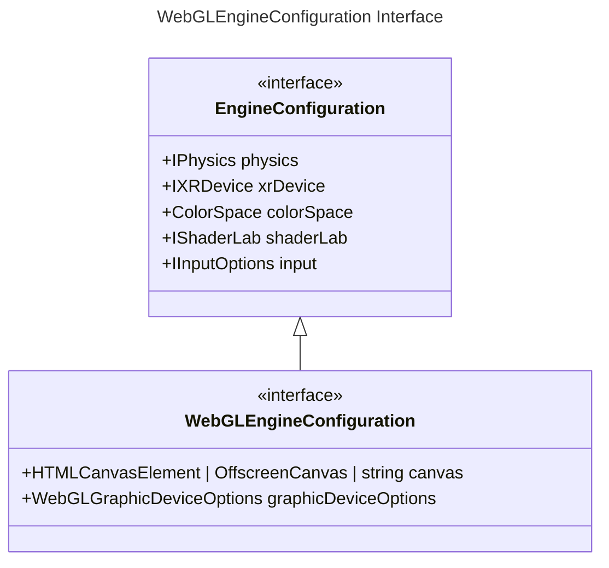

`Engine` 在 Galacean Engine 中扮演着总控制器的角色，主要包含了**画布**、**渲染控制**和**引擎子系统管理**等功能：

- **[画布](/docs/core/canvas)**：主画布相关的操作，如修改画布宽高等。
- **渲染控制**： 控制渲染的执行/暂停/继续、垂直同步等功能。
- **引擎子系统管理**：
  - [场景管理](/docs/core/scene)
  - [资源管理](/docs/assets-overall)
  - [物理系统](/docs/physics-overall)
  - [交互系统](/docs/input)
  - [XR 系统](/docs/xr-overall)
- **执行环境的上下文管理**：控制 WebGL 等执行环境的上下文管理。

## 初始化

为了方便用户直接创建 web 端 engine，Galacean 提供了 [WebGLEngine](${api}rhi-webgl/WebGLEngine) ：

```typescript
const engine = await WebGLEngine.create({ canvas: "canvas" });
```

`WebGLEngine.create` 不仅承担着实例化引擎的职责，还负责渲染上下文的配置和某些子系统的初始化，下方是创建引擎时传入配置的类型说明：



编辑器导出的项目通常自动设置了编辑器配置的相关选项，比如开发者可以在 [导出界面](/docs/assets-build) 设置上下文的渲染配置：


又或者在编辑器的项目设置界面选择物理后端与 XR 后端：


您也可以修改代码变更引擎配置，拿**画布透明**来举例，引擎默认是将画布的透明通道开启的，即画布会和背后的网页元素混合，如果需要关闭透明，可以这样设置：

```typescript
const engine = await WebGLEngine.create({
  canvas: htmlCanvas,
  graphicDeviceOptions: { alpha: false }
});
```

类似的，可以用 `webGLMode` 控制 WebGL1/2，除 `webGLMode` 外的属性将透传给上下文，详情可参考 [getContext 参数释义](https://developer.mozilla.org/en-US/docs/Web/API/HTMLCanvasElement/getContext#parameters)。

更多相关配置信息，可参考[物理系统](/docs/physics-overall)、[交互系统](/docs/input)、[XR 系统](/docs/xr-overall)。

## 属性

| 属性名称 | 属性释义 |
| --- | --- |
| [time](/apis/core/#Engine-time) | 引擎时间相关信息，详情可参考[时间](/docs/core/time/) |
| [vSyncCount](/apis/core/#Engine-vSyncCount) | 垂直同步刷新率，引擎默认开启[垂直同步](https://baike.baidu.com/item/%E5%9E%82%E7%9B%B4%E5%90%8C%E6%AD%A5/7263524?fromtitle=V-Sync&fromid=691778)且刷新率 `vSyncCount` 为`1` （与屏幕刷新率保持一致）。若 `vSyncCount` 设置为`2`，则屏幕每刷新 2 帧，引擎更新 1 次。 |
| [resourceManager](/apis/core/#Engine-resourceManager) | 资源管理器，一般通过它进行资产的[加载](/docs/assets/load/)和[释放](/docs/assets/gc/) |
| [sceneManager](/apis/core/#Engine-sceneManager) | 场景管理器。Galacean 支持多场景同时渲染，通过场景管理器可以方便地管理当前场景的增删改查，详情可参考[场景](/docs/core/scene/) |
| [inputManager](/apis/core/#Engine-inputManager) | 交互管理器，一般通过它获取键盘，触控与滚轮信息，详情可参考[交互](/docs/input/input/) |

### 刷新率

默认情况下引擎采用垂直同步模式并使用 [vSyncCount](/apis/core/#Engine-vSyncCount) 控制渲染刷新率，该模式才渲染帧会等待屏幕的垂直同步信号， [vSyncCount](/apis/core/#Engine-vSyncCount) 代表了渲染帧之间期望的屏幕同步信号次数，默认值为 1，该属性的值必须为整数，例如我们想在一个屏幕刷新率为 60 帧的设备上期望每秒渲染 30 帧，则可以将该值设置为 2。

另外用户还可以关闭垂直同步，即将 [vSyncCount](/apis/core/#Engine-vSyncCount) 设置为 0，然后设置 [targetFrameRate](/apis/core/#Engine-targetFrameRate) 为期望的帧数值，该模式下的渲染不考虑垂直同步信号，而是，如 120 表示 120 帧，即每秒期望刷新 120 次。

```typescript
// 垂直同步
engine.vSyncCount = 1;
engine.vSyncCount = 2;

// 非垂直同步
engine.vSyncCount = 0;
engine.targetFrameRate = 120;
```

> ⚠️ 不建议使用非垂直同步

## 方法

| 方法名称                              | 方法释义           |
| ------------------------------------- | ------------------ |
| [run](/apis/core/#Engine-run)         | 执行引擎渲染帧循环 |
| [pause](/apis/core/#Engine-pause)     | 暂停引擎渲染帧循环 |
| [resume](/apis/core/#Engine-resume)   | 恢复引擎渲渲染循环 |
| [destroy](/apis/core/#Engine-destroy) | 销毁引擎           |
