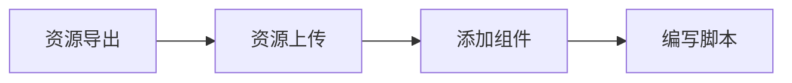

Spine 动画是一款针对游戏开发的 `2D 骨骼动画`，它通过将图片绑定到骨骼上，然后再控制骨骼实现动画，它可以满足程序对动画的`控制`与`自由度`，同时也为美术与设计提供了更`高效`和`简洁`的工作流。

|        | 表现效果 | 性能 | 文件体积 | 灵活程度 | 上手难度 | 是否免费 |
| ------ | -------- | ---- | -------- | -------- | -------- | -------- |
| Spine  | 最优     | 次之 | 最优     | 最优     | 最复杂   | 工具收费 |
| Lottie | 次之     | 最差 | 次之     | 次之     | 次之     | 免费     |
| 帧动画 | 最差     | 最优 | 最差     | 最差     | 最简单   | 免费     |

Spine 动画支持换皮换肤，动画混合以及使用代码控制骨骼。

## 在编辑器中使用

在编辑器中使用 spine 包含下面几个步骤：



### 资源导出

下载 [Spine 编辑器](https://zh.esotericsoftware.com/)，并选择 3.8 版本制作动画（目前仅支持 3.8 版本）。通过 spine 编辑器的导出功能能够导出所需的资源文件。导出后，在目标文件夹内会看到 .json（或者.bin）, atlas, png 三种格式的资源文件。[点击下载示例文件](https://mdn.alipayobjects.com/portal_h1wdez/afts/file/A*uhFUSbeI5z0AAAAAAAAAAAAAAQAAAQ)

> Galacean Spine 运行时目前只支持加载单张纹理，所以当贴图尺寸过大时，需要对图片资源进行缩放处理，把贴图的张数控制在一张。
> 文件导出的详细配置见 spine 官方文档：[http://zh.esotericsoftware.com/spine-export](http://zh.esotericsoftware.com/spine-export/)

### 资源上传

资源导出后，开发者需要同时把三个文件上传到 Galacean Editor。通过 **[资产面板](/docs/assets-interface)** 的上传按钮选择 “spine” 资产，选择本地的这三个文件，上传成功后能够在资产面板看到上传的 spine 资产：


也可以直接把三个文件拖动到资产区域完成上传：


完成上传后，能够在 Asset 面板看到上传的 spine 素材：


### 添加组件

完成资源上传后，在编辑器左侧节点树中添加一个 spine 渲染节点（一个自带 SpineRenerer 组件的节点），选择 resource 为上一步上传的资产，选择动画名称即可播放 spine 动画（如果不选择，默认第一个）。


Spine 渲染组件的属性如下：

| 属性        | 功能说明                                         |
| :---------- | :----------------------------------------------- |
| `Resource`  | 选择 Spine 资产                                  |
| `AutoPlay`  | 是否自动播放                                     |
| `loop`      | 是否循环播放                                     |
| `Animation` | 动画名称                                         |
| `SkinName`  | 皮肤名称                                         |
| `Scale`     | 动画缩放                                         |
| `priority`  | 渲染优先级，值越小，渲染优先级越高，越优先被渲染 |

### 编写脚本

如果需要对 spine 动画进行额外的逻辑编写，就需要借助编辑器的脚本功能了。创建一个脚本资源，并给上一小节创建的节点添加一个脚本组件，选择创建好的脚本。


双击素材面板中的脚本，或者点击脚本组件的编辑按钮，能够进入脚本编辑器，在脚本编辑器中可以从当前 entity 上获取 spine 渲染组件，通过组件 API 进行更多操作。比如，主动播放某一段动画：


更详细的 API 请参考下面的章节。

## 在代码中使用

### 安装

首先需要手动添加 [@galacean/engine-spine](https://github.com/galacean/engine-spine) 二方包。

```bash
npm i @galacean/engine-spine --save
```

### 资源导出

安装了二方包后，与在编辑器中使用一样，需要下载 [Spine 编辑器](https://zh.esotericsoftware.com/)，并选择 3.8 版本制作动画（目前仅支持 3.8 版本）。通过 spine 编辑器的导出功能能够导出所需的资源文件。导出后，在目标文件夹内会看到 .json（或者.bin）, atlas, png 三种格式的资源文件。[点击下载示例文件](https://mdn.alipayobjects.com/portal_h1wdez/afts/file/A*uhFUSbeI5z0AAAAAAAAAAAAAAQAAAQ)

### 资源加载

在代码中，引入了 _@galacean/engine-spine_ 后，会自动在 [engine]($%7Bapi%7Dcore/Engine) 的 [resourceManager]($%7Bapi%7Dcore/Engine#resourceManager) 上注册 spine 资源的资源加载器。通过 resourceManager 的 [load]($%7Bapi%7Dcore/ResourceManager/#load) 方法能够加载 spine 动画资源。

- 当传递参数为 url 时，默认 spine 动画的资源拥有同样的 baseUrl，仅需传递 json（或者 bin） 文件的 cdn 即可。
- 当传递参数为 urls 数组时，需要传递 json（或者 bin），atlas， image（png，jpg）三个资源的 cdn 地址。
- 资源的 type 必须指定为 spine。

加载完毕后，会返回一个 SpineResouce。我们需要创建一个节点，添加 Spine 渲染器，然后指定渲染器的资源为返回的 SpineResouce。请参考下方示例中的代码：

<playground src="spine-animation.ts"></playground>

### 动画播放

Spine 渲染器（SpineRenderer） 提供了多种动画播放的方法。

1. 通过 animationName,autoPlay,loop 属性播放。当设置了 animationName 为待播放的动画名称，且 autoplay 为 true 时，对应名称动画会自动播放。通过 loop 能够控制是否循环播放。

```javascript
const spineRenderer = spineEntity.getComponent(SpineRenderer);
spineRenderer.animationName = "idle";
spineRenderer.autoPlay = true;
spineRenderer.loop = true;
```

2. 调用 play 方法播放。play 方法支持传入动画名称和是否循环两个参数。

```javascript
const spineRenderer = spineEntity.getComponent(SpineRenderer);
spineRenderer.play("idle", true);
```

3. 从 spineAnimation 属性上，能够获取 spine 的 [AnimationState](http://zh.esotericsoftware.com/spine-api-reference#AnimationState) 以及 [Skeleton](http://zh.esotericsoftware.com/spine-api-reference#Skeleton) 接口，能够借助 spine-core 原生 API 来播放动画。

```javascript
const spineRenderer = spineEntity.getComponent(SpineRenderer);
spineRenderer.spineAnimation.state.setAnimation(0, "idle", true);
```

#### 动画控制

借助 Spine 渲染器(SpineRenderer) 的 spineAnimation 暴露的 AnimationState 对象，能够实现动画的控制，比如循环播放动画，暂停动画播放等。这里可以参考下面的示例。
详细的 API 可以参考 AnimationState 的官方文档：[http://zh.esotericsoftware.com/spine-api-reference#AnimationState](http://zh.esotericsoftware.com/spine-api-reference#AnimationState)

### 动画事件机制

spine 还提供了一些事件方便用户进行开发。动画事件的机制如下图所示：

详细文档：
[http://esotericsoftware.com/spine-unity-events](http://esotericsoftware.com/spine-unity-events)
通过 AnimationState 的 addListener 方法，能够在不同的事件触发时，添加回调方法。

### 换肤

运行时提供了多种方法来进行换肤。最简单的方式是通过 Spine 渲染器的 skinName 属性进行换肤。

```javascript
const spineRenderer = spineEntity.getComponent(SpineRenderer);
spineRenderer.skinName = "skin1";
```

也可以通过 spine-core 原生 API 来进行换肤。请参考下方示例：
<playground src="spine-skin-change.ts"></playground>

#### 附件替换

借助原生 API 能够实现 spine 的附件替换，从而实现部分换装的效果。请参考下方示例：
<playground src="spine-change-attachment.ts"></playground>

#### 插槽拆分

spine 组件会合并 spine 动画的所有顶点生成一个 `Mesh`。使用 `addSeparateSlot` 方法能够将指定名称的插槽拆分成单独的 `SubMesh`，然后使用 `hackSeparateSlotTexture` 方法，能够替换拆分插槽的材质。通过这种方式，也能实现局部换装的效果。请参考下方示例：

<playground src="spine-hack-slot-texture.ts"></playground>
