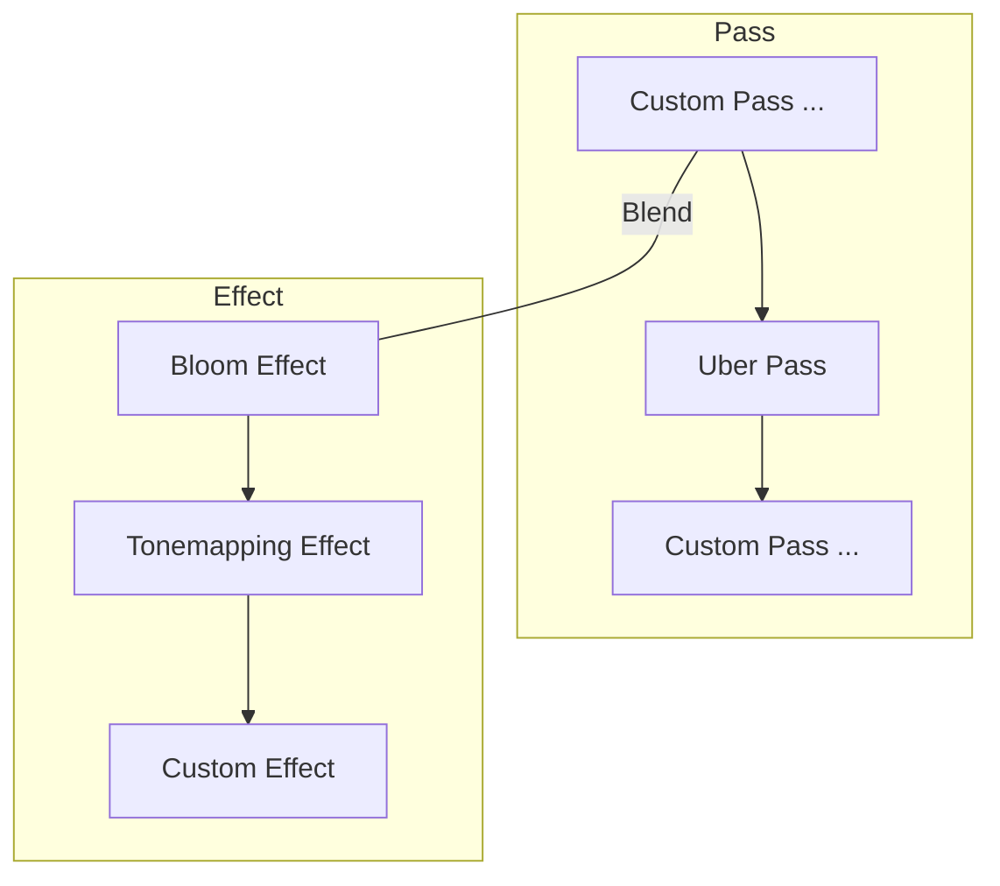

在后处理系统中，特效([Effect](/apis/core/#PostProcessEffect)) 负责数据层的维护，管线([Pass](/apis/core/#PostProcessPass))负责渲染逻辑的编写，在管线中调用 [getBlendEffect](/apis/core/#PostProcessManager-getBlendEffect) 方法可以拿到经过 **全局/局部** 混合后的最终后处理数据。



引擎内置了 [PostProcessUberPass](/apis/core/#PostProcessUberPass)，搭配 [BloomEffect](/apis/core/#BloomEffect) 和 [TonemappingEffect](/apis/core/#TonemappingEffect) 的数据使用，如果想要自定义后处理特效，我们需要新建一个 Pass，然后根据是否需要融合数据来创建 Effect。

## 一个 Demo

这里就简单地实现一个灰度图的后处理效果吧～

<Comparison
  leftSrc="https://gw.alipayobjects.com/zos/OasisHub/f5d3ea3d-47a4-4618-b3d6-0ea46321e786/image-20250115162952605.png"
  leftText="Uber Pass"
  rightSrc="https://gw.alipayobjects.com/zos/OasisHub/75ccba72-b70b-49f6-812a-e00305e89201/image-20250115163026345.png"
  rightText="Uber Pass + Custom Pass"
/>

### 1. 添加脚本

我们先创建一个脚本，接下去我们要在这个脚本文件里面编写我们的自定义后处理 Shader 和 Pass。

<Image src="https://gw.alipayobjects.com/zos/OasisHub/6df5fd1c-a24c-4e32-a62e-841b61fe76c7/image-20250124111456360.png" />

我们参考[添加后处理方式](/docs/graphics/postProcess/postProcess/#1添加后处理组件)添加全局或者局部后处理组件，并且将脚本挂到这个实体上面：

<Image src="https://gw.alipayobjects.com/zos/OasisHub/62a36df2-fdc5-4c13-9a32-c41f963d18b5/image-20250124112043221.png" />

### 2. Shader 编写

算法没有特殊的， 需要注意 `renderer_BlitTexture` 这个内置变量就是上一个 Pass 的后处理渲染结果，在此处就是 Bloom 和 Tonemapping 后的结果，我们针对这个结果进行了灰度显示。

```ts showLineNumbers {14} filename="CustomPostProcessPass.ts"
const customShader = Shader.create(
  "Gray Scale Shader",
  `
  attribute vec4 POSITION_UV;
  varying vec2 v_uv;

  void main() {	
	  gl_Position = vec4(POSITION_UV.xy, 0.0, 1.0);	
	  v_uv = POSITION_UV.zw;
  }
  `,
  `
  varying vec2 v_uv;
  uniform sampler2D renderer_BlitTexture;

  void main(){
    vec4 color = texture2D(renderer_BlitTexture, v_uv);
    float grayScale = 0.299 * color.r + 0.587 * color.g + 0.114 * color.b;
    gl_FragColor = vec4(vec3(grayScale), 1.0);
  }
  `
);
```

### 3. 新建 Pass

我们新建一个 Pass，在 [onRender 钩子](/apis/core/#PostProcessUberPass-onRender) 里面直接 [Blitter](/apis/core/#Blitter) 到屏幕，然后将这个 Pass 添加到引擎中。

```ts showLineNumbers {15,20} filename="CustomPostProcessPass.ts"
class CustomPass extends PostProcessPass {
  private _blitMaterial: Material;

  constructor(engine: Engine) {
    super(engine);
    this._blitMaterial = new Material(this.engine, customShader);

    // 我们这里关掉深度测试和深度写入，保证每次 Blit 都能覆盖到屏幕上。
    const depthState = this._blitMaterial.renderState.depthState;
    depthState.enabled = false;
    depthState.writeEnabled = false;
  }

  onRender(_, srcTexture: Texture2D, dst: RenderTarget): void {
    Blitter.blitTexture(this.engine, srcTexture, dst, undefined, undefined, this._blitMaterial, 0);
  }
}

const customPass = new CustomPass(engine);
engine.addPostProcessPass(customPass);
```

Pass 的执行顺序默认在 Uber Pass 的后面执行，即 [`PostProcessPassEvent.AfterUber`](/apis/core/#PostProcessPassEvent-AfterUber)，我们也可以手动修改管线的执行顺序：

```ts filename="CustomPostProcessPass.ts"
customPass.event = PostProcessPassEvent.BeforeUber;
```

Pass 是否生效默认是根据 Pass 的 [isActive](/apis/core/#PostProcessUberPass-isActive) 来决定的，我们也可以修改生效逻辑，比如强度是否大于 0 ：

```ts showLineNumbers {2-9} filename="CustomPostProcessPass.ts"
class CustomPass extends PostProcessPass {
  override isValid(postProcessManager: PostProcessManager): boolean {
    if (!this.isActive) {
      return false;
    }

    const customEffectBlend = postProcessManager.getBlendEffect(CustomEffect);
    return customEffectBlend?.intensity > 0;
  }
}
```

### 4. 融合数据

上述 2、3 步骤已经能够自定义后处理效果，这里再来一个进阶版的融合数据。

拿 `intensity` 举例，我们定义一个 `CustomEffect`，专门用来融合强度，需要融合的数据也很简单，引擎已经封装了一系列后处理参数，如[浮点类型参数](/apis/core/#PostProcessEffectFloatParameter)。

```ts showLineNumbers {2,7} filename="CustomPostProcessPass.ts"
class CustomEffect extends PostProcessEffect {
  intensity = new PostProcessEffectFloatParameter(0.8);
}

// 将这个 effect 添加到后处理组件中，postProcess 可以是单独新建的，
// 也可以是跟 Bloom 等 effect 同一个，具体看融合的需求～
postProcess.addEffect(CustomEffect);
```

定义好数据后，需要在自定义 Pass 的 `onRender` 钩子中，改成获取融合数据:

```ts showLineNumbers {3-6} filename="CustomPostProcessPass.ts"
class CustomPass extends PostProcessPass {
  onRender(camera: Camera, srcTexture: Texture2D, dst: RenderTarget): void {
    const postProcessManager = camera.scene.postProcessManager;
    const customEffectBlend = postProcessManager.getBlendEffect(CustomEffect);
    if (customEffectBlend) {
      this._blitMaterial.shaderData.setFloat("u_intensity", customEffectBlend.intensity.value);
    }

    Blitter.blitTexture(this.engine, srcTexture, dst, undefined, undefined, this._blitMaterial, 0);
  }
}
```

可以看到，我们在自定义管线的 `onRender` 钩子中，不断设置融合后的强度，然后在 shader 中消费这个数据即可：

```ts showLineNumbers {8,12} filename="CustomPostProcessPass.ts"
const customShader = Shader.create(
  "Gray Scale Shader",
  `
   ......
  `,
  `
  ......
  uniform float u_intensity;

  void main(){
    ......
    gl_FragColor = vec4(mix(color.rgb, vec3(grayScale), u_intensity), 1.0);
  }
  `
);
```

如果你的后处理组件是局部模式，我们还可以通过 [Blend Distance](/apis/core/#PostProcess-blendDistance) 来设置相机靠近碰撞体多少距离时开始混合：

<Image src="https://gw.alipayobjects.com/zos/OasisHub/76b084c1-f517-47d7-8067-7f838db002f8/2025-01-15%25252017.38.30.gif" />
