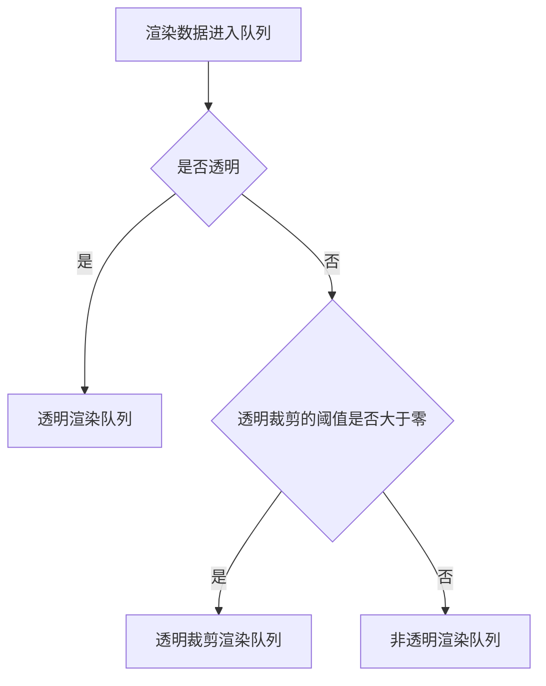
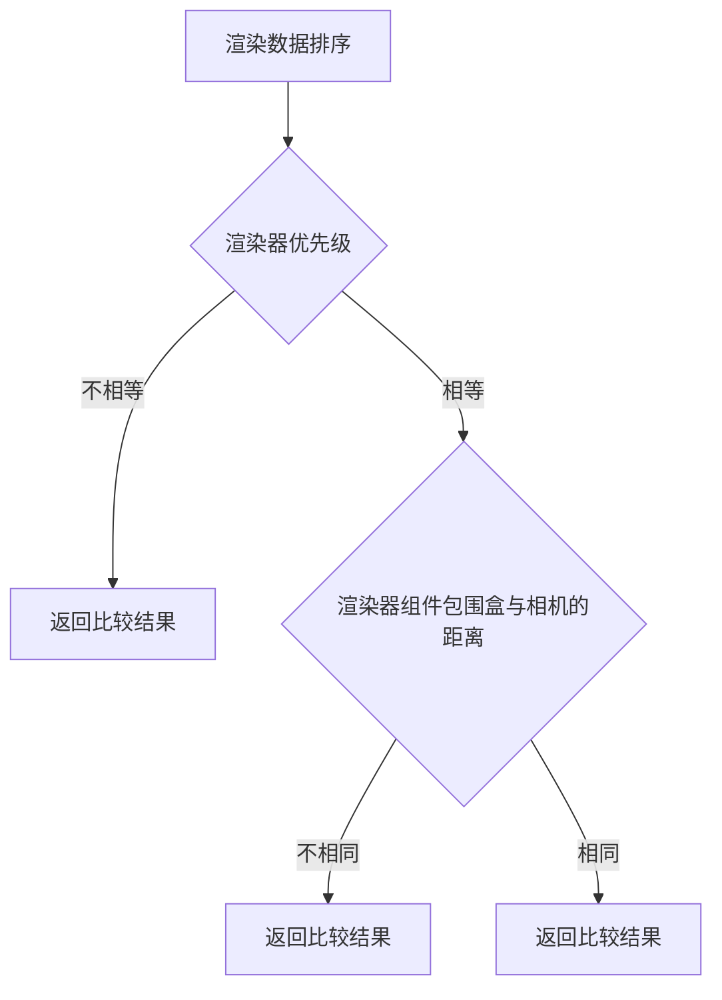

渲染器的渲染顺序会影响渲染的**性能**和**准确性**，在 Galacean 中，对于每个相机，组件会按照统一的**判定规则**放置在对应的**渲染队列**中。

## 渲染队列

Galacean 共划分了三个渲染队列，按照渲染顺序依次为：

- 非透明渲染队列（**Opaque**）
- 透明裁剪渲染队列（**AlphaTest**）
- 透明渲染队列（**Transparent**）

而渲染器分配到哪个队列由渲染器材质**是否透明**与**透明裁剪的阈值**共同决定。

## 判定规则

Galacean 中对渲染顺序的判定规则如下：

### 渲染器优先级

引擎为渲染器提供了 `priority` 属性用于修改渲染队列中的渲染顺序，默认值为 0 ，**priority 越小（可以为负数），渲染的优先级越高**。

### 渲染器组件包围盒到相机的距离

渲染器组件包围盒到相机距离的计算方式取决于[相机](/docs/graphics/camera/camera/)的类型。在正交相机中，是渲染器包围盒中心点与摄像机沿着摄像机视图方向的距离，在透视相机中，是渲染器包围盒中心点与摄像机位置的直接距离。

> 需要注意的是，不同渲染队列中，距离对渲染顺序的影响规则是不同的，在非透明渲染队列和透明裁剪渲染队列中中，渲染的顺序都是**由近到远**，而在透明渲染队列中，渲染的顺序则为**由远到近**。

