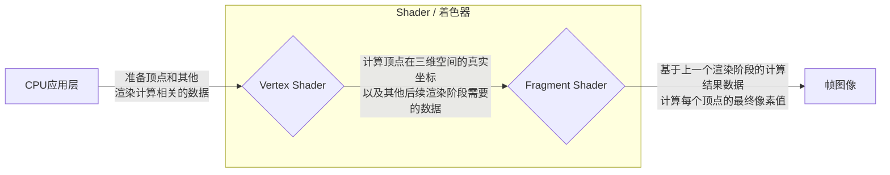

<Image src="https://gw.alipayobjects.com/zos/OasisHub/a3f74864-241e-4cd8-9ad4-733c2a0b2cc2/image-20240206153815596.png"  />

## 着色器简介

着色器(Shader)是一段运行在GPU中的程序，通常由2个“入口函数”组成，我们称之为顶点着色器(Vertex Shader)和片元着色器(Fragment Shader)，分别对应于渲染管线的两个不同阶段。下面是一幅简化的引擎渲染过程（渲染管线）的图示，我们聚焦于着色器部分进行描述

<figcaption style={{"text-align":"center", color: "#889096","font-size":"12px"}}>简化的渲染管线</figcaption>

本章节我们将介绍如下内容：
|小节|内容|
|:--:|:--:|
|[Shader对象](/class)|引擎中Shader对象的概括和基本用法|
|[内置着色器](/builtins/intro)|引擎内置的常用着色器|
|[Shader资产](/assets)|在编辑器中如何创建、修改Shader资产|
|[ShaderLab](/lab)|一种更为便捷的创建Shader的方式|

