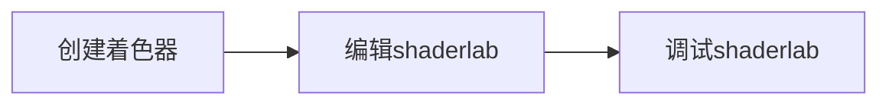

> 在[自定义着色器](./custom)章节我们了解到如何使用 WebGL 原生 GLSL 语言创建自定义 Shader，本节我们将介绍另一种创建 Shader 的方式 --- ShaderLab。

`ShaderLab` 是一个针对 Galacean 引擎打造的 Shader 包装语言，它允许开发人员使用熟悉的 [GLSL](https://www.khronos.org/files/opengles_shading_language.pdf) 语法编写自定义 Shader，同时提供了额外的高级抽象和管理特性以增强开发效率。在[材质组成](../material/composition/)章节我们提到，未引入 ShaderLab 前各类[渲染状态](./material/composition/#渲染状态)的设置需要开发者手动调用 api 进行设置，有了 ShaderLab 后，开发者能够直接在 "Shader" 文件中对渲染状态进行设置和指定，此外还能定义绑定 Shader 的材质渲染参数，映射到编辑器的 Inspector 面板中，方便开发者即时调整渲染效果。

尽管 ShaderLab 为着色器的编写引入了便利性，但它并不取代 GLSL，而是与之兼容。开发者可以在 ShaderLab 框架内编写原生 GLSL 代码块，享受两者的结合优势。ShaderLab 使用流程如下:



以下是一个简单的 ShaderLab 使用示例，其中包含了两个 Shader。`normal` Shader 定义了一个只实现 MVP 转换的顶点着色器，并且通过 Uniform 变量指定了像素颜色的片元着色器。另外，`lines` Shader 是一个使用 ShaderLab 进行改造的 [shadertoy](https://www.shadertoy.com/view/DtXfDr) 示例。

<playground src="shader-lab-simple.ts"></playground>

## 创建着色器

#### 在编辑器中创建

编辑器中可以添加 3 种 ShaderLab 模板: `Unlit`、`PBR`、和 着色器片段

  

其中 **`Unlit`** 和 **`PBR`** 是使用 ShaderLab 语法进行编写的着色器模板，**着色器片段** 则是为了方便代码段复用，ShaderLab 中可以如下使用 `include` 宏进行代码段引用，后续编译过程中会被自动扩展替换。使用方式详见语法标准模块。

#### 在脚本中创建

当前`ShaderLab`尚未集成到引擎 core 核心包中，需要在引擎初始化时传入新建的`ShaderLab`对象，否则引擎无法解析使用`ShaderLab`语法编写的 Shader。

1.  `ShaderLab` 初始化

```ts
import { ShaderLab } from '@galacean/engine-shaderlab';

const shaderLab = new ShaderLab();
// 使用ShaderLab初始化Engine
const engine = await WebGLEngine.create({ canvas: 'canvas', shaderLab });
```

2. 创建 Shader

```glsl
// 直接使用ShaderLab创建Shader
const shader = Shader.create(galaceanShaderCode);
```

## `ShaderLab` 编写

### 在编辑器中编辑着色器

双击我们在上一步创建的着色器资产即可跳转到代码编辑页

> 未来版本会推出 Galacean VSCode 插件，该插件会为`ShaderLab`提供语法检测和自动补全功能以及代码同步功能，敬请期待

   

### 语法标准

`ShaderLab`语法骨架如下，每个模块语法和使用会在下文详细展开。

```glsl
Shader "ShaderName" {
  ...
  SubShader "SubShaderName" {
    ...
    Pass "PassName" {
      ...
    }
    ...
  }
  ...
}
```

#### Shader

```glsl
Shader "ShaderName" {
  ...
  // 全局变量区：变量声明，结构体声明，渲染状态声明，材质属性定义
  ...
  SubShader "SubShaderName" {
    ...
  }
  ...
}
```

ShaderLab 中的`Shader`是传统渲染管线中着色器程序和其他引擎渲染设置相关信息的集合封装，它允许在同一个`Shader`对象中定义多个着色器程序，并告诉 Galacean 在渲染过程中如何选择使用它们。`Shader` 对象具有嵌套的结构，包分别对应引擎封装的 [Shader](./class/#shader)，[SubShader](./class/#subshader) 和 [ShaderPass](./class/#shaderpass) 对象。

#### 宏

ShaderLab 支持 GLSL 标准语法中的部分宏和宏操作符：
- `#define`
- `#undef`
- `#if`
- `#ifdef`
- `#ifndef`
- `#else`
- `#elif`
- `#endif`
- `defined` 
  
以及额外引入的 `#include` 宏。

> ShaderLab 宏不能影响 ShaderLab 结构，即 `Shader`，`SubShader`，`Pass`，`EditorProperties`，`EditorMacros` 关键字不能被包含在类似 `#ifdef` 这样的分支宏内。

#### 材质属性定义

```glsl
// Uniform
EditorProperties
{
  material_BaseColor("Offset unit scale", Color) = (1,1,1,1);
  ...

  Header("Emissive")
  {
    material_EmissiveColor("Emissive color", Color) = (1,1,1,1);
    ...
  }
  ...
}

// 宏
EditorMacros
{
  [On] UV_OFFSET("UV Offset", Range(1,100)) = 10;
  ...
}
```

此模块用于定义绑定该 Shader 的材质在编辑器 Inspector 面板中的 UI 展示。ShaderLab 材质属性对宏属性和其它 Uniform 属性使用`EditorProperties`和`EditorMacros`进行分开声明，其声明格式为：

1. Uniform 属性

   ```glsl
   EditorProperties {
     propertyName("label in Inspector", type) [= defaultValue];
     ...
     [ Header("blockName") {
         propertyName("label in Inspector", type) [= defaultValue];
         ...
     } ]
   }
   ```

   > 可以使用嵌套`Header`块对材质属性进行层级分类。

   支持的类型有

   | Type | Example |
   | :-: | :-- |
   | Bool | propertyName("Property Description", Boolean) = true; |
   | Int | propertyName("Property Description", Int) = 1; <br/>propertyName("Property Description", Range(0,8)) = 1 |
   | Float | propertyName("Property Description", FLoat) = 0.5; <br/>propertyName("Property Description", Range(0.0, 1.0)) = 0.5; |
   | Texture2D | propertyName("Property Description", Texture2D); |
   | TextureCube | propertyName("Property Description", TextureCube); |
   | Color | propertyName("Property Description", Color) = (0.25, 0.5, 0.5, 1); |
   | Vector2 | propertyName("Property Description", Vector2) = (0.25, 0.5); |
   | Vector3 | propertyName("Property Description", Vector3) = (0.25, 0.5, 0.5); |
   | Vector4 | propertyName("Property Description", Vector4) = (0.25, 0.5, 0.5, 1.0); |

2. 宏属性

   ```glsl
   EditorMacros {
     [\[Off/On\]] propertyName("label in Inspector"[, type]) [= defaultValue];
     ...
     [ Header("blockName") {
         [\[Off/On\]] propertyName("label in Inspector"[, type]) [= defaultValue];
         ...
     } ]
   }
   ```

   均包含开启和禁用功能，初始化通过 `[On/Off]` 指令指定，其类型包含

   | Type | Example |
   | :-: | :-- |
   | 无(开关宏) | macroName("Macro Description"); |
   | Bool | macroName("Macro Description", Boolean) = true; |
   | Int | macroName("Macro Description", Int) = 1; <br/> macroName("Macro Description", Range(0,8)) = 1; |
   | Float | macroName("Macro Description", FLoat) = 0.5; <br/> macroName("Macro Description", Range(0.0, 1.0)) = 0.5; |
   | Color | macroName("Macro Description", Color) = (0.25, 0.5, 0.5, 1); |
   | Vector2 | macroName("Macro Description", Vector2) = (0.25, 0.5); |
   | Vector3 | macroName("Macro Description", Vector3) = (0.25, 0.5, 0.5); |
   | Vector4 | macroName("Macro Description", Vector4) = (0.25, 0.5, 0.5, 1.0); |

> 注意，当前版本 ShaderLab 材质属性模块只是定义了绑定该 Shader 的材质在编辑器中的 Inspector UI 面板，并不会替你在`ShaderPass`中声明对应的全局变量，如果`ShaderPass`代码中引用了该变量需在全局变量模块(见下文)中明确声明补充。

#### 全局变量

可以在 ShaderLab 中声明 4 类全局变量：渲染状态(RenderState)，结构体，函数，以及单变量。

- 渲染状态

  包含混合状态(BlendState)，深度状态(DepthState)，模板状态(StencilState)，光栅化状态(RasterState)

  - BlendState

    ```glsl
    BlendState {
      Enabled[n]: bool;
      ColorBlendOperation[n]: BlendOperation;
      AlphaBlendOperation[n]: BlendOperation;
      SourceColorBlendFactor[n]: BlendFactor;
      SourceAlphaBlendFactor[n]: BlendFactor;
      DestinationColorBlendFactor[n]: BlendFactor;
      DestinationAlphaBlendFactor[n]: BlendFactor;
      ColorWriteMask[n]: float // 0xffffffff
      BlendColor: vec4;
      AlphaToCoverage: bool;
    }
    ```

    [n] 可省略，在使用 MRT 的情况下， [n] 为指定某个 MRT 渲染状态，省略为设置所有 MRT 状态，BlendOperation 和 BlendFactor 枚举等同引擎 API

  - DepthState

    ```glsl
    DepthState {
      Enabled: bool;
      WriteEnabled: bool;
      CompareFunction: CompareFunction;
    }
    ```

    CompareFunction 枚举等同引擎 API

  - StencilState

    ```glsl
    StencilState {
      Enabled: bool;
      ReferenceValue: int;
      Mask: float; // 0xffffffff
      WriteMask: float; // 0xffffffff
      CompareFunctionFront: CompareFunction;
      CompareFunctionBack: CompareFunction;
      PassOperationFront: StencilOperation;
      PassOperationBack: StencilOperation;
      FailOperationFront: StencilOperation;
      FailOperationBack: StencilOperation;
      ZFailOperationFront: StencilOperation;
      ZFailOperationBack: StencilOperation;
    }
    ```

    CompareFunction 和 StencilOperation 举等同引擎 API

  - RasterState

    ```glsl
    RasterState {
      CullMode: CullMode;
      DepthBias: float;
      SlopeScaledDepthBias: float;
    }
    ```

    CullMode 举等同引擎 API

  在`ShaderLab`中设置`BlendState`示例:

  ```glsl
  Shader "Demo" {
    ...
    BlendState customBlendState
    {
      Enabled = true;
      // 常量复制方式
      SourceColorBlendFactor = BlendFactor.SourceColor;
      // 变量赋值方式
      DestinationColorBlendFactor = material_DstBlend;
    }
    ...
    Pass "0" {
      ...
      BlendState = customBlendState;
      ...
    }
  }
  ```

  上述案例中对于 BlendState 属性赋值展示了 2 种方式: *常量赋值*和*变量赋值*方式:

  - 常量赋值指赋值语句右端为指定的对应引擎枚举变量，譬如：BlendFactor.SourceColor
  - 变量赋值指赋值语句右端为任一变量名，变量具体值由用户通过脚本方式在运行时通过 ShaderData.setInt("material_DstBlend", BlendFactor.SourceColor) API 进行指定

- 结构体、函数

  等同 glsl 中的语法

- 单变量

  ```glsl
  [lowp/mediump/highp] variableType variableName;
  ```

与其他编程语言类似，ShaderLab 中的全局变量也有作用域和同名覆盖原则。简单来说，ShaderLab 中的全局变量的作用范围仅限于其声明的 SubShader 或 Pass 模块内部，而同名覆盖原则指的是如果存在与 Pass 内部同名的全局变量，则 Pass 内的全局变量会覆盖 SubShader 内的同名全局变量。

#### SubShader

```glsl
SubShader "SubShaderName" {
  ...
  // 全局变量区：变量声明，结构体声明，渲染状态声明
  ...
  Tags {ReplaceTag = "opaque"}

  UsePass "ShaderName/SubShaderName/PassName"

  Pass "PassName" {
    ...
  }
}
```

一个`Shader`对象可以包含多个，但至少一个`SubShader`。它表示一组渲染管线的具体实现，定义了一种渲染效果的多个实现步骤(Pass),当前`SubShader`可以通过自定义 Tag，如`ReplaceTag`，搭配 [`Camera.setReplacementShader`](/apis/core/#Camera) 指定可能需要替换的着色器程序。

- `UsePass` 指令

  如果一个 `SubShader` 包含多个 `Pass`，可以通过 `UsePass` 指令复用其他 `Pass` 对象，比如引擎内置的 PBR Pass: `UsePass "pbr/Default/Forward"`

  |   内置 Shader   |            Pass 路径            |
  | :-------------: | :-----------------------------: |
  |       PBR       |       pbr/Default/Forward       |
  |      Unlit      |      unlit/Default/Forward      |
  |     Skybox      |     skybox/Default/Forward      |
  | Particle-shader | particle-shader/Default/Forward |
  |   SpriteMask    |   SpriteMask/Default/Forward    |
  |     Sprite      |     Sprite/Default/Forward      |

#### Pass

```glsl
Pass "PassName" {
  Tag {PipelineStage = "ShadowCaster"}

  ...
  // 全局变量区：公共变量声明，结构体声明，函数声明
  ...

  // 渲染管线和渲染状态设置

  // 指定顶点着色器和片元着色器  强调glsl语言
  VertexShader = vert;

  // 指定渲染队列
  RenderQueueType = Transparent;
}
```

`Pass` 是 `Shader` 对象的基本元素。简单的着色器对象可能只包含一个 `Pass`，但更复杂的着色器可以包含多个 `Pass`。 它定义了渲染管线特定阶段执行的操作，例如在 GPU 上运行的着色器程序，渲染状态，以及渲染管线相关设置。

- 渲染状态指定

  可以通过以下两种方式指定

  1. 显示赋值

     ```
     BlendState = blendState;
     ```

  2. Pass 全局变量域中声明指定

     ```
     BlendState blendState {
       渲染状态属性 = 属性值;
     }
     ```

- uniform 变量指定

  直接声明成全局变量

  ```glsl
  mediump vec4 u_color;
  float material_AlphaCutoff;
  mat4 renderer_ModelMat;
  vec3 u_lightDir;
  ```

- attribute 变量声明

  通过定义顶点着色器函数入参结构体指定

  ```glsl
  struct a2v {
    vec4 POSITION;
  }

  v2f vert(a2v o) {
    ...
  }
  ```

- varying 变量声明

  通过定义顶点着色器出参结构体和片元着色器入参结构体指定

  ```glsl
  struct v2f {
    vec3 color;
  }

  v2f vert(a2v o) {
    ...
  }
  void frag(v2f i) {
    ...
  }
  ```

- 顶点、片元着色器指定

  通过`VertexShader`和`FragmentShader`指定显示指定着色器入口函数

  ```
  VertexShader = vert;
  FragmentShader = frag;
  ```

- 渲染队列设置

  通过`RenderQueueType`指令指定，`RenderQueueType`等同与引擎 API。

  ```
  RenderQueueType = RenderQueueType.Transparent;
  ```

#### `include` 宏

为了方便代码段复用，ShaderLab 中可以如下使用 `include` 宏进行代码段引用，后续编译过程中会被自动扩展替换。

```glsl
#include "{includeKey}"
```

为了能使代码段可以通过 `include` 宏进行引用，我们有 2 种方式进行代码段声明：

1. 编辑器中创建 着色器 / 着色器片段

创建的代码段 `includeKey` 为该文件在工程中的文件路径，比如 `/Root/Effect.glsl`

2. 脚本中显示注册代码段

```ts
import { ShaderFactory } from '@galacean/engine';

const commonSource = `// shader chunk`;
ShaderFactory.registerInclude('includeKey', commonSource);
```

Shader 文件引入代码段支持相对路径引用，所有相对路径都基于主 Shader 文件路径进行转换。如Shader文件路径为`/root/hair/shader.gs`，引入代码段路径为`/root/hair/common.glsl`，则引入的相对路径为 `#include "./common.glsl"`。

## 材质绑定着色器

有了使用`ShaderLab`编写的自定义着色器资产后，我们可以通过将着色器绑定到新建的材质实现用户自定义材质。


- `ShaderLab`反射材质属性

如果我们在`ShaderLab`中编写了`材质属性定义`模块，模块中定义的属性会暴露在绑定该 Shader 的材质资产 Inspector 面板中


## 一个利用多 Pass 技术实现平面阴影的示例

<playground src="shader-lab.ts"></playground>
