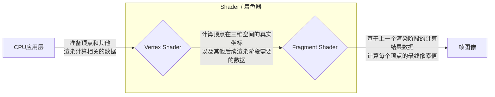

## 着色器简介

着色器(Shader)是一段运行在GPU中的程序，通常由2个“入口函数”组成，我们称之为顶点着色器(Vertex Shader)和片元着色器(Fragment Shader)，分别对应于渲染管线的2个阶段。如果我们聚焦于着色器，引擎渲染一幅图像的过程(即渲染管线)可以简化为

<figcaption style="text-align:center; color: #889096;font-size:12px">简化的渲染管线</figcaption>

## Shader 对象

在Galacean中，我们将上述着色器以及其他渲染相关信息封装抽象为Shader对象。具体的，Shader对象包含:
- Shader本身信息，如Shader名字
- 一个或多个SubShader对象

## SubShader

Galacean中通过SubShader可以将Shader对象拆分为多个子模块(即SubShader)，通过对每个子模块设置不同的tag以实现对不同的渲染管线、不同的GPU硬件平台分别设置不同的渲染逻辑。具体的，SubShader对象包含:

- SubShader名字
- tas: 用于标识兼容的硬件平台和渲染管线的key-value键值对
- 一个或多个ShaderPass对象

此外，你还可以定义其他额外的信息，如SubShader下所有ShaderPass公用的全局函数、变量、渲染状态等等。

## ShaderPass

一个ShaderPass对象包含:

- tags: 用于提供ShaderPass相关信息的key-value键值对
- Shader程序，通过宏指令，最终被编译成多个Shader变种程序

## 内置着色器

目前Galacean引擎内置了许多常用的Shader，诸如

| 类型 | 描述 |
| :-- | :-- |
| [Unlit ](/docs/graphics-material-Unlit) | Unlit 材质适用于烘焙好的模型渲染，她只需要设置一张基本纹理或者颜色，即可展现离线渲染得到的高质量渲染结果，但是缺点是无法实时展现光影交互，因为 Unlit 由纹理决定渲染，不受任何光照影响，可参考 [烘焙教程](/docs/graphics-bake-blender) 和 [导出 Unlit 教程](/docs/graphics-material-Unlit) |
| [Blinn Phong ](/docs/graphics-material-BlinnPhong) | Blinn Phong 材质适用于那些对真实感没有那么高要求的场景，虽然没有遵循物理，但是其高效的渲染算法和基本齐全的光学部分，可以适用很多的场景。 |
| [PBR ](/docs/graphics-material-PBR) | PBR 材质适合需要真实感渲染的应用场景，因为 PBR 是基于物理的渲染，遵循能量守恒，开发者通过调整金属度、粗糙度、灯光等参数，能够保证渲染效果都是物理正确的。 |

以下属性在内置着色器中可以直接使用。

| 参数 | 应用 |
| :-- | :-- |
| [isTransparent](/apis/core/#BaseMaterial-isTransparent) | 是否透明。可以设置材质是否透明。如果设置为透明，可以通过 [BlendMode](/apis/core/#BaseMaterial-blendMode) 来设置颜色混合模式。 |
| [alphaCutoff](/apis/core/#BaseMaterial-alphaCutoff) | 透明度裁剪值。可以设置裁剪值，在着色器中，透明度小于此数值的片元将会被裁减，参考 [案例](${examples}blend-mode) |
| [renderFace](/apis/core/#BaseMaterial-renderFace) | 渲染面。可以决定渲染正面、背面、双面。 |
| [blendMode](/apis/core/#BaseMaterial-blendMode) | 颜色混合模式。当设置材质为透明后，可以设置此枚举来决定颜色混合模式，参考 [案例](${examples}blend-mode) |
| [tilingOffset](/apis/core/#BlinnPhongMaterial-tilingOffset) | 纹理坐标的缩放与偏移。是一个 Vector4 数据，分别控制纹理坐标在 uv 方向上的缩放和偏移，参考 [案例](${examples}tiling-offset) |
